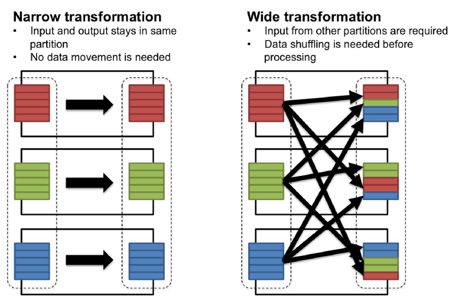

With workspace administration, security configuration, and tooling out of the way, it is time to consider optimizations based on your day-to-day tasks as a data engineer. Making best use of your resources will go a long way toward reducing overall operational overhead.

## Tune shuffle for optimal performance

A shuffle occurs when we need to move data from one node to another in order to complete a stage. Depending on the type of transformation, you are doing you may cause a shuffle to occur. This happens when all the executors require seeing all of the data in order to accurately perform the action. If the Job requires a wide transformation, you can expect the job to execute slower because all of the partitions need to be shuffled around in order to complete the job. For example: Group by, Distinct.



Figure 1: Shuffle vs. no-shuffle

You've got two control knobs of a shuffle you can use to optimize:
  
- The number of partitions being shuffled:

  ```python
  spark.conf.set("spark.sql.shuffle.partitions", 10)
  ```

- The number of partitions that you can compute in parallel.
  - This is equal to the number of cores in a cluster.

These two determine the partition size, which we recommend should be in the Megabytes to 1-Gigabyte range. If your shuffle partitions are too small, you may be unnecessarily adding more tasks to the stage. But if they are too big, you may get bottlenecked by the network.

## Partition your data

This is a broad Big Data best practice not limited to Azure Databricks, and we mention it here because it can notably impact the performance of Databricks jobs. Storing data in partitions allows you to take advantage of partition pruning and data skipping, two important features that can avoid unnecessary data reads. Most of the time partitions will be on a date field but you should choose your partitioning field based on the predicates most often used by your queries. For example, if you're always going to be filtering based on "Region," then consider partitioning your data by region.

- Evenly distributed data across all partitions (date is the most common)
- 10 s of GB per partition (~10 to ~50 GB)
- Small data sets should not be partitioned
- Beware of over partitioning

## Additional considerations

- Use [Delta Lake](https://docs.azuredatabricks.net/delta/index.html) wherever you can, to get the best performance and reliability for your big data workloads, and to create no-fuss multi-step data pipelines.
- Use [Machine Learning Runtime](https://docs.azuredatabricks.net/user-guide/clusters/mlruntime.html) for working with the latest ML/DL libraries (including HorovodRunner for distributed DL).
- Use [Delta Cache](https://docs.azuredatabricks.net/delta/delta-cache.html) for accelerating reads from Blob Storage or ADLS.
- Use [ABS-AQS connector](https://docs.azuredatabricks.net/spark/latest/structured-streaming/aqs.html) for structured streaming when working with consistent rate of incoming files on Blob Storage.
- Turn on [Databricks Advisor](https://docs.azuredatabricks.net/user-guide/notebooks/databricks-advisor.html) for automated tips on how to optimize workload processing.
