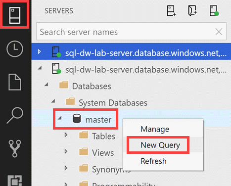

To add SQL Server Authenticated user to SQL Data warehouse, we need to do following things:

1. Create new server login
1. Add user to master database using this new server login
1. Add user to SQL Data Warehouse using this new server login

Let's start out by creating a new server login that we'll use for the exercises in this module.

## Add user to master database

1. Using Azure Data Studio, connect to the **master** database located under the SQL Server instance you created in the previous unit (procedure for _Create new connections in Azure Data Studio_).

    Use the following properties while making a connection to the master database:

    - _SQL Server_: SQL server created for this exercise
    - _Authentication_: SQL Login
    - _Username_: Server Admin
    - _Database_: master

1. Navigate to the Servers list on the left-hand menu in Azure Data Studio. Underneath the SQL Data Warehouse connection you made to the master database, expand Databases --> System Databases, then right-click on **master**. Select **New Query** from the context menu.

    

1. Check if **master** database is selected for the query window.

1. Create a new server login by executing below statement in the window:

    ```sql
    CREATE LOGIN LabUserLogin WITH PASSWORD = 'Str0ng_password';
    ```

1. Click the **Run** button to execute the query. You should see an output telling you that the commands completed successfully.

    

1. Create user in **master** database using the above login byt executing the following command:

    ```sql
    CREATE USER LabUser FOR LOGIN LabUserLogin;
    ```

## Add user to SQL Data Warehouse

1. Using Azure Data Studio, connect to the **SQL Data Warehouse** database located under the SQL Server instance you created in earlier steps of this exercise by following steps listed in Step 2 of this exercise: **Create new connections in Azure Data Studio**.

    Use the following properties while making a connection to the master database:

    **SQL Server:** SQL server created for this exercise

    **Authentication:** SQL Login

    **Username:** Server Admin

    **Database:** SQL Data Warehouse created for this exercise

1. Navigate to the Servers list on the left-hand menu in Azure Data Studio. Right-click on the SQL Data Warehouse connection you made to the SQL Data Warehouse database, then select **New Query** from the context menu.

    

1. Check if **SQL data Warehouse** (`sql-dw-exercise`) is selected for the query window.

1. To create user in **SQL Data Warehouse** using login created in earlier steps, execute the below statement:

    ```sql
    CREATE USER LabUser FOR LOGIN LabUserLogin;
    ```

1. Execute the following statement to allow LabUser to read data from SQL Data Warehouse:

    ```sql
    EXEC sp_addrolemember 'db_datareader', 'LabUser';
    ```

## Assign Resource Class

Resource Classes manage resource allocation for query execution in SQL Data Warehouse. Resource Classes help to control memory allocation, CPU cycles, and Concurrency Slots given to each query.

Click [here](https://docs.microsoft.com/azure/sql-data-warehouse/sql-data-warehouse-develop-concurrency#resource-classes)
to learn more about resource classes.

To assign resource class to user added in SQL Data Warehouse, execute the below statement in same query window used for the previous step:

```sql
EXEC sp_addrolemember 'largerc', 'LabUser';
```

The above statement assigns the '**largerc'** resource class to the newly added user.