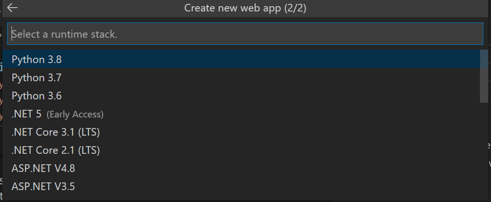
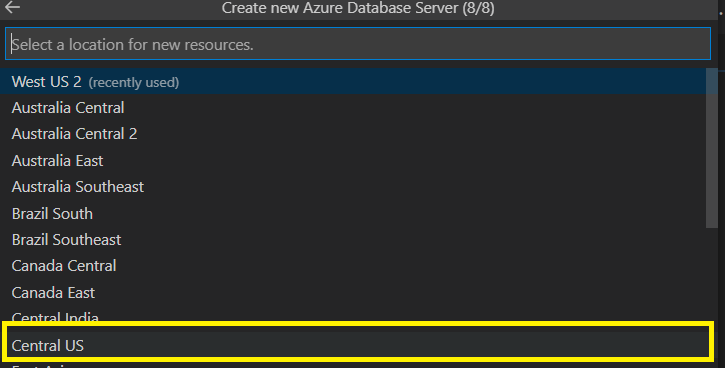
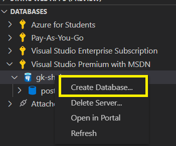
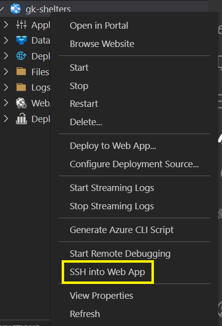

This exercise requires a sandbox. A sandbox gives you access to free resources. Your personal subscription won't be charged. 

You can use the sandbox only to complete training on Microsoft Learn. Using the sandbox for any other reason is prohibited and may result in permanent loss of access to the sandbox.

To make your site available to the public, you'll deploy it to Azure. You'll use the Azure App Service extension in Visual Studio Code to streamline the process.

## Install the Azure App Service extension

Start by installing the Azure App Service extension in Visual Studio Code:

1. In **Visual Studio Code**, select the **Extensions** icon.

    

1. In the **Search Extensions** field, type *App Service*.
1. Under **Azure App Service**, select **Install**.

The extension is installed.

## Deploy the application

Now that the extension is installed, you can start the installation.

1. In **Visual Studio Code**, on the toolbar, select the **Azure** icon.

    

1. Select **Sign in** to sign in to Azure by using the same account you used to create the sandbox.
1. On the **App Service** bar, select the **Deploy** icon.

    

1. For **Select subscription**, choose your Azure subscription.

    

1. Select **Create new Web App**.

    

1. Provide a unique name for your application.

    

1. Select **Python 3.8** as the runtime stack.

    

    The extension creates your web application and begins deploying it. The process will take a few moments.

1. When you're asked whether to **Always deploy the workspace** to the application you created during the deployment, select **Yes**.

    

Your site will now deploy!

## Create the database

While your site is deploying, turn your attention to creating the database. You'll use PostgreSQL.

1. In the **Databases** extension, select **Create server**.

    

1. In the dialog box, select the sandbox subscription.

    

1. For the Azure Database Server, select **PostgreSQL**.

    

1. Enter a unique name for your database server.

    > [!IMPORTANT]
    > Make a note of the name you use for your database server.

1. For the name of the admin user, enter *shelter_admin*.
1. Enter a secure password, such as *86i*^z5#emSk6wu3t10nC*.

    > [!IMPORTANT]
    > When you create the password, don't use a dollar sign (`$`). This symbol can cause issues for connections from Python. Make a note of the password you use.

1. Enter the password a second time to confirm it.
1. For the firewall rule, select **Skip for now**.

    

1. For the resource group, select **appsvc_linux_centralus**. This group was created when you deployed your web application.

    

1. For the location for new resources, select **Central US**.

    

    > [!IMPORTANT]
    > When you create multiple Azure resources that will communicate with one another, always place them in the same region. This collocation ensures the best performance.

Your server will now be created! This process will take a few minutes.

## Configure application settings

While your database server is being created, configure the App Service you set up earlier. App Service uses the application settings to configure environmental variables. Settings are a convenient way to store information you shouldn't put in your code, such as database connection strings.

1. Under **App Service**, expand the sandbox subscription. Then expand your application.
1. To create the first application setting, right-click **Application Settings** and then select **Add New Setting**.

    

1. In the first field, enter the name *DBUSER*.
1. In the second field, enter the value *shelter_admin*.
1. Repeat the preceding steps to create the remaining settings:

    Name       | Value
    -----------|---------------------------------------
    DBHOST     | `<The server name you created previously>`
    DBPASS     | `<The password you created previously>`
    DBNAME     | `shelters`
    SECRET_KEY | `<Generate a secure password>`

    > [!NOTE]
    > Replace the **DBHOST** and **DBPASS** values with the ones you created earlier in this exercise. For **SECRET_KEY**, create a new password.

All the necessary environmental variables are now created on your app service.

## Create the database

Now that you've configured App Service and created the server, you can create the database.

1. Under **Databases**, expand the sandbox subscription.
1. Right-click the name of your database server and select **Create Database**.

    

1. Enter *shelters*.

Your database will be created.

## Create the schema and superuser

The last step in the deployment is to set up the database. In local development, you run `python manage.py migrate` and `python manage.py createsuperuser` to create the database schema and superuser. On Azure, you'll do the same. 

You'll connect to the web server in Azure by using Secure Shell (SSH). You can make the connection in Visual Studio Code.

1. In the **App Service** extension, right-click your app service and then select **SSH into Web App**.

    

    An SSH connection will be made to your web server in Azure. This process might take a few minutes. A terminal pane appears in Visual Studio Code. This terminal is the SSH connection to your web server.

    > [!IMPORTANT]
    > If you receive an error message stating you need to enable SSL for the database, ensure you created all environmental variables correctly.

1. Inside the SSH terminal pane, run the following commands to ensure the appropriate libraries are installed and to create the database.

    ```bash
    # Change to the app folder
    cd $APP_PATH
    # Activate the venv
    source /antenv/bin/activate
    # Install requirements
    pip install -r requirements.txt
    # Run database migrations
    python manage.py migrate
    ```

1. Create your superuser by running the following command.

    ```bash
    python manage.py createsuperuser
    ```

1. Provide a **name**, **email** address, and **password** for the superuser.
1. After you create your superuser, run the command `exit` to close the connection.

Your database is now configured in Azure, and you have a superuser for your site.

## Go to your site

Now that you've deployed and configured everything, you can view your website on Azure.

In the **App Service** extension, right-click the name of your site, and then select **Browse Website**.


Your website now appears.

Because you deployed your SQLite database, your site should already contain data. If you try to go to a location that doesn't exist on your site, you'll get a generic **Not found** error because `DEBUG` is disabled.

You've now deployed a website to Azure!
