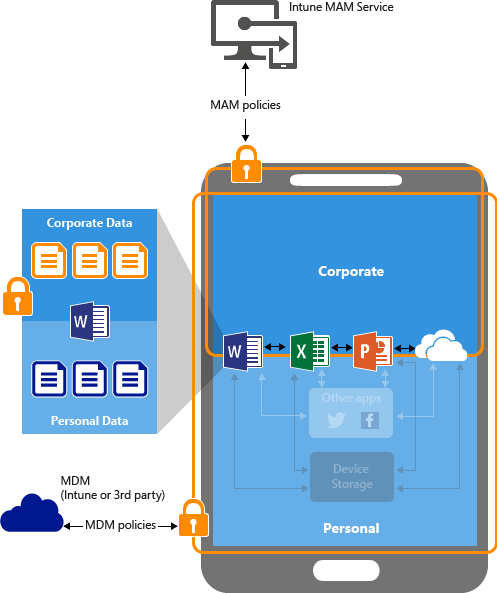

One of the primary ways that Intune provides mobile app security is through policies. App protection policies allow you to do the following actions:
- Use Azure AD identity to isolate organization data from personal data. So personal information is isolated from organizational IT awareness. Data accessed using organization credentials are given additional security protection.
- Help secure access on personal devices by restricting actions users can take with organizational data, such as copy-and-paste, save, and view.
- Create and deploy on devices that are enrolled in Intune, enrolled in another mobile device management (MDM) service, or not enrolled in any MDM service. 

> [!NOTE]
> App protection policies are designed to apply uniformly across a group of apps, such as applying a policy across all Office mobile apps. 

## App protection policies with enrollment

On enrolled devices that use an MDM service, app protection policies can add an extra layer of protection. For example, a user signs in to a device with their organization credentials. Their organization identity allows access to data that's tied to their personal identity. As that organization data is used, app protection policies control how the data is saved and shared. When users sign in with their personal identity, those same protections (access and restrictions) aren't applied. In this way, IT has control of organization data, while end users maintain control and privacy over their personal data.

The following illustration shows the layers of protection that an MDM service and app protection policies offer together:

## App protection policies without enrollment 

There are additional benefits to using an MDM service with app protection policies, and companies can use app protection policies with and without MDM at the same time. For example, consider an employee that uses both a tablet issued by the company, and their own personal phone. The company tablet is enrolled in MDM and protected by app protection policies while their personal phone is protected by app protection policies only.

For more information about app protection in Intune, see [App protection policies overview](/mem/intune/apps/app-protection-policy?azure-portal=true).