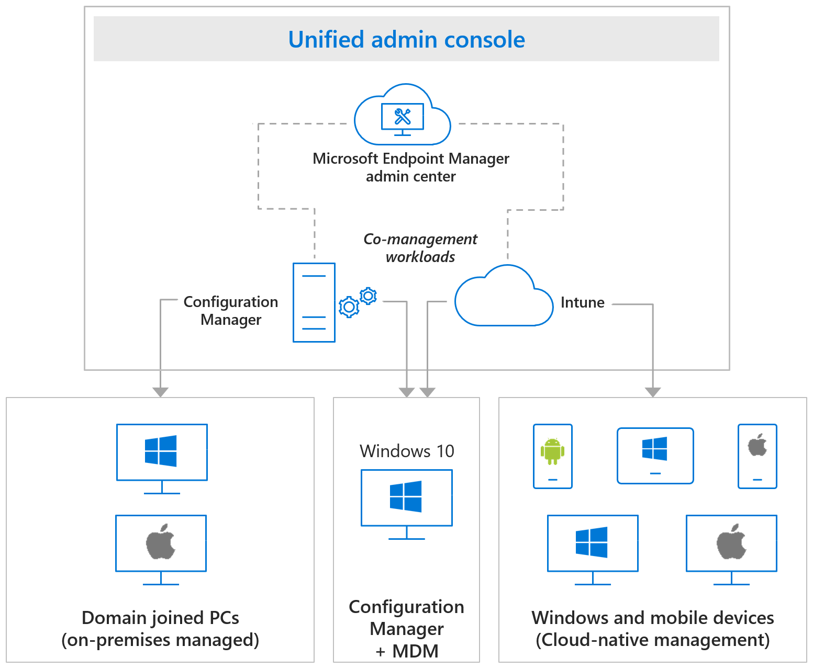

Effectively managing endpoints presents a number of challenges. For instance, how do you manage existing investments? How do you provide proper security in the form of access control and encryption? How do you determine which user, device, or app is in compliance based on your corporate requirements? 

Microsoft Endpoint Manager provides the services and tools you need in one location to manage your organization's endpoints by providing:
- **Cloud security across endpoints** - You can help protect user's devices against threats using [Microsoft Zero Trust](/security/zero-trust/) technology.
- **Comprehensive Windows 10 management** - You can simplify automated provisioning, configuration management, and software updates for all your endpoints.
- **Maximum return on investment** - You can leverage your existing investments to modernize the user experience with Microsoft 365 cloud telemetry.

## Endpoint architecture

The Microsoft Endpoint Manager architecture provides three stages of the cloud management journey using Configuration Manager and Intune in a single, unified endpoint management solution.
The first stage uses tenant-attach capabilities that provide the most flexible path for Configuration Manager customers to start gaining cloud benefits without necessarily enrolling their Windows clients with Intune. Connect the Configuration Manager site to the cloud and immediately gain access to a host of remote actions and analytics.
Organizations ready for the next step can use co-management to manage Windows using both Configuration Manager and Intune. The Windows 10 device is managed by both Configuration Manager and mobile device management (MDM) systems in the second stage. We recommend new customers or new endpoints go directly to the cloud with Intune. Existing customers can gradually move more workloads to the cloud in the third stage.

## Modern endpoint Management

Modern IT provides cloud intelligence at the core. Microsoft Endpoint Manager provides this modern management. Microsoft Endpoint Manager doesn't require you to make an either/or decision between on-prem and cloud management. You can do both, and modernize at your own pace, to manage risk in a smart way. You can take advantage of modern IT and the cloud by using Microsoft Endpoint Manager, but it also gives you the tools and capabilities to manage your existing on-prem investments.

Suppose that you're the administrator or business decision maker of a company with several thousand employees. Your company must determine the best way to implement an Enterprise Mobility Management service that allows you to keep your corporate data safe, protect the data, apps, and devices that your employees use, and maximize the return on your investment. Learn how Microsoft Endpoint Manager provides these capabilities.

## Learning objectives

In this module, you will:

- Learn about intelligent and unified endpoint security.
- Learn about flexible and unified endpoint management.
- Learn about protecting data without device enrollment.
- Understand how Microsoft Endpoint Manager increases your end users' productivity.
- Learn about the benefits of co-management.
- Learn how Microsoft Endpoint Manager helps you maximize your return on investment.

## Prerequisites

- None