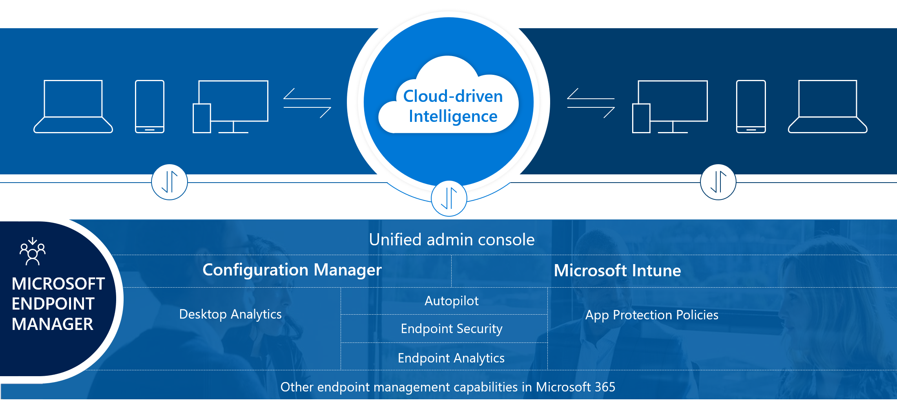

Microsoft Intune is a single, integrated management platform for managing, protecting, and monitoring all of your organization's endpoints.

Endpoints include all the apps and devices that your organization uses. Endpoints include the following devices:
- Mobile devices
- Desktop and laptop computers
- Virtual machines
- Embedded devices
- Shared devices
- Retail point-of-sale devices
- Ruggedized devices
- Digital interactive whiteboards
- Conference-room devices
- Holographic wearable computers

By protecting and managing your organization's endpoints with Microsoft Intune, you can accomplish the following goals:

- Help protect the data that the people at your organization access.
- Help safeguard the devices and apps that access organizational resources.
- Ensure your organization uses proper credentials to access and share company data.
- Confirm that security rules are in place based on your organization's requirements.
- Confirm that every organization member's devices are correctly configured and protected.
- Ensure that all corporate services are available to end users on all the devices they use.
- Help new members of your organization have a good onboarding experience.
- Ensure that users get a first-class support experience for all the products they use.

Microsoft Intune integrates Intune, Microsoft Endpoint Configuration Manager, and Windows Autopilot. You can use the Microsoft Intune console to help keep your organization's cloud and on-premises devices, apps, and data secure.

> [!IMPORTANT]
> Microsoft Endpoint Configuration Manager and Microsoft Intune are now one management system. If you already have Configuration Manager, you also have Microsoft Intune.

To quickly step through the areas of Microsoft Intune, see [Tutorial: Walk through Microsoft Intune admin center](/mem/intune/fundamentals/tutorial-walkthrough-endpoint-manager?azure-portal=true).