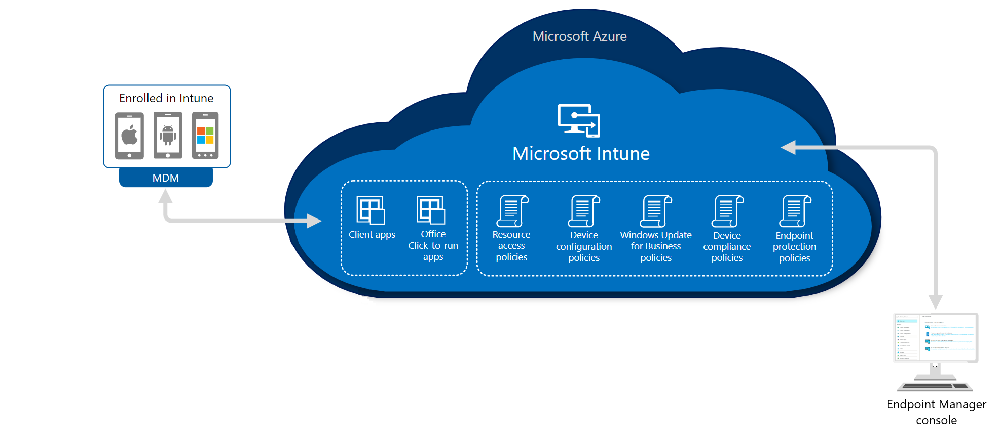

Microsoft Intune provides the cloud infrastructure, the cloud-based mobile device management (MDM), cloud-based mobile application management (MAM), and cloud-based PC management for your organization. It lets you protect your organization by controlling features and settings on Android, Android Enterprise, iOS/iPadOS, macOS, and Windows 10/11 devices. It integrates closely with Microsoft Entra ID for identity and access control and Azure Information Protection and advanced threat protection products for data protection. 

When you use it with Microsoft 365, you can enable your workforce to be productive on all their devices while keeping your organization's information protected. If you have on-premises infrastructure such as Exchange or an Active Directory, you can use Intune connectors to help you connect to external services. Intune, which is a part of Microsoft Intune, is included in Microsoft's [Enterprise Mobility + Security (EMS) suite](https://www.microsoft.com/microsoft-365/enterprise-mobility-security?azure-portal=true).

In the following diagram, you can see how Intune interacts with other components in both your on-premises and cloud infrastructure:

