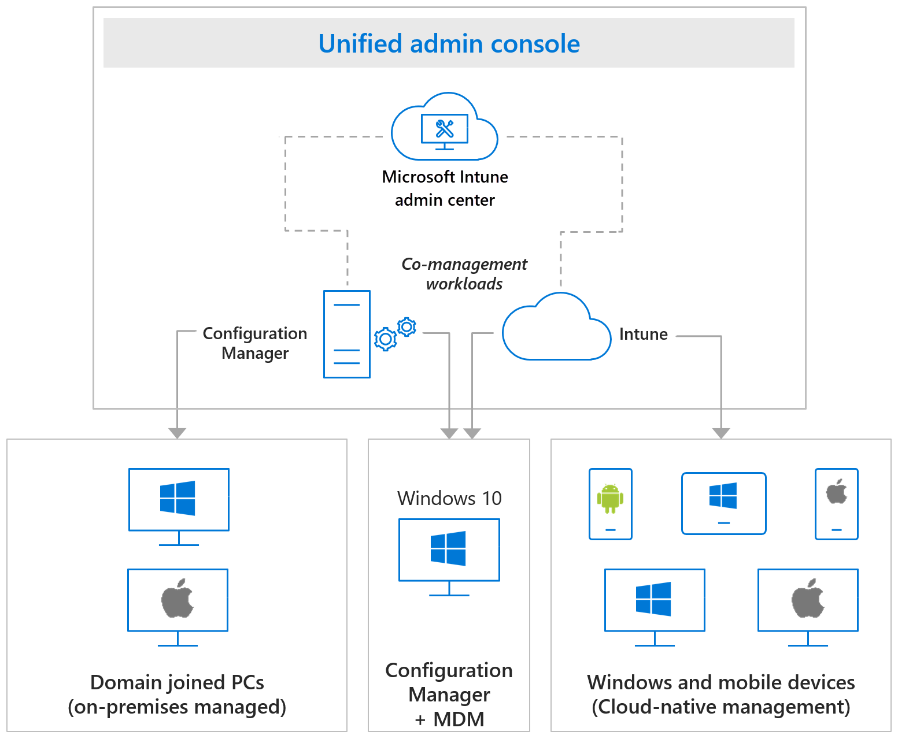

Microsoft Endpoint Manager supports several device platforms. The available platforms that can be managed by Endpoint Manager include iOS/iPadOS, Windows, Android, and macOS. These platforms are often referred to as device types. Because each platform is different, each offers sightly different enrollment methods, devices settings, protection policy settings, configuration policy settings, custom policy settings, and remote actions.

You need to determine the platforms that must be supported in your endpoint environment. Once you know the platforms you need to support, you must verify whether each platform is supported by Intune when you create your endpoint management design.

## Intune supported operating systems

You can manage devices running the following operating systems:

### Apple
- Apple iOS 11.0 and later
- Apple iPadOS 13.0 and later
- macOS X 10.12 and later

### Google
- Android 5.0 and later (including Samsung KNOX Standard 2.4 and higher)
- Android Enterprise

### Microsoft
- Surface Hub
- Windows 10/11 (Home, S, Pro, Education, and Enterprise versions)
- Windows 10 Enterprise 2019 LTSC
- Windows 10/11 Mobile
- Windows 10/11 IoT Enterprise (x86, x64)
- Windows 10/11 IoT Mobile Enterprise
- Windows Holographic for Business

For more information about Intune supported devices, platforms, and operating systems, see [Supported operating systems and browsers in Intune](/mem/intune/fundamentals/supported-devices-browsers?azure-portal=true).

## Configuration Manager supported operating systems

The supported OS versions for clients and devices that can be managed by Configuration Manager include several dozen operating system. The following provides an overall list of operating systems and devices types:

- Windows computers
    - Windows 10/11 (x86, x64, ARM64): Enterprise, Pro, Education, Pro Education, Pro for Workstation, Windows Insider
    - Windows 10 Enterprise 2015 LTSB, Enterprise 2016 LTSB, and Enterprise LTSC 2019
    - Windows 8.1 (x86, x64): Professional, Enterprise
- Windows Servers (*several variations available*)
- Windows Server Core (*several variations available*)
- Azure Virtual Desktop
- Windows Embedded computers (*several variations available*)
- Windows 10 IoT Mobile Enterprise
- Windows 10 Team for Surface Hub
- Mac computers (*several variations available*)
 
For more information about Configuration Manager supported devices, servers, platforms, and operating systems, see [Supported OS versions for clients and devices for Configuration Manager](/mem/configmgr/core/plan-design/configs/supported-operating-systems-for-clients-and-devices?azure-portal=true).