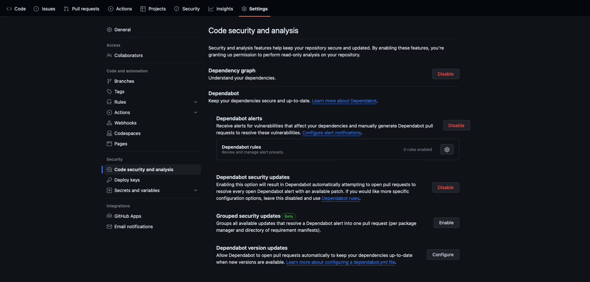
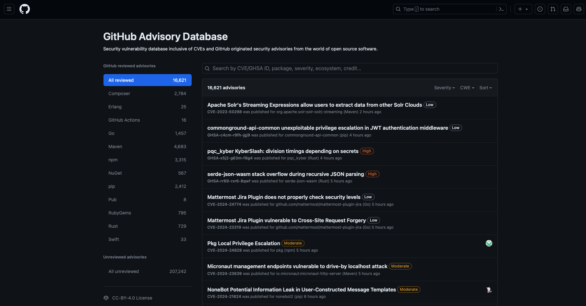

It's common for software projects to depend on external packages or dependencies. Managing these external dependencies consumes resources and affects productivity. These dependencies can also include vulnerabilities that introduce security threats. A vulnerability is a flaw in a project's code that can be exploited to damage the confidentiality, integrity, or availability of the project or other projects that use its code. You might not even notice dependency vulnerabilities right away, because they exist outside of the code on which you work. Understanding how to effectively and efficiently manage your dependencies with GitHub improves the security of your software supply chain. 

In this unit, you'll learn about the GitHub tools for managing your dependencies:

- The Dependency graph
- The GitHub Advisory Database
- Software Bill of Materials (SBOM)
- Dependabot
- Dependency review

## The Dependency graph

:::image type="content" source="../media/dependency-graph.png" alt-text="Screenshot of Dependencies of the Dependency graph.":::

The dependency graph is a summary of the manifest and lock files stored in a repository and any dependencies that are submitted for the repository using the Dependency submission API. These files contain metadata about your project. The dependency graph is automatically generated for public repositories and includes the following information:

- **Dependencies**, which are the ecosystem and packages on which the repository depends.
- **Dependents**, which are the repositories and packages that depend on the repository.

The dependency graph uses the information from your lock and manifest files to provide a list of two kinds of dependencies:

- The **direct dependencies** explicitly defined in a manifest or lock file or submitted with the Dependency submission API.
- The **indirect dependencies**, also known as transitive dependencies or subdependencies, which are dependencies used by packages that are dependencies of your project.

Lock files (or their equivalent) generate the most reliable dependency graph, because they define exactly which versions of the direct and indirect dependencies you currently use. If you use lock files, you also ensure that all contributors to the repository are using the same versions, which makes it easier for you to test and debug code. If your ecosystem doesn't have lock files, you can use premade actions that resolve transitive dependencies for many ecosystems.

### Enable the dependency graph for private repositories

As a repository administrator, you can also choose to enable the dependency graph for private repositories by completing these steps:

1. Go to your GitHub repository.
2. Select your repository **Settings**.
3. Select **Code security and analysis**.
4. Select **Enable** in the dependency graph section.

>[!NOTE]
> Dependent information is not included for private repositories.

### View the dependency graph

You can view the dependency graph for your repository by following these steps:

1. Go to your GitHub repository.
2. Select your repository **Insights**.
3. Select **Dependency graph**.
4. You can select the **Dependencies** or **Dependents** tab from the Dependency graph view.

    

### Supported package ecosystem for the dependency graph

This table lists the recommended and supported formats for files containing your dependencies. If you use these formats, your dependency graph is more accurate. Using the recommended file format means that your dependency graph reflects the current build setup and can report vulnerabilities for both direct and indirect dependencies.

We generally recommend lock files in your repository, because they define the exact versions of the direct and indirect dependencies that you're currently using. If you're using lock files, make sure the contributors to your repository are also using the same versions. If you use a manifest file (or equivalent), indirect dependencies aren't included in checks for vulnerable dependencies.

|Package manager |Languages |Recommended formats |All supported formats |
|-----|-----|-----|----|
| Cargo | Rust | `Cargo.lock` | `Cargo.toml`, `Cargo.lock` |
| Composer | PHP | `composer.lock` | `composer.json`, `composer.lock` |
| NuGet | .NET languages (C#, F#, VB), C++  |   `.csproj`, `.vbproj`, `.nuspec`, `.vcxproj`, `.fsproj` |  `.csproj`, `.vbproj`, `.nuspec`, `.vcxproj`, `.fsproj`, `packages.config` |
| GitHub Actions workflows | YAML | `.yml`, `.yaml` | `.yml`, `.yaml` |
| Go modules | Go | `go.mod` | `go.mod` |
| Maven | Java, Scala |  `pom.xml`  | `pom.xml`  |
| npm | JavaScript | `package-lock.json` | `package-lock.json`, `package.json`|
| pip | Python | `requirements.txt`, `pipfile.lock` | `requirements.txt`, `pipfile`, `pipfile.lock`, `setup.py` |
| pnpm | JavaScript | `pnpm-lock.yaml` | `pnpm-lock.yaml`, `package.json`|
| pub | Dart | `pubspec.lock` | `pubspec.yaml`, `pubspec.lock` |
| Python Poetry | Python | `poetry.lock` | `poetry.lock`, `pyproject.toml` |
| RubyGems | Ruby | `Gemfile.lock` | `Gemfile.lock`, `Gemfile`, `*.gemspec` |
| Swift Package Manager | Swift | `Package.resolved` | `Package.resolved` |
| Yarn | JavaScript | `yarn.lock` | `package.json`, `yarn.lock` |

## The GitHub Advisory Database

The [GitHub Advisory Database](https://github.com/advisories?azure-portal=true) is a security vulnerability database inclusive of CVEs and GitHub originated security advisories from the world of open source software. GitHub collects information on vulnerabilities and includes it in the GitHub Advisory Database to:

- Provide a free and open-source repository of security advisories.
- Enable the community to crowd-source their knowledge about these advisories.
- Surface vulnerabilities in an industry-accepted formatting standard for machine interoperability.

The GitHub Advisory Database contains detailed information about each vulnerability including description, severity, and affected package. This database uses the [Common Vulnerability Scoring System (CVSS), Section 5](https://www.first.org/cvss/v3.1/specification-document?azure-portal=true) to assign a severity level to each vulnerability: low, medium/moderate, high, and critical. The database is populated from the following sources:

- Security advisories reported on GitHub
- The National Vulnerability Database
- The npm Security advisories database
- The FriendsOfPHP database
- The Go Vulncheck database
- The Python Packaging Advisory database
- The Ruby Advisory database
- The RustSec Advisory database
- Community contributions
- A combination of machine learning and human reviews to detect vulnerabilities in public commits on GitHub.

## Software Bill of Materials (SBOM)

A Software Bill of Materials (SBOM) is a formal, machine-readable inventory of a project's dependencies and associated information (such as versions, package identifiers, and licenses). SBOMs help reduce supply chain risks by:

- Providing transparency about the dependencies used by your repository.
- Allowing vulnerabilities to be identified early in the process.
- Providing insights into the license compliance, security, or quality issues that may exist in your codebase.
- Enabling you to better comply with various data protection standards.

GitHub offers two ways to export a Software Bill of Materials (SBOM) for your repository. You can export the current state of the dependency graph for your repository as an SBOM using the industry-standard [Software Package Data Exchange(SPDX)](https://spdx.github.io/spdx-spec/v2.3/?azure-portal=true) format:

- Via the GitHub UI
- Using the REST API

You can leverage SBOMs as part of your audit process and use them to comply with regulatory and legal requirements. If your company provides software to the US federal government, per [Executive Order 14028](https://www.gsa.gov/technology/technology-products-services/it-security/executive-order-14028-improving-the-nations-cybersecurity?azure-portal=true), you'll need to provide an SBOM for your product.

## Dependabot  

Dependabot is a GitHub tool that automates managing your repository’s dependencies. Dependabot keeps your dependencies up to date by informing you of any security vulnerabilities in your dependencies, and automatically opens pull requests to upgrade your dependencies to the next available secure version when a Dependabot alert is triggered, or to the latest version when a release is published. For Dependabot to work, the dependency graph must be enabled in a repository. Dependabot uses the dependency graph and the GitHub Advisory Database to provide three features:

- **Dependabot alerts**: Notify you about vulnerable dependencies, including a link to the affected file in the project and information about a fixed version.
- **Security updates**: Automatically update or generate a pull request to update vulnerable dependencies.
- **Version updates**: Automatically update supported packages used by your repository on a schedule you configure.

## Dependency review

You can use dependency review to catch vulnerable dependencies before they're added to your main branch. Dependency review helps you understand dependency changes and the security impact of these changes at every pull request. It provides an easily understandable visualization of dependency changes with a rich diff on the a pull request's **Files Changed** tab. By checking the dependency reviews in a pull request and changing any dependencies that are flagged as vulnerable, you can avoid vulnerabilities being added to your project. Dependency review informs you of:

- Which dependencies were added, removed, or updated, along with the release dates.
- How many projects use these components.
- Vulnerability data for these dependencies.

Where Dependabot is more about automatically monitoring and updating known dependencies, dependency review proactively analyzes dependency changes during pull request to highlight key information, like insecure dependencies, enabling you to keep your project safer. Together, these complementary tools can be used to maintain a more secure and up-to-date codebase.

In the remaining units, you'll learn more about using Dependabot and dependency review in your repository.
