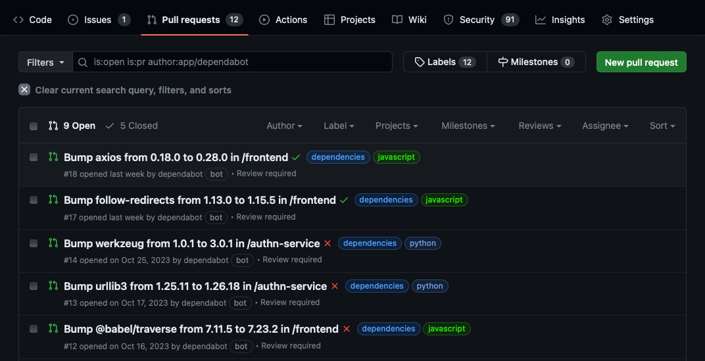
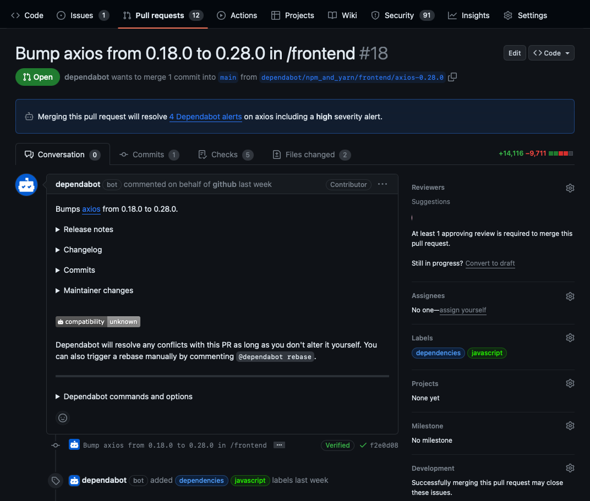

Now you know how Dependabot alerts can help you identify vulnerable dependencies in your repository and you're ready to learn about security updates and version updates. Dependabot security updates help you to fix the vulnerabilities identified by Dependabot alerts. Version updates help manage different versions of dependent packages.

Once you have set up Dependabot alerts to notify you of vulnerabilities in your repository, you can enable two related features so that Dependabot automatically opens pull requests to try to help with your dependency management:

- **Dependabot security updates** are automated pull requests that help you update dependencies with known vulnerabilities.
- **Dependabot version updates** are automated pull requests that keep your dependencies updated, even when they don’t have any vulnerabilities.

:::image type="content" source="../media/dependabot-pull-requests.png" alt-text="Screenshot of pull requests opened by Dependabot.":::



## Supported repositories

GitHub automatically enables Dependabot security updates for newly created repositories if your personal account or organization has enabled **Automatically enable for new repositories** for Dependabot security updates. Further, GitHub automatically enables Dependabot security updates for every new repository that meets the following prerequisites:
- The repository isn't a fork.
- The repository isn't archived.
- The repository is public or it's private and you've enabled the read-only analysis by the dependency graph, and vulnerability alerts in the repository's settings.
- Dependabot security updates aren't disabled for the repository.


## Manually enable security updates

You can enable Dependabot security updates manually on your repositories that don't meet the prerequisites mentioned in the section above. Make sure you've enabled the dependency graph and Dependabot alerts, then follow these steps to manually enable Dependabot security updates as well:
1. Sign in to your GitHub account and select your profile photo from the upper-right.
2. Select **Settings**, then select **Code security and analysis** under **Security** in the left-side menu.
3. Select **Enable all** for Dependabot security updates.
4. If you would like these settings to be applied to all new repositories, then select the **Automatically enable for new repositories** checkbox.
5. Select **Enable Dependabot security updates** to enable the feature for all the repositories you own.

For an individual repository: 
1. Go to the main page of the repository. 
2. Select **Settings**, then select **Code security and analysis** under **Security** in the left-side menu.
3. Select **Enable** for Dependabot security updates.


## View and resolve security updates 

View Dependabot pull requests the same way that you would view other pull requests on GitHub, within the **Pull requests** tab of the related repository. Dependabot pull requests will have dependabot as the author, this account is the bot account used by Dependabot. They'll also use the `dependencies` label. Every Dependabot pull request identifies the vulnerable dependency and version in the PR title, and also specifies the target version to patch it. 

Dependabot pull requests include all the information that you need to review and merge a proposed fix into your project like release notes, changelog entries, and commit details. Details of which vulnerability a pull request resolves are hidden from anyone who doesn't have access to Dependabot alerts for the repository. Merging a security update pull request automatically marks the related Dependabot alert as closed for the repository. 

Another approach is to remove the dependency entirely. Rather than updating a vulnerable dependency to a patched version, you can modify the Dependabot pull request to remove the dependency and remediate the findings. Removing dependencies can often cause breaking changes, but if possible, it reduces:
- the attack surface 
- software supply chain risk
- ongoing dependency maintenance

Despite all this information, it's still best practice to have automated processes in place so that checks are carried out before the pull request is merged. This approach is especially important if the update includes other functionality or potentially breaking changes. Be sure to complete testing and code review to ensure quality and stability. 




## Security update compatibility scores

Dependabot security updates may include compatibility scores to let you know whether updating a dependency could cause breaking changes. This score is calculated from continuous integration (CI) tests in other public repositories where the same security update has been generated. The compatibility score is the percentage of CI runs that passed when updating between specific versions of the dependency.


## Grouped security updates

To reduce the number of pull requests from security updates, there is a grouped security updates capability that can be enabled to group sets of dependencies together. Dependabot then opens a single pull request to update as many vulnerable dependencies as possible for each package ecosystem to secure versions at the same time. For security updates, Dependabot will group dependencies from different directories. Dependabot will not group dependencies from different package ecosystems together and it will not group security updates with version updates. In order to use grouped security updates, the following features must be enabled:
- Dependency graph
- Dependabot alerts
- Dependabot security updates

>[!NOTE]
> When grouped security updates are first enabled, Dependabot will immediately try to create grouped pull requests. You may notice Dependabot closing old pull requests and opening new ones.


## Enable grouped security updates

For an individual repository:
1. Go to the main page of the repository. 
2. Select **Settings**, then select **Code security and analysis** under **Security** in the left-side menu.
3. Select **Enable** for Grouped security updates.

For an organization:
1. Sign in to your GitHub account and select your profile photo from the upper-right.
2. Select **Your organizations**
3. Select **Settings** next to the organization for which you would like to enable Dependabot alerts.
4. Select **Code security and analysis** from the left sidebar.
5. Select **Enable all** for Grouped security updates.
6. If you would like these settings to be applied to all new repositories in your organization, select the **Enable by default for new repositories** checkbox.
7. Select **Enable grouped security updates** to enable the feature for all the repositories in your organization.

Alternatively, you can override the default behavior of Dependabot updates by adding a `dependabot.yml` file to a repository. The following sections explain how to create a valid `dependabot.yml` configuration file for version updates. 

>[!NOTE]
> The `groups` option in the `dependabot.yml` file only applies to version updates.


## Version updates 

Version updates are another Dependabot feature that helps to manage your dependencies by automatically generating a pull request whenever there's a new version of a package or application that your project depends on.

Dependabot checks for new versions by looking at the semantic versioning of the dependency (`MAJOR.MINOR.PATCH` naming convention), which is included in a manifest or other type of package definition file stored in your repository. To enable version updates, you need to create a `dependabot.yml` file, which will essentially tell Dependabot where to find the manifest, or other package definition file. You'll learn how to create a `dependabot.yml` file in the next section.


### Enable version updates for repositories

Users with write permissions can enable Dependabot version updates for a repository by checking a `dependabot.yml` file into the `.github` directory of the repository.

The `dependabot.yml` file should include the following information: 

- `version`: Should be set to 2.
- `registries`: Optional if you have dependencies in a private registry. This section contains authentication details.
- `updates`: Include an entry for each dependency you want Dependabot to monitor.

For each package manager, include:

- `package-ecosystem`: Specifies the package manager.
- `directory`: Specifies the location of the manifest or other definition files.
- `schedule.interval`: Specifies how often to check for new versions.

Below is an example of a `dependabot.yml` file: 

```
# Basic dependabot.yml file with
# configuration for two package managers

version: 2
updates:
  # Enable version updates for npm
  - package-ecosystem: "npm"
    # Look for `package.json` and `lock` files in the `root` directory
    directory: "/"
    # Check the npm registry for updates every day (weekdays)
    schedule:
      interval: "daily"
    groups:
      production-dependencies:
        dependency-type: "production"
      development-dependencies:
        dependency-type: "development"

  # Enable version updates for Docker
  - package-ecosystem: "docker"
    # Look for a `Dockerfile` in the `root` directory
    directory: "/"
    # Check for updates once a week
    schedule:
      interval: "weekly"
    groups:
      production-dependencies:
        dependency-type: "production"
      development-dependencies:
        dependency-type: "development"
```


### View dependencies configured for version updates

After creating and checking your `dependabot.yml` file into your repository, you can view the dependencies being monitored by Dependabot to confirm everything is working properly by following the steps below: 

1. Go to the main page of the repository. 
2. Under your repository name, select **Insights**. 
3. Select **Dependency graph** in the left sidebar.
4. Select **Dependabot**. 
5. Select the three dots next to a package manager to view the files being monitored.

The **Last checked TIME ago** link in the **Dependabot** tab also enables you to see the log files that Dependabot generated during the last check for version updates. You can rerun the version check by selecting the **Check for updates** button.


### Version updates on forks 

Dependabot version updates aren't automatically enabled on forks. This safeguard prevents fork owners from unintentionally enabling version updates when they pull changes including a `dependabot.yml` file from the original repository.

To enable version updates on the fork of a repository:

1. Go to the main page of the repository where you want to enable version updates. 
2. Select **Insights**. 
3. Select **Dependency graph** from the left sidebar.
4. Select **Dependabot**.
5. Select **Create config file**.
6. Edit `dependabot.yml` config file
7. Commit and merge `dependabot.yml` file


## Grant Dependabot access to private repositories

To check for outdated dependencies and generate a security update, Dependabot must have access to the repository that contains the dependencies. Dependabot generally can't update dependencies that are located in private repositories or private package registries. However, if the dependency is in a private repository located in the same organization as the package that uses it, then you can grant Dependabot access.

To allow Dependabot to access a private GitHub repository:

1. Go to the security and analysis settings for your organization.
2. Under **Grant Dependabot access to private repositories**, select **Add private repositories** or **Add internal and private repositories**.
3. Start typing the name of the repository you want to allow.
4. Select the repository you want to allow.
5. Optionally, to remove a repository from the list, go to the right of the repository and select **X**.
 
