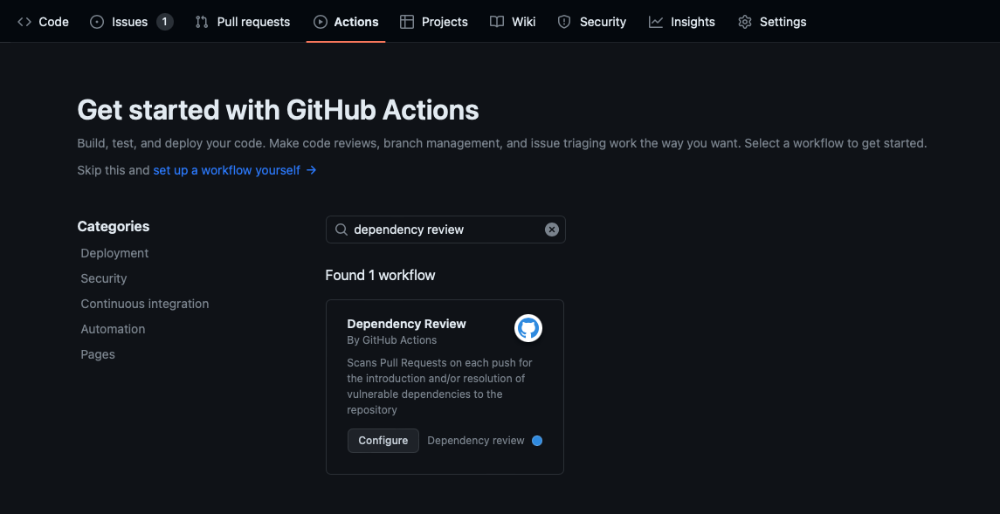
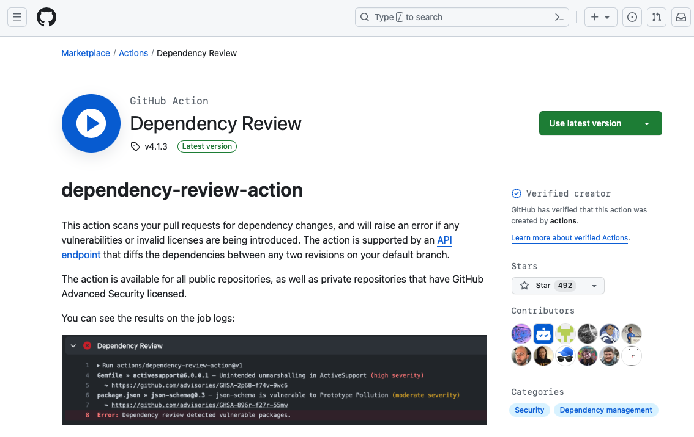
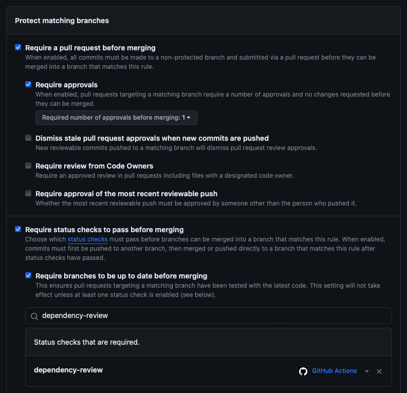
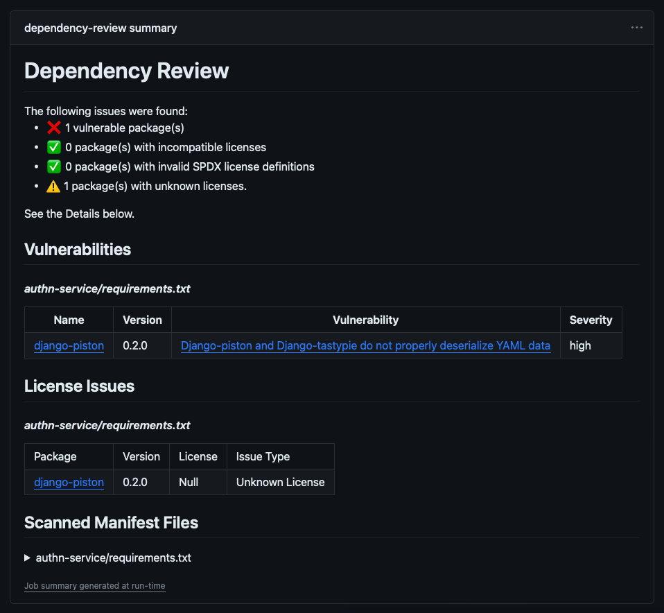
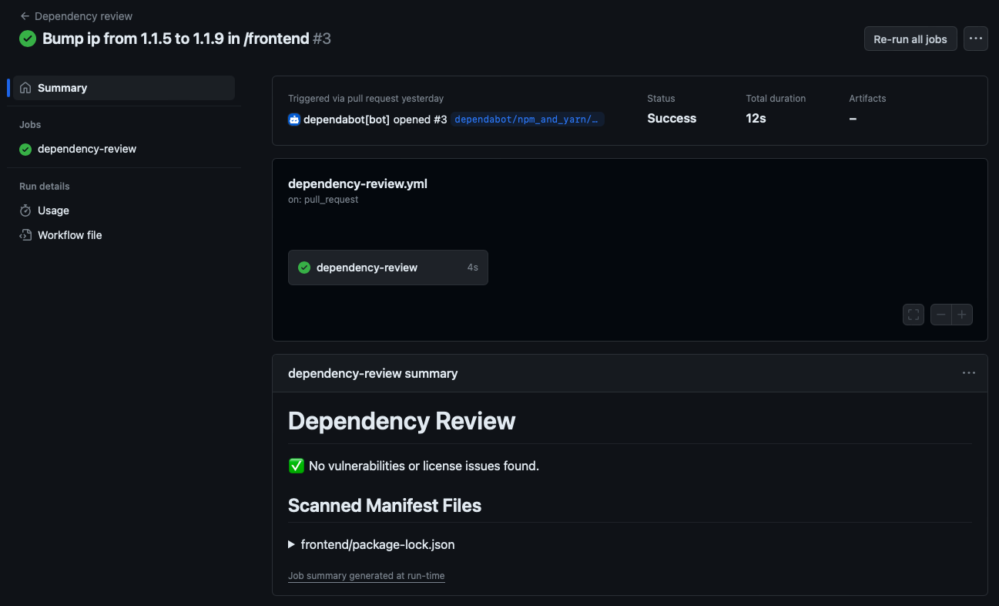

So far we've covered the dependency graph and Dependabot. The next tool to help manage dependencies is dependency review. 

Sometimes you might just want to update the version of one dependency in a manifest and generate a pull request. However, if the updated version of this direct dependency also has updated dependencies, your pull request may have more changes than you expected. The dependency review for each manifest and lock file provides an easy way to see what has changed, and whether any of the new dependency versions contain known vulnerabilities.

Dependency review helps you understand dependency changes and the security impact of these changes at every pull request with:

- Which dependencies were added, removed, or updated.
- How many projects use these components.
- Vulnerability data for these dependencies.

Dependency review allows you to "shift left". You can use the provided predictive information to catch vulnerable dependencies before they hit production. By checking the dependency reviews in a pull request, and changing any dependencies that are flagged as vulnerable, you can avoid vulnerabilities being added to your project. 

Though dependency review sounds similar to Dependabot, the key difference is prevention. Dependency review analyzes dependency changes to identify and prevent insecure dependencies from entering your project in the first place, while Dependabot helps to automatically keep known dependencies patched and up-to-date. These complementary tools work together to improve software supply chain security. 


## Set up dependency review

The simplest way to get started with dependency review is to set it up from an existing repository. The dependency-review-action is available for all public repositories, as well as private repositories that have GitHub Advanced Security enabled. The action scans for vulnerable versions of dependencies introduced by package version changes in pull requests, and warns you about the associated security vulnerabilities. This gives you better visibility of what's changing in a pull request, and helps prevent vulnerabilities being added to your repository. 

1. Go to the main page of the repository.
2. Select the **Actions** tab for the repository.
    - If already using GitHub Actions, select **New workflow**
3. Enter "dependency review" in the search field.
4. Select **Configure** for the **Dependency Review** workflow.
5. Commit the default `dependency-review.yml` file in the `.github/workflows` directory of the repository.



```
# Dependency Review Action Default/Example Workflow
#
# This Action will scan dependency manifest files that change as part of a Pull Request,
# surfacing known-vulnerable versions of the packages declared or updated in the PR.
# Once installed, if the workflow run is marked as required, PRs introducing known-vulnerable
# packages will be blocked from merging.
#
# Source repository: https://github.com/actions/dependency-review-action
# Public documentation: https://docs.github.com/en/code-security/supply-chain-security/understanding-your-software-supply-chain/about-dependency-review#dependency-review-enforcement
name: 'Dependency review'
on:
  pull_request:
    branches: [ "main" ]

# If using a dependency submission action in this workflow this permission will need to be set to:
#
# permissions:
#   contents: write
#
# https://docs.github.com/en/enterprise-cloud@latest/code-security/supply-chain-security/understanding-your-software-supply-chain/using-the-dependency-submission-api
permissions:
  contents: read
  # Write permissions for pull-requests are required for using the `comment-summary-in-pr` option, comment out if you aren't using this option
  pull-requests: write

jobs:
  dependency-review:
    runs-on: ubuntu-latest
    steps:
      - name: 'Checkout repository'
        uses: actions/checkout@v4
      - name: 'Dependency Review'
        uses: actions/dependency-review-action@v4
        # Commonly enabled options, see https://github.com/actions/dependency-review-action#configuration-options for all available options.
        with:
          comment-summary-in-pr: always
        #   fail-on-severity: moderate
        #   deny-licenses: GPL-1.0-or-later, LGPL-2.0-or-later
        #   retry-on-snapshot-warnings: true

```


## Leverage the marketplace

If you're already familiar with GitHub Actions, another approach to start with dependency review is through the GitHub marketplace<sup>[7]</sup>. From here you can learn what the dependency-review-action<sup>[8]</sup> workflow does and copy sample code to use in your project. 




## Configure a dependency review workflow

You can configure the dependency review action to better suit your needs. For example, you can specify the severity level that will make the action check fail, or set an allow or deny list for licenses to scan. 

There are two methods of configuring the dependency review action:

- Inlining the configuration options in your workflow file.
- Referencing a configuration file in your workflow file.

Let's say you want to configure license checks and custom severity thresholds to control risk from dependency changes. An example inline configuration to accomplish this within your dependency review action workflow file could be:
```
      - name: Dependency Review
        uses: actions/dependency-review-action@v4
        with:
          comment-summary-in-pr: always

          # Possible values: "critical", "high", "moderate", "low"
          fail-on-severity: high

          # # ([String]). Block the pull request on these licenses (optional)
          # Possible values: Any SPDX-compliant license identifiers or expressions from https://spdx.org/licenses/
          deny-licenses: GPL-1.0-or-later, LGPL-2.0-or-later

```

Alternatively, you can use a separate configuration file and reference it in the dependency review action workflow file. To use this approach:

1. Create a YAML configuration file (Ex. `dependency-review-config.yml`) in the repository. For example, a dependency review configuration file might look like:
```
  # Possible values: "critical", "high", "moderate", "low"
  fail-on-severity: moderate

  # You can only include one of these two options: `allow-licenses` and `deny-licenses`
  # ([String]). Only allow these licenses (optional)
  # Possible values: Any SPDX-compliant license identifiers or expressions from https://spdx.org/licenses/
  allow-licenses:
    - GPL-3.0-only
    - BSD-3-Clause
    - MIT

```

2. Reference the configuration file in the dependency review action workflow file. For example:
```
    - name: Dependency Review
      uses: actions/dependency-review-action@v4
      with:
       # ([String]). Representing a path to a configuration file local to the repository or in an external repository.
       # Possible values: An absolute path to a local file or an external file.
       config-file: './.github/dependency-review-config.yml'

       # Syntax for an external file: OWNER/REPOSITORY/PATH/FILENAME@BRANCH
       config-file: 'github/octorepo/.github/dependency-review-config.yml@main'
```

Notice that the examples above use a short version number for the action (v4) instead of a semver release number (for example, v4.0.0). This ensures that you use the most recent minor version of the action.

We only scratched the surface here. There are many configuration options<sup>[9]</sup> available to fine-tune dependency review. Before implementing dependency review, there are a few considerations to be aware of:
- The 'allow-licenses' and 'deny-licenses' options are mutually exclusive; an error will be raised if you use both in the same workflow.
- If the license for a dependency can't be detected, the dependency-review-action will inform you, but the action won't fail. 
- Some configuration options are not supported with GitHub Enterprise Server. 
- All configuration options are optional. 


## Enforce dependency review

You can use branch protection rules and the dependency-review-action in your repository to enforce dependency reviews on your pull requests. By default, the dependency review action check will fail if it discovers any vulnerable packages. A failed check blocks a pull request from being merged when the repository owner requires the dependency review check to pass. This proactive guardrail ensures insecure dependencies are not unknowingly introduced into your project. 

Here's how to set up a new branch protection rule to enforce dependency review: 

1. Go to the repository settings
2. Select **Branches** under **Code and automation** in the left-side menu
3. Select **Add branch protection rule**
4. Enter a **Branch name pattern** (Ex. `main`)
5. Select to enable **Require a pull request before merging**
6. Select to enable **Require status checks to pass before merging**
7. Select to enable **Require branches to be up to date before merging**
8. Enter `dependency-review` in the search bar 
9. Select `dependency-review` in the search results to add it to **Status check that are required." list
10. Select **Create** 



If you already have branch protection rules in place, simply edit the relevant rule to enforce dependency review. 


## Check dependency review results

A summary and details from the dependency review action are available when the workflow is finished. You can review this information from the pull request to gain visibility on what changed and understand the security impact of the change. If `comment-summary-in-pr: always` is configured in the workflow, you can simply review the comment in the pull request conversation. If not, switch to the **Checks** tab of the pull request and select **Dependency review** from the left sidebar. The dependency review summary includes vulnerable packages detected, incompatible licenses, invalid SPDX license definitions, unknown licenses, and references to more detailed information. 

**Example dependency review summary with vulnerable package**


**Example dependency review with no issues**


With this automatic dependency analysis at pull request, you can easily identify insecure dependencies sooner and remediate before merging into your project. 
