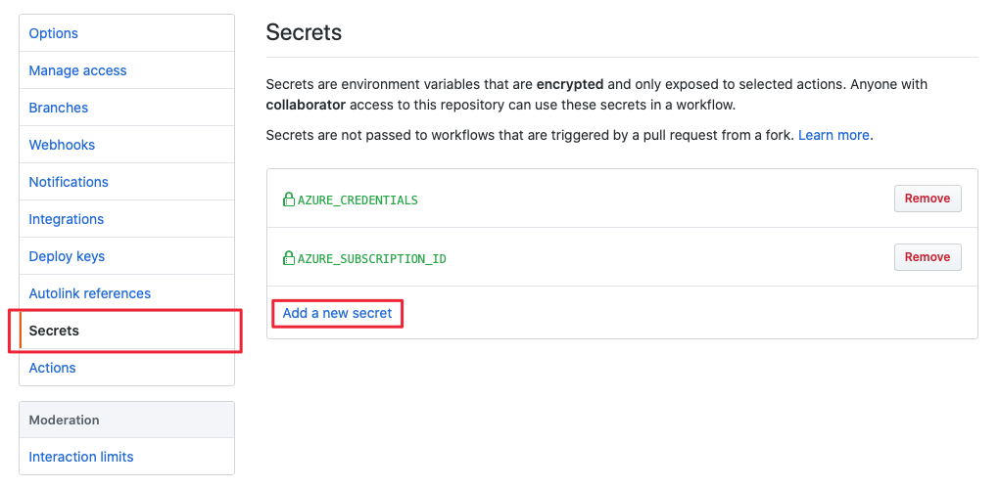
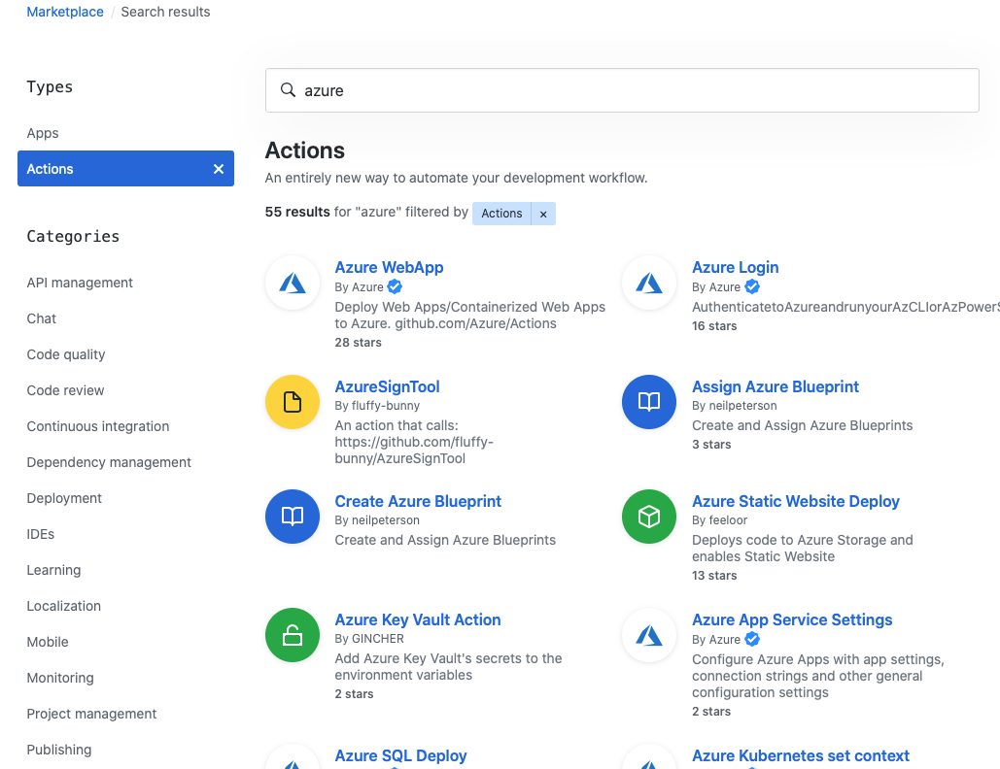

TODO: Small intro to write here.

## Options for Triggering a continuous delivery GitHub Workflow

There are several options for starting a continuous delivery workflow. Let's talk about a few of them.

In the previous module on continuous integration using GitHub Actions you learned about triggering a workflow from a push to the GitHub repo. However, for continuous delivery you may want to trigger that workflow on some other event.

A deployment workflow can be triggered by ChatOps. *ChatOps* is using digital conversation and bots to facilitate some part of a workflow. For example, leaving a specific comment in a pull request can kick-off a bot that comments back with some statistics or runs a workflow.

Another option is to use labels in your pull request to run a workflow. With this option, different labels can start different workflows. For example, you add a *stage* label to begin a deployment workflow to your staging environment, or a *spin up environment* label to run the workflow that cerates the Azure resources you will deploy to. To use this option, your workflow will look like this:

```yml
on:
  pull_request:
    types: [labeled]
```

## Control execution with a job conditional

A common scenario with workflows is to only run the workflow based on some condition.

GitHub workflows provide the *if* conditional for this scenario. The conditional uses an [expression](https://help.github.com/actions/reference/context-and-expression-syntax-for-github-actions?azure-portal=true) that will be evaluated at run time. For example, we want to run this workflow if a *stage* label is added to the pull request.

```yml
if: contains(github.event.pull_request.labels.*.name, 'stage')
```

## Store credentials with GitHub Secrets

GitHub Secrets is a secure place to store sensitive information that your workflow will need without exposing that information in the workflow file.

In order to deploy to an Azure resource, the GitHub Action must have permission to access the resource. But you don't want to store your Azure credentials in the workflow file in plain sight.

To store information in GitHub Secrets, you create a secret on the portal.



Then you use the name of the secret you created in your workflow wherever you need that secret. For example, here you can see that we are using the Azure credential that was stored in GitHub Secrets in the ```creds:``` attribute.

```yml
steps:
      - name: "Login via Azure CLI"
        uses: azure/login@v1
        with:
          creds: ${{ secrets.AZURE_CREDENTIALS }}
```

## Deploy to Microsoft Azure

The [GitHub Marketplace](https://github.com/marketplace?type=actions&query=azure&azure-portal=true) has several actions that help you automate Azure related tasks.



Suppose you wanted to deploy a container-based webb app to Azure Web Apps. Searching the GitHub Marketplace for the Actions you need yields these actions:

- [azure/webapps-container-deploy@v1](https://github.com/Azure/webapps-container-deploy?azure-portal=true)
- [azure/login@v1](https://github.com/Azure/login?azure-portal=true) that we saw above  
- [azure/docker-login@v1](https://github.com/Azure/docker-login?azure-portal=true).

Using these actions, your workflow would look like this:

```yml
  Deploy-to-Azure:
    runs-on: ubuntu-latest
    needs: Build-Docker-Image
    name: Deploy app container to Azure
    steps:
      - name: "Login via Azure CLI"
        uses: azure/login@v1
        with:
          creds: ${{ secrets.AZURE_CREDENTIALS }}

      - uses: azure/docker-login@v1
        with:
          login-server: ${{env.IMAGE_REGISTRY_URL}}
          username: ${{ github.actor }}
          password: ${{ secrets.GITHUB_TOKEN }}

      - name: Deploy web app container
        uses: azure/webapps-container-deploy@v1
        with:
          app-name: ${{env.AZURE_WEBAPP_NAME}}
          images: ${{env.IMAGE_REGISTRY_URL}}/${{ github.repository }}/${{env.DOCKER_IMAGE_NAME}}:${{ github.sha }}

      - name: Azure logout
        run: |
          az logout
```

(Expand on explanation here)

## Create and destroy Azure resources with GitHub Actions

GitHub Actions can automate the tasks needed to create and destroy deployment environments on Azure. With continuous delivery, you will want automate these tasks.

One option do this is to create a new workflow with two jobs, one for for spin-up and and one for destroy. The use a conditional to run only the job you want. In this example, the conditional looks for a label in the pull request and runs the set-up job if the label is *spin up environment* and the destroy job if the label is *destroy environment*.

```yml
jobs:
  setup-up-azure-resources:
    runs-on: ubuntu-latest

    if: contains(github.event.pull_request.labels.*.name, 'spin up environment')

    ...

  destroy-azure-resources:
    runs-on: ubuntu-latest

    if: contains(github.event.pull_request.labels.*.name, 'destroy environment')

    ...
```

TODO: Ask Aaron about actions instead of Azure CLI? Put the CLI here?