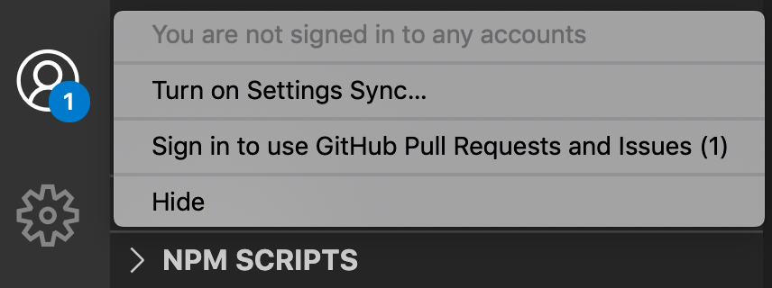

To make it easier for you to start working on a GitHub project, you can authenticate with your GitHub account inside Visual Studio Code.

## How can I authenticate with GitHub?

First, you should install the GitHub Pull Requests and Issues extension from the extensions marketplace. 

Once you install the extension, you can click on the gear icon at the bottom of the activity bar and click on "Sign into use GitHub Pull Requests and Issues". 

This will open a browser window where you will be granting permission to VS Code to access GitHub. This step is needed to connect VS Code to GitHub and does not store any sensitive information. Once you click "Continue", you will be redirected back to VS Code.  

## What is VS Code doing with this authorization?

When you sign in to your GitHub account in VS Code, there are various extensions or parts of VS Code that can now access your GitHub account information and provide specific features or streamlined experiences. After you have signed in, you can choose which VS Code extensions can use your GitHub authentication. When you click on the account icon, click on your GitHub user name, and choose "Manage Trusted Extensions", you can see all the extensions that are using your GitHub account. "GitHub" refers to the built-in GitHub and source control features in VS Code. You can see the GitHub Pull Requests and Issues extension we installed earlier also has access and you can check or uncheck this later. You can also always sign out of your GitHub account in VS Code through the gear menu as well. 

## What GitHub features does VS Code provide?

Because you've signed in, VS Code will now help you with initializing and publishing a repository to your GitHub account with a push of a button. It will also let you search for repositories you've created on GitHub so you can clone them locally. There are even more GitHub features in the GitHub Pull Requests and Issues extension, but in this module, we'll explore the built-in ones first.

