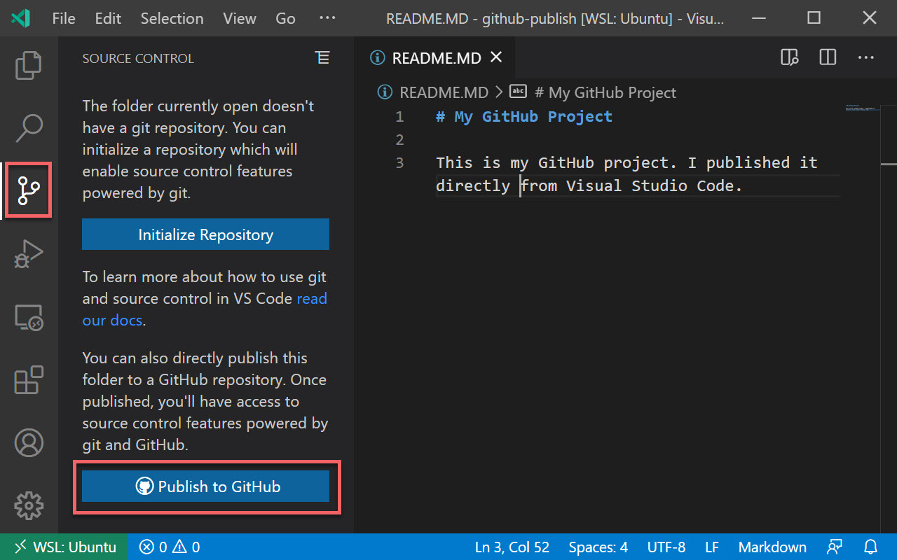

Now that you have authenticated to GitHub, you can publish a project from your local machine using the built-in GitHub integration in Visual Studio Code.

## Create a new project

1. Create a folder on your machine called "mslearn-demo".
1. In Visual Studio Code, select the "File" menu and choose "Open Folder".
1. Select the "mslearn-demo" folder you created in step 1.

### Create README.md

The README file is what is scene when people go to your GitHub repo.

1. Select the "File" menu and select "New File".
1. Add the following text to the file.

   ```markdown
   # My GitHub Project

   This is my GitHub project. I published it directly from Visual Studio Code.
   ```

1. Select the "File" menu and select "Save".
1. Save the file as "README.MD".

### Create .env.develpment

Many programs use a .env file type to define program information that is confidential (such as connection strings) that should **not** be pushed to GitHub.

1. Select the "File" menu and select "New File".
1. Add the following text to the file.

   ```bash
   CONNECTION_STRING=secret-that-should-not-be-pushed-to-github
   ```

1. Select the "File" menu and select "Save".
1. Save the file as ".env.development".

## Publish to GitHub

1. Open the Source Control Management (SCM) View by clicking on the SCM icon in the activity bar.

1. Click the "Publish to GitHub" button.

   

1. In the prompt, select "Publish to GitHub public repository".
1. Uncheck the ".env.development" file as we do not want to publish that to GitHub.

   

1. Click "OK"

   The project will now be published to GitHub.

## View project On GitHub

1. Select "Open in GitHub" from the notification in Visual Studio Code
1. View your repository on github.com

   

1. Notice that the commit message is set to "first commit".
1. Notice that there is a new file called ".gitignore" in your project. This file was added by Visual Studio Code during the publish process.

## Examine .gitignore in Visual Studio Code

1. In Visual Studio Code, select the "View" menu
1. Select "Explorer" from the dropdown
1. Select ".gitignore" file
1. Notice that the ".env.development" file has been added to the ".gitignore". Any files or directories added here will **not** be pushed to GitHub.

You've published a repository to GitHub from Visual Studio Code with just a few clicks. Visual Studio Code handled all of the tedious work that needs to happen behind the scenes to make that happen.

Many times, though, we start a project from GitHub, not from our local machine. In the next section, you'll see how Visual Studio Code allows you to clone repositories from your editor.
