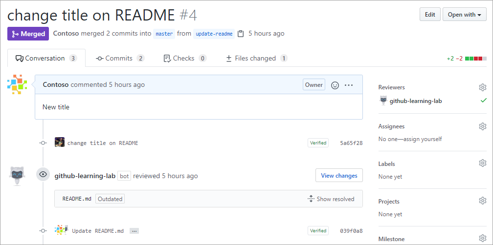
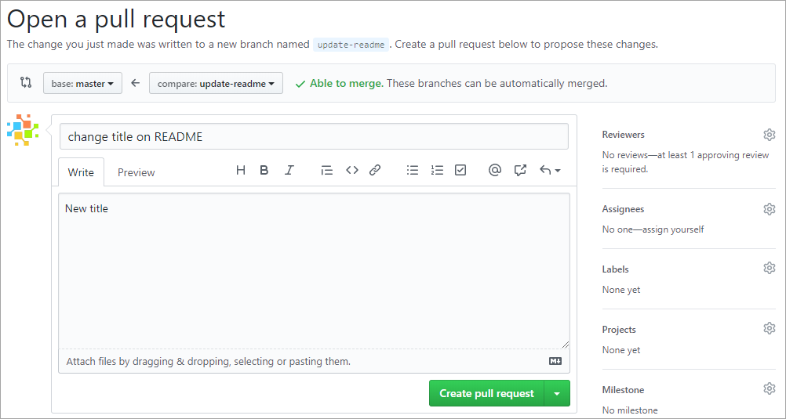
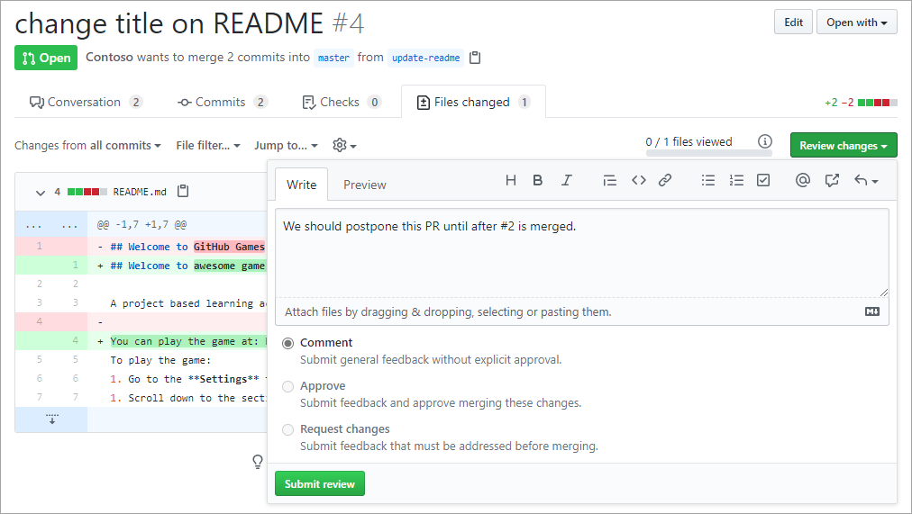

Here, we discuss how pull requests can help you request, review, and incorporate changes across your repository.

## The GitHub flow

In addition to providing a platform for collaborative software development, GitHub also offers a prescribed workflow designed to optimize use of its various features. While this unit focuses on pull requests, it is recommended that you first review [Understanding the GitHub flow](https://guides.github.com/introduction/flow/?azure-portal=true).

### Working on branches

Developers working on independent branches has become a ubiquitous concept in modern software development. By having their own branch, a developer can make any changes they need to without worrying about how those changes will impact other developers working on their own branches.

### You have to merge eventually

While working on a branch is great for individual developer productivity, it opens a new challenge. At some point, each developer's branch will need to be merged into a common branch, like `master`. As projects scale, there can be many merges that need to happen, and it becomes increasingly important to track and review each. This is where pull requests come in.

## What is a pull request?

A pull request is a mechanism used to communicate that changes from one branch are ready to be merged into another. They offer an opportunity for stakeholders to review and discuss the proposed changes to ensure that the code quality in the base branch is kept as high as possible.

> [!NOTE]
> This unit discusses working with pull requests within the context of a browser. There are also many development platforms, like [Visual Studio](https://visualstudio.microsoft.com/?azure-portal=true), that offer integrated pull request experiences.

### Author responsibilities

The author of a pull request is the person who created the pull request. They're hoping to ultimately have the changes from the **compare** branch merged into the **base** branch. They're generally responsible for answering questions about the changes and applying feedback.

Before creating a pull request, the author is responsible for ensuring the merge can succeed. This usually means that they've rebased their branch recently to confirm that the code builds with the latest base changes.

Learn more about [Proposing changes to your work with pull requests](https://help.github.com/github/collaborating-with-issues-and-pull-requests/proposing-changes-to-your-work-with-pull-requests?azure-portal=true).

### Reviewer responsibilities

Reviewers may be assigned to review the pull request based on their expertise with or responsibility for the code in question. For example, there may be a database guru who reviews any database code. Or there might be a lead developer who reviews any code before it gets merged into `master` anywhere in the project.

GitHub offers a visual experience for reviewing code that allows reviewers to see code changes in a *diff* view where changes are highlighted. They can then leave comments inline, suggest changes, or approve. Reviewer feedback is kept as part of the repository history so that changes and decisions can be easily traced within their original context.

As the name implies, reviewers are responsible for reviewing changes. When feedback is minor, such as typos, reviewers may leave comments or edit the files directly to incorporate fixes. To recommend more substantive changes, a pull request should be opened against the author's branch.

Reviewers may be automatically assigned to a pull request by using a [CODEOWNERS file](https://help.github.com/github/creating-cloning-and-archiving-repositories/about-code-owners?azure-portal=true). This file uses the same path syntax as `.gitignore` to map parts of the codebase to users or teams responsible for reviewing their changes. Learn how to [make these reviews mandatory](https://help.github.com/github/administering-a-repository/enabling-required-reviews-for-pull-requests?azure-portal=true).

Learn more about [Reviewing changes in pull requests](https://help.github.com/github/collaborating-with-issues-and-pull-requests/reviewing-changes-in-pull-requests?azure-portal=true).

### Assignee responsibilities

While not mandatory, pull requests may be assigned to a specific user. That person takes responsibility for determining if and when the pull request is merged. This may require them to corral stakeholders into agreeing whether the merge should be approved.

Once a pull request has been merged, it's recommended that you delete the branch it was based on. Allowing the branch to linger can result in headaches down the road. Remember that all branch history will have been merged into the base branch, so its commits can always be accessed later on.

Learn more about [Incorporating changes from a pull request](https://help.github.com/github/collaborating-with-issues-and-pull-requests/incorporating-changes-from-a-pull-request?azure-portal=true).
