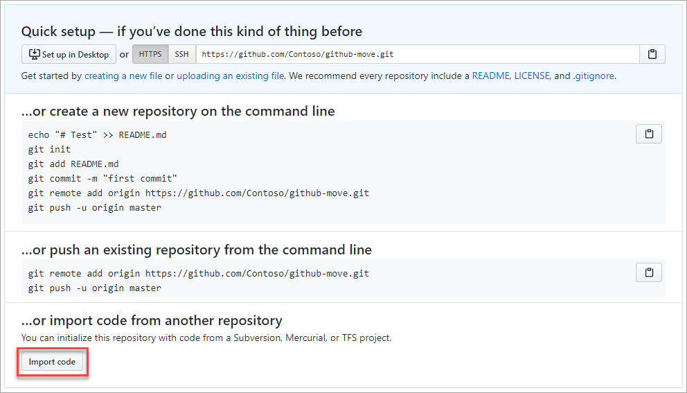
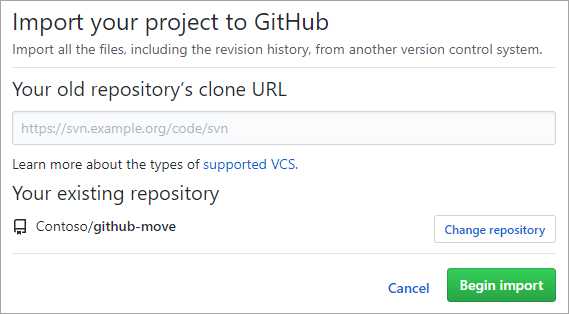

Here, we discuss the important considerations for migrating a project to GitHub from a legacy version control system. 

## Why migrate to GitHub?

There are volumes of literature extolling the virtues of GitHub. It's beyond the scope of this module to convince you to move, but we can recap some of the key benefits within the context of topics you'll need to consider when planning your migration. 

### Version control

GitHub exclusively uses **Git**, arguably the best version control system around. However, Git is incredibly sophisticated and can enable some complex scenarios for working with code that your team may not be experienced with. *Branches* and *pull requests* are a fundamental part of day-to-day life for developers using Git, so understanding when and how to use them effectively is necessary to be successful on GitHub. It is worthwhile for your team to first be familiar with [the GitHub flow](https://guides.github.com/introduction/flow/?azure-portal=true) so you can hit the ground running.

### Keep your code in the cloud

Much project code is still stored in legacy version control systems behind corporate firewalls. When you migrate to GitHub, you're moving your code to GitHub's cloud platform where team members can easily access it from anywhere. This migration offers a good opportunity to review your team's policy for the kinds of files and data you keep in version control. As a best practice, you should assume that anything you commit to GitHub has been compromised, so be sure not to include sensitive data, such as API keys, passwords, or other files containing comparable information. See **Security strategy essentials** for best practices on managing a secure repository.

> [!NOTE]
> GitHub offers both public and private repositories, as well as granular access controls for different parts of a repository. This enables you to control who your projects are visible to, as well as what actions a given user can perform.

### Collaboration

GitHub offers excellent support for team collaboration through features like issues, pull requests, and code reviews. However, the GitHub flow may differ from the practices your team is currently accustomed to. It's a good idea to consider whether the team will adapt to GitHub, retain its given process, or meet somewhere in the middle before completing the migration.

If your project is an open source project that allows outside contributors, there's no better option than GitHub for maximizing the benefits. See **Create an open source program** for tips on making the most of your open source program on GitHub.

## Migrating to GitHub

### Planning considerations

The most important thing to consider before executing your migration to GitHub is whether you need to retain anything beyond the current state of your source. If you are satisfied with starting a new project with just your current source as-is, then your best option is to treat it like a new project and upload the source to your repository.

However, if you want to retain version control history, then you will need to import using the **GitHub Migrator tool**. For more information about the import support for different version control platforms, see [Importing data from third-party version control systems](https://help.github.com/enterprise/2.20/admin/migrations/importing-data-from-third-party-version-control-systems?azure-portal=true).

Beyond Git data, you may also have a desire to retain issues, pull requests, or other data. Support for these items will vary by platform and is generally available from community projects. This module does not cover migrating non-Git data.

### Handling binary files currently stored in your project

As a best practice, GitHub repositories should be limited to the files necessary for building projects. Avoid committing large binary files, such as build artifacts. Binary files like spreadsheets and presentations are better suited to be tracked on portals that understand how to serve and version them properly. If you have a need to version large binary files, consider another tool, like [git-lfs](https://git-lfs.github.com/?azure-portal=true).

### Creating important Git files like `.gitignore`

Git supports `.gitignore` files to help enforce version control file policies. These files define the search patterns used to exclude files and folders from source control tracking. The simple example below recursively excludes **any** folders called *Bin* or *bin*, as well as their contents, from source control tracking.

```.gitignore
[Bb]in/
```

To learn more about `.gitignore`, see [Ignoring files](https://help.github.com/github/using-git/ignoring-files?azure-portal=true). Also check out the collection of starter `.gitignore` files offered for various platforms in the [gitignore repository](https://github.com/github/gitignore?azure-portal=true).

There are several other files commonly used in GitHub projects to explain different policies to repository consumers and contributors. Even if your project is private and restricted to a limited audience, it can still be useful to explicitly articulate these policies. While none of these files are required, a few of the common ones are listed below.

|File|Purpose|
|---|----|
|`README.md`|The landing page for the directory. This page is rendered when its directory is viewed on GitHub.|
|`LICENSE.md`|The license the code is provided under.|
|`CONTRIBUTING.md`|Explains how users should contribute to the project, such as pull request expectations.|
|`SECURITY.md`|Explains the security policy for the project and provides guidance to users wanting to submit sensitive security-related code or feedback that should not be publicly disclosed before it is addressed.|

For more information on other important files, see [Setting up your project for healthy contributions](https://help.github.com/github/building-a-strong-community/setting-up-your-project-for-healthy-contributions?azure-portal=true).

### Importing your project to GitHub

Once you have prepared your repository for migration, navigate to the **Code** tab of your GitHub repository. Use the **Import code** option to specify the source repository. 



The **GitHub Migrator tool** will take care of the rest.

