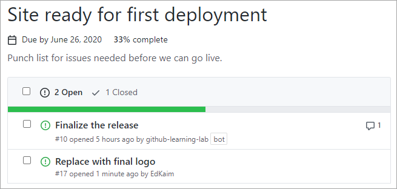
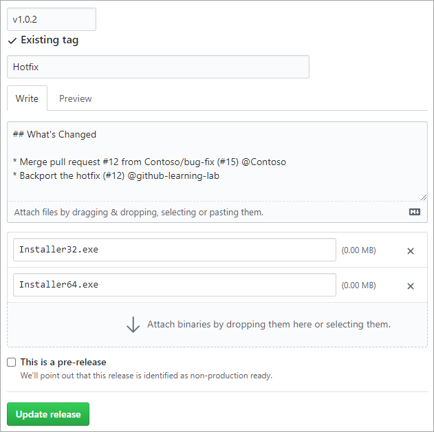
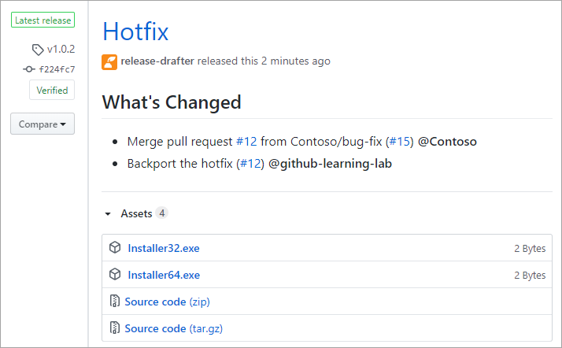

Here, we discuss how you can create a release based workflow using GitHub. 

## What is a release based workflow?

A **release based workflow** is a set of patterns and policies that focus on *releasing software*. While this notion may seem like an obvious goal for a development team, the value of this perspective is somewhat nuanced. This unit will discuss how it drives three different parts of the release cycle: managing the project, selecting a branching strategy, and releasing to customers. 

## Planning work with GitHub project boards

From a planning mindset, being release-centric means that issues are divided up into distinct iterations that produce a new version. These iterations are often called *sprints* and are time-boxed in roughly equal periods to produce incremental changes. Other teams prefer to package entire release versions into a single iteration that can last a few months or longer. In GitHub, these iterations are managed as **projects**.

The dominant feature of a project is its **board**. The board is the central plan of record for the iteration and contains all of the **cards** that are to be resolved. A card can represent an issue, a pull request, or even just a generic note.

By default, each card starts in the **To do** column and moves to **In progress** after work begins before ending in **Done**. You may customize these columns, add additional columns, or apply automation to the movement of these cards and their properties to fit your team's process.

Learn more about [managing project boards](https://help.github.com/github/managing-your-work-on-github/managing-project-boards?azure-portal=true).

The card's project status is integrated across the repository. For example, dragging a card from **To do** to **In progress** changes its status, as well as updates the visual indicator next to the project's title. The green section indicates the portion of cards marked as **Done**, whereas purple is used for cards **In progress**. The remaining space represents the quantity of cards that have yet to begin. In addition to dragging cards around the board, you may update them from their main view.

By using a project board, all stakeholders have an easy way to understand the status and velocity of a project. You can also create boards that are scoped to individual users or a collection of repositories owned by an organization.

Learn more about [tracking the progress of your work with project boards](https://help.github.com/github/managing-your-work-on-github/tracking-the-progress-of-your-work-with-project-boards?azure-portal=true).

### Tracking specific milestones

For teams, or possibly subsets of teams, GitHub offers **milestone** tracking.

Milestones are similar to project tracking in that there is an emphasis on the prioritized completion of issues and pull requests. However, where a project may be focused on the team's process, a milestone is focused on the product.

Learn more about [tracking the progress of your work with milestones](https://help.github.com/github/managing-your-work-on-github/tracking-the-progress-of-your-work-with-milestones?azure-portal=true).

## Selecting a branching strategy

Repositories that have multiple developers working in parallel need a well-defined branching strategy. Settling on a unified approach early in the project will save confusion and frustration as the team and codebase scale.

Learn about [how we use Git at Microsoft](/azure/devops/user-guide/code-with-git).

### The GitHub flow

In addition to providing a platform for collaborative software development, GitHub also offers a prescribed workflow designed to optimize use of its various features. While GitHub can work with virtually any software development process, it's recommended that you consider [the GitHub flow](https://guides.github.com/introduction/flow/?azure-portal=true) if your team has not yet settled on a process.

### Working with long-lived branches

A **long-lived branch** is a Git branch that is never deleted. Some teams prefer to avoid them altogether in favor of short-lived feature and bug fix branches. For those teams, the goal of any effort is to produce a pull request that merges their work back into `master`. This approach can be effective for projects that never have the need to look back, such as first-party web applications that will never support a previous version. 

However, there are certain scenarios where a long-lived branch serves the best interests of a team. The most common case for a long-lived branch is when a product has multiple versions that must be supported for an extended period of time. When a team needs to plan for this commitment, the repository should follow a standard convention, such as `release-v1.0`, `release-v2.0`, and so on. Those branches should also be marked as protected in GitHub so that write access is controlled and they cannot be accidentally deleted.

Teams should still maintain `master` as the root branch and merge their release branch changes upstream as long as they fit into the future of the project. When the time comes, `release-v3.0` should base off of `master` so that servicing work for `release-v2.0` doesn't complicate the repository.

### Servicing long-lived branches

Suppose a bug fix were merged into the `release-v2.0` branch, and then merged again upstream into `master`. It was then later discovered that this bug also existed in the `release-v1.0` branch and needed to be backported for customers still using that version. What's the best way to do this?

Merging `master` down into `release-v1.0` would not be a feasible option since it would contain a significant number of commits that were not intended to be part of that version. For the same reason, rebasing `release-v1.0` onto the current `master` commit would not be an option.

An alternative option would be to manually reimplement the fix on the `release-v1.0` branch, but that approach would require much rework and not scale well across multiple versions. However, Git does offer an automated solution to this problem in the form of its `cherry-pick` command.

### What is Git's cherry-pick command?

`git cherry-pick` is a command that enables you to apply specific commits from one branch to another. It simply iterates the selected commits and applies them to the target branch as new commits. If necessary, developers can merge any conflicts before completing the backport. 

Learn more about [Git's cherry-pick](https://git-scm.com/docs/git-cherry-pick?azure-portal=true).

## Releasing to consumers 

When a product version is ready to be released, GitHub simplifies the process of packaging it up and notifying consumers.

Creating a version is as straightforward as filling out the form:

- Enter a Git tag to apply, which should follow [semantic versioning](https://semver.org/?azure-portal=true), such as `v1.0.2`. GitHub manages the process of creating the Git tag you specify.
- Enter a name for your release. Some common practices are to:
	- Use a descriptive name.
	- Use the Git version.
	- Use a concise summary of how this release has changed since the previous one.
	- Use a code name or random phrase.
- Provide release notes. This can be automated with the [Release Drafter app](https://github.com/apps/release-drafter?azure-portal=true), which analyzes the changes since the previous version and includes the associated pull request titles.
- If you would like to provide files as part of the release, such as pre-built installers, you can drag and drop them onto the form. You don't need to package the source as GitHub handles that for you automatically.
- Indicate whether this is a pre-release version by checking that box. This will help customers avoid pre-release versions if they want to.

Once a release has been published, everyone watching the repository will receive a notification.

Learn more about [GitHub releases](https://help.github.com/github/administering-a-repository/about-releases?azure-portal=true).