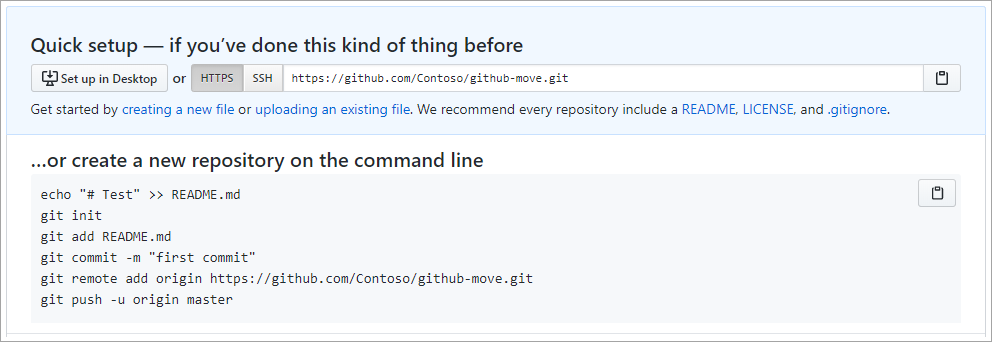

In this unit, we discuss the important considerations for uploading a project to GitHub. 

## Why upload to GitHub?

There are volumes of literature extolling the virtues of GitHub, and it's beyond the scope of this module to convince you to join. However, in this module we recap some of the key benefits within the context of subjects you need to consider when planning your upload.

### Version control

GitHub exclusively uses **Git**, arguably the best version-control system around. However, Git is incredibly sophisticated and can create some complex scenarios for working with code that your team might not be experienced with. *Branches* and *pull requests* are a fundamental part of day-to-day life for developers using Git, so understanding when and how to use them effectively is necessary to be successful on GitHub. It's worthwhile for your team to first be familiar with [the GitHub flow](https://guides.github.com/introduction/flow/?azure-portal=true) so you can hit the ground running.

### Keep your code in the cloud

A large amount of project code is still stored exclusively on developer machines. When you upload to GitHub, you're moving your code to GitHub's cloud platform, where team members can easily access it from anywhere. This change offers a good opportunity to review your team's policy for the kinds of files and data you keep in version control. As a best practice, you should assume that anything you commit to GitHub is potentially compromised. So, be sure not to include sensitive data, such as API keys, passwords, or other files containing comparable information.

> [!NOTE]
> GitHub offers both public and private repositories, as well as granular access controls for different parts of a repository. This lets you control to whom your projects are visible, as well as what actions a given user can perform.

### Collaboration

GitHub offers excellent support for team collaboration through features like issues, pull requests, and code reviews. However, the GitHub flow might differ from the practices to which your team is currently accustomed. It's a good idea to consider how your team might adapt to GitHub, and whether or not you should retain any existing processes.

If your project is an open-source project that allows outside contributors, there's no better option than GitHub for maximizing those benefits.

## Upload to GitHub

### Plan considerations

The most important thing to consider before executing your upload to GitHub is whether you need to retain anything beyond the current state of your source. For example, you might use a spreadsheet or project-management software to track bugs you plan to fix. Support for migrating these items varies by platform, and is generally available from community projects. This module doesn't cover migrating that type of data.

### Handle binary files currently stored in your project

As a best practice, GitHub repositories should be limited to the files necessary for building projects. Avoid committing large binary files, such as build artifacts. Binary files like spreadsheets and presentations are better suited to be tracked on portals that understand how to serve and version them properly. If you have a need to version large binary files, consider using the Git extension [Git LFS](https://git-lfs.github.com/?azure-portal=true) (Large File Storage).

### Create important Git files like .gitignore

Git supports `.gitignore` files to help enforce version-control file policies. These files define the search patterns used to exclude files and folders from source-control tracking. The following example recursively excludes **any** folders called *Bin* or *bin*, and their contents, from source-control tracking.

```.gitignore
[Bb]in/
```

Learn more about [Ignoring files](https://docs.github.com/get-started/getting-started-with-git/ignoring-files). Also check out the collection of starter `.gitignore` files offered for various platforms in the [gitignore repository](https://github.com/github/gitignore?azure-portal=true).

There are several other files commonly used in GitHub projects to explain different policies to repository consumers and contributors. Even if your project is private and restricted to a limited audience, it can still be useful to explicitly articulate these policies. While none of these files are required, a few of the common ones are listed here.

|File|Purpose|
|---|----|
|`README.md`|The landing page for the directory. This page is rendered when its directory is viewed on GitHub.|
|`LICENSE.md`|The license under which the code is provided.|
|`CONTRIBUTING.md`|Explains how users should contribute to the project, such as pull request expectations.|
|`SECURITY.md`|Explains the security policy for the project and provides guidance to users wanting to submit sensitive security-related code or feedback that shouldn't be publicly disclosed before it's addressed.|

Learn more about [Setting up your project for healthy contributions](https://docs.github.com/communities/setting-up-your-project-for-healthy-contributions).

### Upload your project to GitHub

Once your repository is prepared for upload, create a repository on GitHub. Once created, navigate to the **Code** tab of your GitHub repository. This view provides you with several ways to get your project code uploaded.



We recommend that you use the **git** client or a Git-friendly tool to upload your source. Alternatively, you can manually upload your files using the **creating a new file** link. Over the long run, you're likely to find that using a **git** client is the best way to manage changes, branches, and more.
