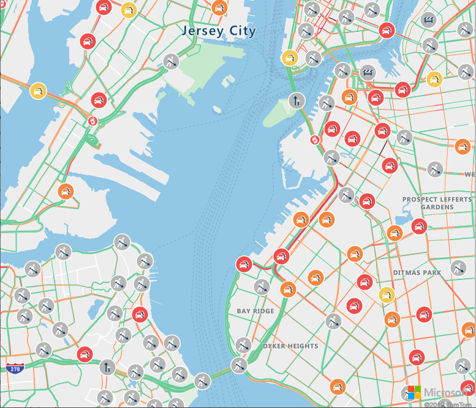

## Layered maps

Azure Maps are constructed in layers. You can choose which layers to display. Let's illustrate this with an example, an area of New York.

The base layer contains only the outline of terrain, complete with parks.

Let's add the transit layer to the base. This adds all known roads, major and minor. If you look closely, you can see it has also added ferry and shipping routes. Rail lines are also added.

On top of transit, we add the labels layer. Now it is starting to look like a map.

We could stop at the labels layer. An additional layer is called the "flow layer". This shows all the traffic hazards. No shortage of those in Hew York!

When we program with calls to Azure Maps, we can add our own layers. An obvious layer to add would be the best route found from A to B. We could add weather layers, and layers containing spatial data, if need be. There obviously comes a point when you have too many layers. Notice how the flow layer above obscures some of the labels layer. Layers have a priority, so you can determine what information gets obscured.

## Hazardous materials

One of the fun features of the app we are going to build, is the ability to set a hazardous material classification to our truck.

There are nine classifications in the USA. Summarized in the following table.

| Classification | Description |
| -------------- | ----------- |
| USHazmatClass1 | Explosives |
| USHazmatClass2 | Gases |
| USHazmatClass3 | Flammable or combustible liquid |
| USHazmatClass4 | Flammable solid, spontaneously combustible, dangerous when wet |
| USHazmatClass5 | Oxidizer and organic peroxide |
| USHazmatClass6 | Poison, inhalation hazard |
| USHazmatClass7 | Radioactive |
| USHazmatClass8 | Corrosive |
| USHazmatClass9 | Miscellaneous |

With the given classification, certain roads cannot be used. The first three have the most significant effect on a route, as they are perceived as the most dangerous. For example, many tunnels are closed to explosive, or inflammable, cargo. When we test our app, you will be able to hone in on routes, and see how the truck routes diverge from car routes, or trucks carrying other content, when hazardous cargo is involved. Road restrictions are most likely to be found in heavily populated areas, for obvious reasons.