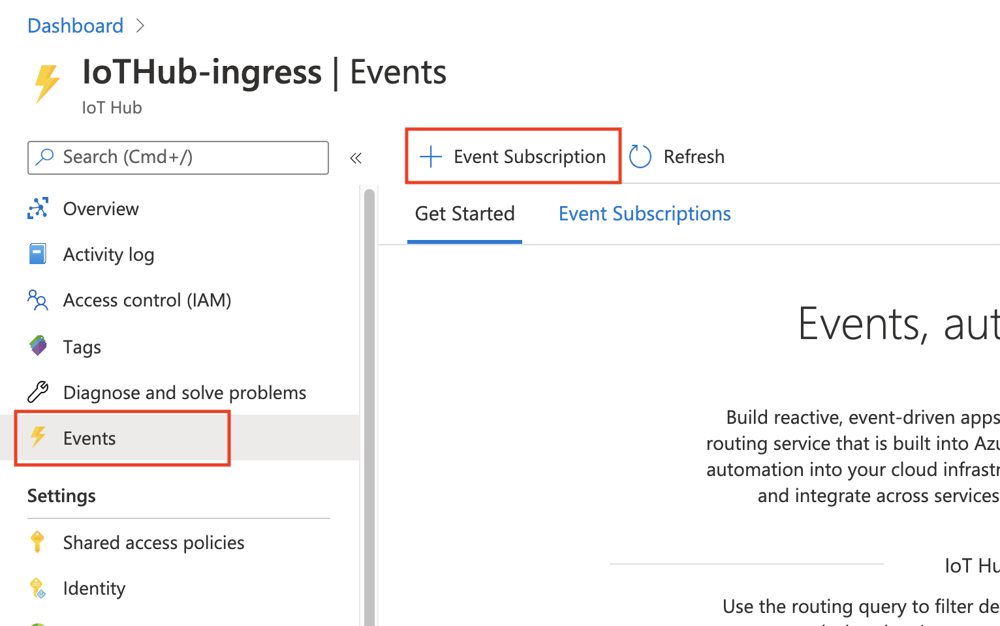
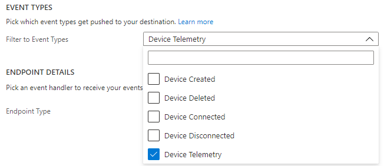
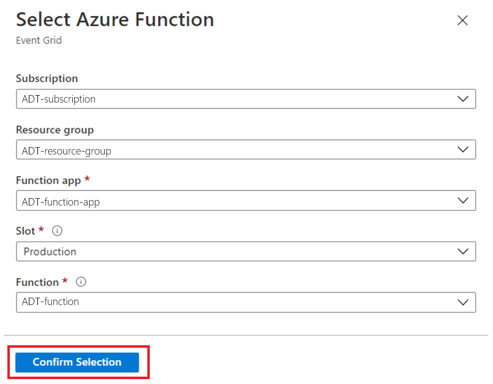

## Create an IoT Hub

Use the Azure CLI to create a resource group and then add an IoT hub. For {resource group} use the one that is created for use by Azure Digital Twin and Azure Function.

1. Run the following [command to create an IoT hub](https://docs.microsoft.com/cli/azure/iot/hub#az-iot-hub-create) in your resource group, using a globally unique name for your IoT hub:
    
   ```azurecli-interactive
   az iot hub create --name $dtname --resource-group $rgname --sku S1
   ```

1. In the active PowerShell window, create a device in IoT Hub with the following command:

    ```azurecli
    az iot hub device-identity create --device-id GrindingStep --hub-name $dtname -g $rgname
    ```

You'll see the output information of the device created.

## Configure and run the simulation

Next, configure the device simulator to send data to your IoT Hub instance.

1. Then, get the *device connection string* with this command:

    ```azurecli
    az iot hub device-identity connection-string show --device-id GrindingStep --hub-name $dtname
    ```

1. Open the file ~\digital-twins-samples\HandsOnLab\SimulatedClient\Sensor.js
1. Find the line const deviceConnectionString = "" and update it with the device connection string created earlier.
    

1. Save and close the file
1. In the PowerShell window, navigate to the SimulatedClient folder in the repo and run the simulated client

    ```Azure CLI
    cd ~\digital-twins-samples\handsonlab\SimulatedClient
    npm install
    node ./Sensor.js
    ```

## Configure EventGrid on IoT Hub

In this section, you configure your IoT Hub to publish events as they occur.

1. In the Azure portal, navigate to your IoT hub. You can do this by selecting **Resource groups**, then select the resource group for this module, and then select your IoT hub from the list of resources.

1. Select **Events**.
1. Select **Event subscription**.

   

1. In the **EVENT SUBSCRIPTION DETAILS** section:
    - Provide a **name** for the event subscription: twinevents
    - Select **Event Grid Schema** for **Event Schema**
1. In the **TOPIC DETAILS** section:
    - Confirm that the **Topic type** is set to **IoT Hub**.
    - Confirm that the name of the IoT hub is set as the value for the **Source Resource** field.
    - Enter a name for the **system topic**: twintopic
1. In the **EVENT TYPES** section:
    - Select the **Filter to Event Types** drop-down.
    - Deselect all leaving only the **Device Telemetry** checkbox selected.

         
   
1. In the **ENDPOINT DETAILS** section: 
   - Select **Endpoint Type** as **Azure Function**.
   - Click **select an endpoint**, paste the URL that you copied from your logic app, and confirm selection.

   

1.  Select **Create**

At this point, you should see messages showing up in the Azure Function Log Stream that is configured in the previous unit.  The Azure Function Log Stream will show the telemetry being received from Event Grid and any errors connecting to Azure Digital Twins or updating the Twin.

   

## Validate Twin is being updated
1. You can see the values in being updated in the Twin Thermostat67 by running the following command

```azurecli
 az dt twin show -n $dtname --twin-id GrindingStep
```