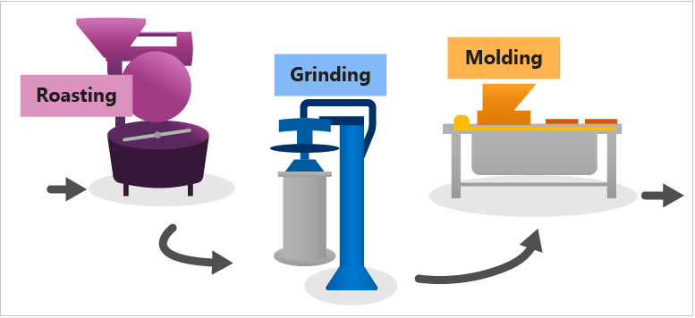

Azure Digital Twins enables an organization to track the past, and predict the future. The key to this knowledge is the creation of working digital models that represent, to any degree of detail, physical devices and structures. The devices can be as focused as IoT sensors, to complex pieces of equipment. The structures can be production lines, whole factories, buildings, railway networks, shipping lines, or, in other words, just about any industrial or commercial environment.

By digitally modeling, for example, a production line, managers can predict the future, based on past performance. Another powerful scenario is the ability to ask "what if" questions. Digitally add new pieces of equipment, new production lines, new transport, to an existing system, and test for its effectiveness. All this insight long before committing to purchasing, and installing, any physical equipment. The realism of the digital model is greatly enhanced by the use of IoT data, to supply real-world sensor data to the digital simulation.

These objectives are the ultimate goals for digital twins. We need to walk before we can run, and in this module our goals are to explain, by example, the creation and purpose of digital models, and their representation and visualization in a connected graph. For our scenario, we're going to use the production line in a chocolate factory.

## Learning objectives

To summarize, in this module you will:
- Create an instance of Azure Digital Twins (ADT), using the Azure portal
- Create digital models for the production line of a chocolate factory, in DTDL (Digital Twins Definition Language)
- Validate the digital models, using the DTDL Validator tool
- Create a graph of the models, using the ADT Explorer Tool
- Query the graph, using SQL-like queries

## Prerequisites

- Introductory knowledge of the purpose of Azure IoT
- Ability to navigate the Azure IoT portal 
- Ability to use the Azure Cloud Shell, and Command Prompt, command line windows
- Ability to download, and install, software tools
- Ability to use Visual Studio, at the beginner level

## The scenario

Imagine you're the IT manager at a chocolate manufacturing company, with growing pains! The company, Contoso Chocolate, has one factory, and one production line. Sales are going well, and you expect the company to grow.

We've simplified the production of chocolate, for the sake of explanation, into three steps: _Roasting_, _Grinding_, and _Molding_. The following image shows our production line:

Cocoa beans are the input to this production line, chocolate bars the output! 

The roasting process cooks fermented cocoa beans. The temperature and time of cooking depends on the type of beans, but typically the roasting (sometimes called _fanning_ in the chocolate trade) might take 35 minutes, at 120 to 150 degrees C. Roasting aids the removal of unwanted stuff, such as acetic acid, and the formation of the sweet taste of cocoa. The grinding process takes the cocoa nibs that result from the roasting, and crushes them to pieces, typically between steel plates, to create a liquid cocoa butter. The molding process cools the cocoa butter in molds, giving the desired shape: chocolate bars, egg shells, figures. The following image shows roasted cocoa nibs.

As IT manager, you've been asked to advise on the correct growth path for the company. You have decided to use the power of Azure Digital Twins, to build a software solution flexible enough, that no matter what questions the company owners may ask you, you'll have a scientific and robust answer.

The first task is to build a digital model of the existing production line. This task is the objective of this module. Further Learn modules take the scenario further, into the world of real-world data input, IoT sensors, time series insights, and, ultimately, simulation and advanced analysis.

Let's make one step at a time. The first step is to create an instance of an Azure Digital Twins resource.

