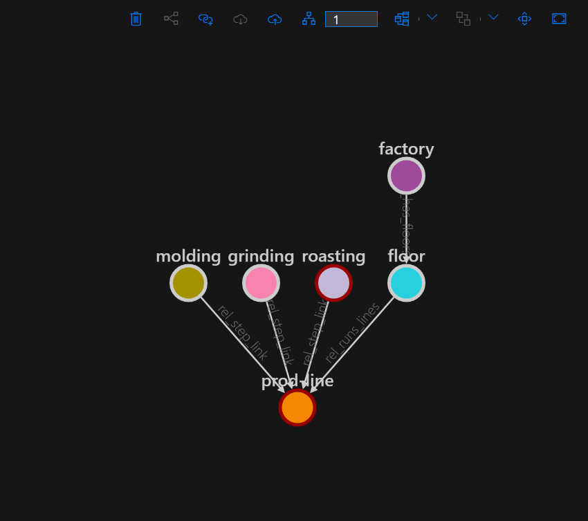

In this exercise, first you download and extract the Azure Digital Twins Explorer tool. Then you set the required permissions for the tool to communicate with your registered **chocolate-app**.

1. Download the [Azure Digital Twins (ADT) explorer](https://docs.microsoft.com/samples/azure-samples/digital-twins-explorer/digital-twins-explorer/), which is a locally hosted web application.

1. Extract all the files.

1. Locate the **client/src** folder, in the extracted files. Copy the full path to the **src** folder to your text file. Storing this path will avoid unnecessary typing later in this unit.

## Set ADT Explorer permissions in your registered app

1. In the Azure portal, locate your registered app, **chocolate-app**. Remember you can locate it by selecting **Azure Active Directory** from the Azure home page, then selecting **App registrations** in the left menu.

1. With the overview page for your app on display, click **Authentication** in the left menu, then **+ Add a platform**. And select the **Web application** tile.

    
    
1. Add **http://localhost:3000** as the **Redirect URI**.
    
1. Click **Configure**.

1. Back on the **Authentication** page, scroll down a bit and make sure the **Access tokens** checkbox is selected, in the **Implicit grant** section.

    

1. Click **Save**. Then verify the **Web** settings on the **Authentication** page include the redirect URI.

    

## Run ADT Explorer

1. Open a **Command Prompt**, as an administrator. Change directory to the path you saved off at the start of this unit, by typing **cd**, then pasting in the path to the **src** folder.

1. Type **npm install**. This command will install all the required dependencies of the explorer tool.

    

1. Start the explorer tool by typing **npm run start**. It might take a few seconds before the opening screen of the tool appears in your web browser.

1. Now, click the **Sign in** button at the top of the tool window. Carefully copy and paste the following three values from your text file, into the window:
    
    - Application (client) ID
    - Directory (tenant) ID
    - Azure Digital Twins URL - this string has the format of **https://** followed by the host name.

1. You may have to grant consent for the app, if a **Permissions requested** pop-up appears.

Great, the tool is loaded and ready! The next stage is to start uploading the models you created in an earlier unit.

## Upload the chocolate factory production line models

1. Locate the icon that uploads models.

1. Navigate to your folder that contains all your chocolate factory production line models. Select all of them. And upload them to the tool.

1. If you get any errors, you'll need to go back to unit 4, and check your work for the model that has the error.

All going well, you'll see a list of models in the left of your tool window.

## Create digital twins

1. Select the **Create a Twin** icon for the Factory model. Name the twin "factory", and create it. 

1. Create digital twins for the following models, giving the models the suggested names, or using your own names:
    1. Factory floor,   "floor"
    1. Production line, "production line"
    1. Roasting step,   "roasting"
    1. Grinding step,   "grinding"
    1. Molding step,    "molding"

1. There's no need to create a twin for the **Factory Production Steps** model. It is a base model, and its values are inherited by the three production steps.

1. Select any of the digital twins, and note that its properties appear in the right-hand pane of the tool.

## Create relationships

To create a relationship, hold down the Ctrl key, and select the _source_ twin, then select the _target_ twin. Next, click the **Add relationship** icon, and select a relationship from the range you're offered. If you aren't offered any options, then no relationship can be created.

1. Locate the **Add Relationship** icon, along the range of icons for the graph view. Don't select it yet.

    

1. Hold down the Ctrl key. Select your **factory** twin circle. Then, select the **floor** twin. From the list of relationships, select **rel_has_floors**.

1. Hold down the Ctrl key. Select your **floor** twin, then the **production line** twin. From the list of relationships, select **rel_runs_lines**.

1. Hold down the Ctrl key. Select your **roasting** twin. Then, select the **production line** twin. From the list of relationships, select **rel_step_link**.

1. Repeat the previous step for the **grinding** twin, then again for the **molding** twin.

    

## Explore the graph layout options

1. Locate the icon in the graph view that gives a range of layout options, with names such as "Cola" and "Klay".

1. Try each of the layout options in turn.

1. Notice that you can zoom in and out, and that there are some other helpful icons to fit your graph to your screen.

Feel free to explore the graph view. However, you've completed all the steps for this unit. In the next unit, we go into the digital twin query language.

