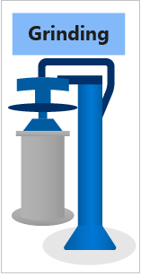
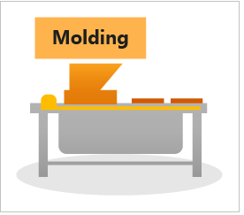

In this final exercise, we create custom queries for our digital twins graph. Before creating the custom queries, we enter a range of property values into the digital twins. Entering these values gives us a bit more to query on!

## Edit the digital twin properties

With all the digital twins in view on the graph, let's set the production step properties. To set a property:

1. Click on the digital twin, so that it's properties appear in the right pane.
1. Click on one or more properties, and enter values using the keyboard.
1. Click the **Save** icon, top right. Verify that the properties have been updated, in the dialog showing the new values.

Now, go through this process three times, one for each production step.

### Set the roasting step properties

[](../media/adt-roasting.png#lightbox)

1. Set **ChasisTemperature** to **120**.
1. Set **TimeSpan** to **35**.
1. Set **PowerUsage** to **150**.
1. Set **FanSpeed** to **3000**.
1. Save the settings.

### Set the grinding step properties

[](../media/adt-grinding.png#lightbox)

1. Set **ChasisTemperature** to **40**.
1. Set **TimeSpan** to **45**.
1. Set **PowerUsage** to **250**.
1. Set **Force** to **200**.
1. Save the settings.

### Set the molding step properties

[](../media/adt-molding.png#lightbox)

1. Set **ChasisTemperature** to **55**.
1. Set **PowerUsage** to **80**.
1. Save the settings.

## Query the graph

Let's now run through a range of queries. Copy and paste the following queries into the query text box, and click **Run Query** each time.

1. Verify the final step of the production line.

    ```sql
    SELECT  *  FROM DIGITALTWINS T   WHERE T.FinalStep = true
    ```

1. You should now only see the molding step. To recover all the models in a graph, you can enter the following query.

    ```sql
    SELECT  *  FROM DIGITALTWINS T   WHERE IS_DEFINED(T.$dtId)
    ```

1. The `$dtId` value can be queried for equality.

    ```sql
    SELECT  *  FROM DIGITALTWINS T   WHERE T.$dtId = 'factory'
    ```

1. The string comparison function `ENDSWITH` can be used to locate the production steps.

    ```sql
    SELECT  *  FROM DIGITALTWINS T   WHERE ENDSWITH(T.$dtId,'ing')
    ```

    [](../media/adt-explorer-query.png#lightbox)


1. String comparisons will work with a single letter.

    ```sql
    SELECT  *  FROM DIGITALTWINS T   WHERE STARTSWITH(T.$dtId,'f')
    ```

1. Use `AND`, `OR` to combine elements.

    ```sql
    SELECT  *  FROM DIGITALTWINS T   WHERE STARTSWITH(T.$dtId,'prod') OR ENDSWITH(T.$dtId,'r')
    ```

1. When looking for whether an item is within a list, use the `IN` keyword.

    ```sql
    SELECT  *  FROM DIGITALTWINS T   WHERE T.$dtId IN ['factory','grinding']
    ```

1. To test the property settings, use numerical comparisons.

    ```sql
    SELECT  *  FROM DIGITALTWINS T   WHERE T.ChasisTemperature > 50
    ```

1. Combine numerical comparisons.

    ```sql
    SELECT  *  FROM DIGITALTWINS T   WHERE T.PowerUsage > 100 AND T.ChasisTemperature >= 55
    ```


## Next steps

Great work, you've completed the exercises in this module. Let's summarize what you've learned, and finish up with a knowledge check.
