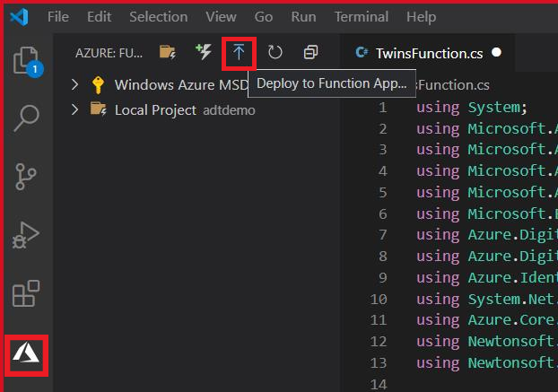

We can ingest data into Azure Digital Twins through external compute resources, such as an Azure function, that receives the data and uses the DigitalTwins APIs to set properties.

## Configure your environment

- [Visual Studio Code](https://code.visualstudio.com/) on one of the [supported platforms](https://code.visualstudio.com/docs/supporting/requirements#_platforms).
- The [C# extension](https://marketplace.visualstudio.com/items?itemName=ms-dotnettools.csharp) for Visual Studio Code.
- The [Azure Functions extension](https://marketplace.visualstudio.com/items?itemName=ms-azuretools.vscode-azurefunctions) for Visual Studio Code.

## Create an Azure Function via CLI

1. Create a Azure storage account

    ```azurecli
    az storage account create --name $functionstorage --location $location --resource-group $rgname --sku Standard_LRS
    ```

1. Create an Azure Function

    ```azurecli
    az functionapp create --resource-group $rgname --consumption-plan-location $location --name $telemetryfunctionname --storage-account $functionstorage --functions-version 3
    ```

## Configure security access for the Azure function app

The Azure function skeleton from earlier examples requires that a bearer token to be passed in order to authenticate with Azure Digital Twins. To make sure that this bearer token is passed, you'll need to create a Managed Service Identity (MSI) for the function app.

In this section, we'll create a system-managed identity and assign the function app's identity to the _Azure Digital Twins Owner (Preview)_ role for your Azure Digital Twins instance. The Managed Identity gives the function app permission in the instance to perform data plane activities. We'll also provide the the URL of Azure Digital Twins instance to the function by setting an environment variable.

1. Use the following command to create the system-managed identity and save the _principalId_ to a variable for use later

    ```azurecli	
    az functionapp identity assign -g $rgname -n $telemetryfunctionname
    $principalID = $(az functionapp identity assign -g $rgname -n $telemetryfunctionname  --query principalId)
    ```

1. Use the _principalId_ value in the following command to assign the function app's identity to the _Azure Digital Twins Data Owner_ role for your Azure Digital Twins instance.

    ```azurecli	
    az dt role-assignment create --dt-name $dtname --assignee $principalID --role "Azure Digital Twins Data Owner"
    ```

Lastly, set the URL of your Azure Digital Twins as an environment variable

> [!TIP]
> The Azure Digital Twins instance's URL is made by adding *https://* to the beginning of your Azure Digital Twins instance's *hostName* which you retrieved earlier.

```azurecli
    $adthostname = "https://" + $(az dt show -n $dtname --query 'hostName' -o tsv)
    az functionapp config appsettings set -g $rgname -n $telemetryfunctionname --settings "ADT_SERVICE_URL=$adthostname"
```

## Create an Azure Functions app in Visual Studio Code

In this section, you use Visual Studio Code to create a local Azure Functions project in your chosen language. Later in this article, you'll publish your function code to Azure.

1. Choose the Azure icon in the Activity bar, then in the **Azure: Functions** area, select the **Create new project...** icon.

    

1. Choose a directory location for your project workspace and choose **Select**.

1. Provide the following information at the prompts:
    - **Select a language for your function project**: Choose `C#`.
    - **Select a template for your project's first function**: Choose `Change template filter`.
    - **Select a template filter**: Choose All
    - **Select a template for your project's first function**: Choose `EventGridTrigger`.
    - **Provide a function name**: Type `TwinsFunction`.
    - **Provide a namespace**: Type `My.Function`.
    - **When prompted for a storage account choose**: Skip for now
    - **Select how you would like to open your project**: Choose `Add to workspace`.

### Install Nuget packages

In the Visual Studio Code Terminal, add the required Nuget packages by typing the following commands:

```dos
    dotnet add package Azure.DigitalTwins.Core --version 1.0.0-preview.3
    dotnet add package Azure.identity --version 1.2.2
    dotnet add package System.Net.Http
```

### Write an Azure function with an Event Grid trigger

1. In VS Code, open the file TwinsFunction.cs
1. Replace the code in the Function App template with the sample provided:

> [!TIP]
> The namespace and function name must match.  If you changed them in the previous steps, make sure to do the same in the code sample.

```csharp
using System;
using Microsoft.Azure.WebJobs;
using Microsoft.Azure.WebJobs.Host;
using Microsoft.Azure.EventGrid.Models;
using Microsoft.Azure.WebJobs.Extensions.EventGrid;
using Microsoft.Extensions.Logging;
using Azure.DigitalTwins.Core;
using Azure.DigitalTwins.Core.Serialization;
using Azure.Identity;
using System.Net.Http;
using Azure.Core.Pipeline;
using Newtonsoft.Json;
using Newtonsoft.Json.Linq;

namespace My.Function
{
    public class TwinsFunction
    {
        //Your Digital Twin URL is stored in an application setting in Azure Functions
        private static readonly string adtInstanceUrl = Environment.GetEnvironmentVariable("ADT_SERVICE_URL");
        private static readonly HttpClient httpClient = new HttpClient();

        [FunctionName("TwinsFunction")]
        public async void Run([EventGridTrigger] EventGridEvent eventGridEvent, ILogger log)
        {
            log.LogInformation(eventGridEvent.Data.ToString());
            if (adtInstanceUrl == null) log.LogError("Application setting \"ADT_SERVICE_URL\" not set");
            try
            {
                //Authenticate with Digital Twins
                ManagedIdentityCredential cred = new ManagedIdentityCredential("https://digitaltwins.azure.net");
                DigitalTwinsClient client = new DigitalTwinsClient(new Uri(adtInstanceUrl), cred, new DigitalTwinsClientOptions { Transport = new HttpClientTransport(httpClient) });
                log.LogInformation($"ADT service client connection created.");
                if (eventGridEvent != null && eventGridEvent.Data != null)
                {
                    log.LogInformation(eventGridEvent.Data.ToString());

                    // Reading deviceId and temperature for IoT Hub JSON
                    JObject deviceMessage = (JObject)JsonConvert.DeserializeObject(eventGridEvent.Data.ToString());
                    string deviceId = (string)deviceMessage["systemProperties"]["iothub-connection-device-id"];
                    var chasistemperature = deviceMessage["body"]["ChasisTemperature"];
                    log.LogInformation($"Device:{deviceId} Temperature is:{chasistemperature}");

                    //Update twin using device temperature
                    var uou = new UpdateOperationsUtility();
                    uou.AppendReplaceOp("/ChasisTemperature", temperature.Value<double>());
                    await client.UpdateDigitalTwinAsync(deviceId, uou.Serialize());
                }
            }
            catch (Exception e)
            {
                log.LogError(e.Message);
            }

        }
    }
}
```

## Publish the function app to Azure

1. In the VSCode function extension, click on on **Deploy to Function App...**
    

- **Select subscription**: Choose `Concierge Subscription` if you're using the sandbox environment
- **Select Function App in Azure**: Choose `<name>twinfunction`.

1. When the deployment finishes, you'll be prompted to Start Streaming Logs
  
1. Click on **Stream Logs** to see the messages received by the Azure Function after the IoT Hub setup in the next step. There won't be any messages received until the IoT Hub is setup and a device sends messages.
1. Alternatively, you can Stream Logs at a later time by right-clicking on the Azure Function in VS Code and choosing **Start Streaming Logs**
  