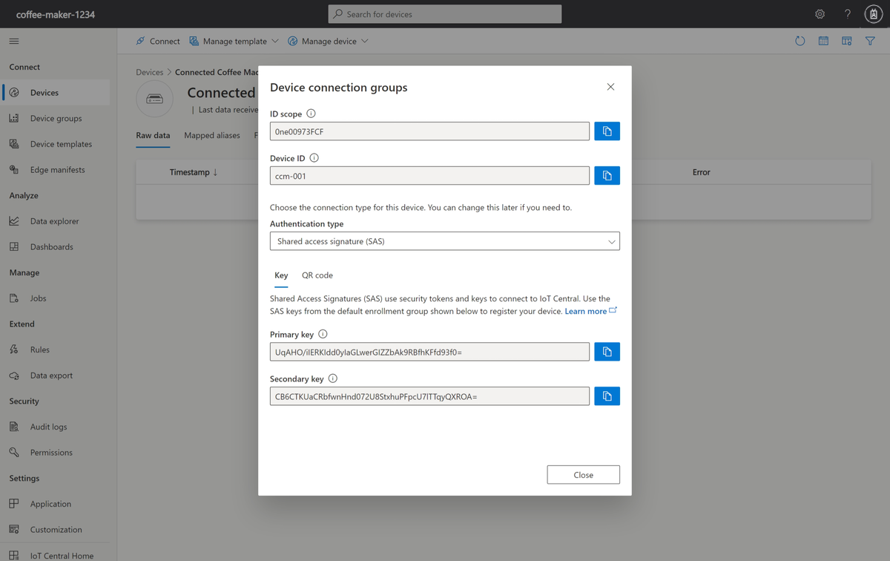
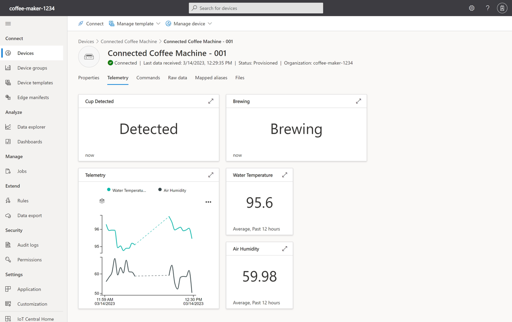

To validate your scenario before connecting a physical device you use use a device simulator that implements the behaviors defined in the device model.

Recall that in the IoT enabled coffee machines example, you'll connect a coffee machine simulator to IoT Central for monitoring telemetry such as water temperature and humidity, observe the state of the machine, set optimal temperature, receive warranty status, and send commands.

Here, you'll simulate a device with a Node.js application and connect it to the Azure IoT Central application.


## Get connection information

To run the Node.js application, you need the following configuration values:

- *`{ID Scope}`*: In your IoT Central application that you created in the previous exercise, navigate to **Permissions > Device connection groups**. Make a note of the **ID scope** value.
- *`{Device ID}`*: Define a device id, such as `ccm-001`.
- *`{Device Primary Key}`*: In your IoT Central application, navigate to **Permissions > Device connection groups > SAS-IoT-Devices**. Make a note of the shared access signature **Primary key** value.

    Use the Azure Cloud Shell to generate a device key. Replace the placeholder text *`<the device id>`* with the one you defined above and *`<the group primary key value>`* with the shared access signature **Primary key** value:

    ```azurecli-interactive
    az extension add --name azure-iot
    az iot central device compute-device-key --device-id <the device id> --pk <the group primary key value>
    ```

    Make a note of the generated device key, this is used to update the *CoffeeMaker.js* placeholder *`{Device Primary key}`*.

    

## Create a Node.js application

The following steps show you how to create a client application that implements the coffee machine device simulator.

> [!TIP]
> In this exercise, you create the Node.js app in the Azure Cloud Shell so that you don't have to install anything on your local machine.

1. Execute the following command in the Azure Cloud Shell to create a `coffee-maker` folder and navigate to it:

    ```azurecli
    mkdir ~/coffee-maker
    cd ~/coffee-maker
    ```

1. Execute the following command in the Cloud Shell to initialize a Node.js project in your `coffee-maker` folder:

    ```azurecli
    npm init
    ```

    > [!NOTE]
    > The init script prompts you to enter project properties. For this exercise, press ENTER to accept all the default values.

1. To install the necessary packages, run the following command in the `coffee-maker` folder:

    ```azurecli
    npm install azure-iot-device azure-iot-device-mqtt azure-iot-provisioning-device-mqtt azure-iot-security-symmetric-key --save
    ```

1. Create and open a file called *CoffeeMaker.js* in the integrated Cloud Shell code editor by executing the following command:

     ```azurecli
    code CoffeeMaker.js
    ```

1. Copy and paste the following code into the empty editor window:

    :::code language="js" source="~/../iot-central-docs-samples/monitor-manage-device-with-iotcentral/CoffeeMaker.js":::

1. Update the placeholders *`{ID scope}`*, *`{Device ID}`*, and *`{Device Primary key}`* at the top of this code with the connection information you made a note of previously.

1. Select the three dots `...` to the top right of the editor to expand the editor menu. Then select **Save** to save the edits you made to *CoffeeMaker.js*

1. Execute the following command in the Cloud Shell to start the app:

    ```azurecli
    node CoffeeMaker.js
    ```

1. Verify that the app starts in the Cloud Shell window with the message *Device successfully connected to Azure IoT Central* along with *Telemetry send:* messages. 

Congratulations! Your app is up and running and communicating with IoT Central!

## Check your work

You've now worked with the Azure IoT Central application and connected the coffee machine to Azure IoT Central. You are well on your way to begin to monitor and manage your remote coffee machine. Here, you take a moment to validate your setup and connection by using the **Connected Coffee Machine** template that you defined earlier. You update the optimal temperature on the **Properties** form, run commands to update the state of your machine, and view your connected coffee machine telemetry.

### Update properties to sync your application with the coffee machine

Use the **Properties** form you defined in the device template to send configuration data to the coffee machine from your application.

1. Navigate to the **Devices** page in your Azure IoT Central application.

1. Select **ccm-001** from the list of devices to view the device details.

1. Select **Properties** to view the form.

1. Enter *95* as the optimal temperature. Then select **Save**.

When the property is changed, the property is marked as **Pending: now** in the UI until the coffee machine acknowledges the setting change. The property is then marked as **Accepted: now**.

> [!NOTE]
> Successful updates in the setting indicate data flow and validate your connection. The telemetry measurements will respond to the update in optimal temperature.

### Update cloud properties

Use the **Properties** form you defined in the device template to update configuration data for the coffee machine.

1. Navigate to the **Devices** page in your Azure IoT Central application.

1. Select **ccm-001** from the list of devices to view the device details.

1. Select **Properties** to view the form.

1. Enter *99* as the **Coffee Maker Max Temperature (&deg;C)** and *92* as the **Coffee Maker Min Temperature (&deg;C)**. Then select **Save**.

Cloud properties are not synced with the device, they only exist in the IoT Central application.

### Run commands on the coffee machine

Navigate to the **Commands** page for your device for the following exercise. To validate the commands setup, you remotely run commands on the coffee machine from IoT Central. If the commands are successful, confirmation messages are sent back from the coffee machine.

1. Start brewing remotely by selecting **Run**.

    The coffee machine will start if these three conditions are satisfied:
    - Cup detected
    - Not in maintenance
    - Not brewing already  

    > [!NOTE]
    > When you've successfully started brewing, the state of the machine changes to **Brewing** as indicated on the **Telemetry** page.

    Look for confirmation messages in the console log of the simulated coffee machine.

    ```
    Device successfully connected to Azure IoT Central
    Device Twin successfully retrieved from Azure IoT Central
     * Property - Warranty State: false
     * Received setting: OptimalTemperature: 95
     * Sent device properties (success)
    Telemetry send: Temperature: 96.1 Humidity: 75.9% Cup Detected: Y Brewing: N Maintenance Mode: N
     * Sent setting update for OptimalTemperature (success)
    Telemetry send: Temperature: 93.7 Humidity: 20.8% Cup Detected: Y Brewing: N Maintenance Mode: N
    Telemetry send: Temperature: 93.9 Humidity: 51.1% Cup Detected: Y Brewing: N Maintenance Mode: N
    Telemetry send: Temperature: 95.3 Humidity: 28.1% Cup Detected: Y Brewing: N Maintenance Mode: N
    Telemetry send: Temperature: 95.2 Humidity: 49.6% Cup Detected: Y Brewing: N Maintenance Mode: N
    Telemetry send: Temperature: 96.2 Humidity: 74.9% Cup Detected: Y Brewing: N Maintenance Mode: N
     * Brewing command received
    Telemetry send: Temperature: 95.2 Humidity: 85.8% Cup Detected: Y Brewing: Y Maintenance Mode: N
    Telemetry send: Temperature: 97.0 Humidity: 29.3% Cup Detected: Y Brewing: Y Maintenance Mode: N
    ```

1. Set maintenance mode by choosing **Run** on the **Commands** page. The coffee machine will set to maintenance if it's *not* already in maintenance.

    Look for confirmation messages in the console log on the coffee machine.

    > [!NOTE]
    > As in real life, when the technician takes the machine offline to perform necessary repairs before switching it back online, the coffee machine continues to stay in the maintenance mode until you reboot the client code.

    ```
    Device successfully connected to Azure IoT Central
    Device Twin successfully retrieved from Azure IoT Central
     * Property - Warranty State: true
     * Received setting: OptimalTemperature: 95
     * Sent device properties (success)
    Telemetry send: Temperature: 94.9 Humidity: 49.2% Cup Detected: Y Brewing: N Maintenance Mode: N
     * Sent setting update for OptimalTemperature (success)
    Telemetry send: Temperature: 96.7 Humidity: 64.4% Cup Detected: Y Brewing: N Maintenance Mode: N
    Telemetry send: Temperature: 95.7 Humidity: 32.4% Cup Detected: Y Brewing: N Maintenance Mode: N
    Telemetry send: Temperature: 94.7 Humidity: 98.6% Cup Detected: Y Brewing: N Maintenance Mode: N
     * Maintenance command received
    Telemetry send: Temperature: 93.2 Humidity: 61.5% Cup Detected: Y Brewing: N Maintenance Mode: Y
    Telemetry send: Temperature: 93.8 Humidity: 64.4% Cup Detected: Y Brewing: N Maintenance Mode: Y
    ```

### View the coffee machine telemetry

Navigate to the **Telemetry** page for the coffee machine. You defined this page when you created the device template:



> [!IMPORTANT]
> It's recommended that you run the Node.js application no more than 60 minutes or so to prevent the application from sending you unwanted notifications/emails. Stopping the application when you're not working on the module also prevents you from exhausting the daily message quota.