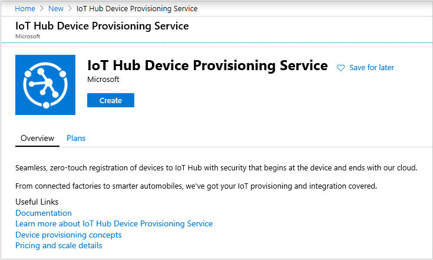
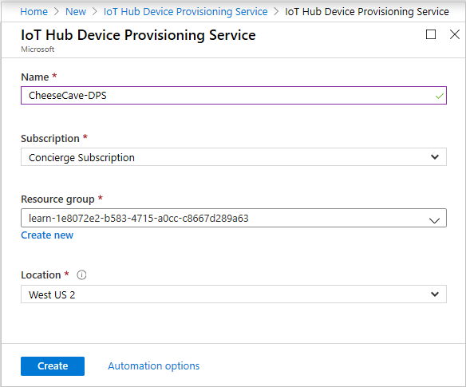
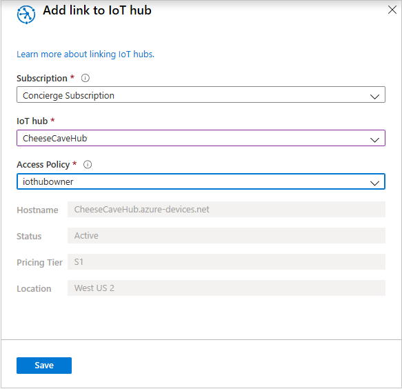
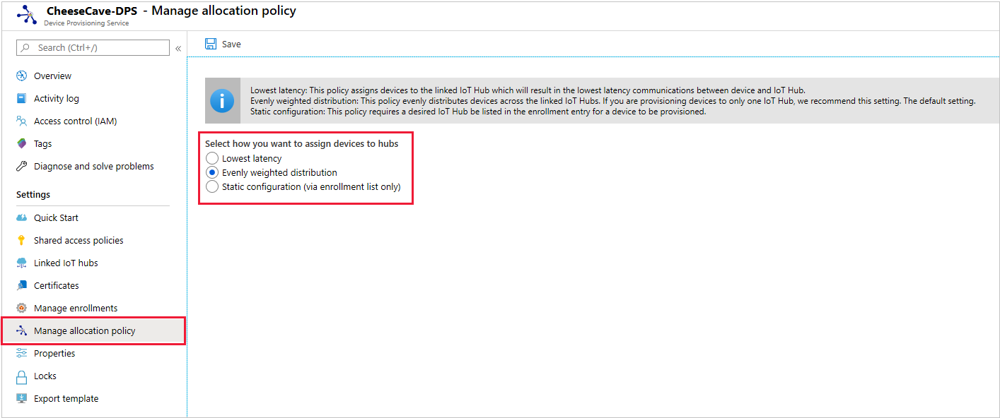

A Device Provisioning Service (DPS) can be linked to one or more hubs. So, it's a separate resource, and is independent of any one IoT Hub. You create a DPS resource the same way you create any other Azure resource.

## Create an Azure IoT Hub Device Provisioning Service

1. In your [Azure portal](https://portal.azure.com/learn.docs.microsoft.com?azure-portal=true), select **Create a resource**.

1. Type "provisioning" in the search box, and select **IoT Hub Device Provisioning Service**.

    [](../media/iot-hub-dps-resource-create.png#lightbox)

1. Specify the resource, with a name such as "CheeseCave-DPS". Use the sandbox subscription and resource group options. And choose your **Location**.

    [](../media/iot-hub-dps-resource-name.png#lightbox)

1. Create the resource, and wait for it to deploy. It can take a minute or two for the deployment message to appear.

### Link the DPS resource to your IoT Hub

1. In the DPS resource, locate, and select, the **Linked IoT hubs** entry, under **Settings** in the left-hand menu.

1. Click **+ Add**.

1. In the **Add link to IoT hub** pane, select the sandbox subscription.

1. Locate the name of your IoT hub, and select **iothubowner** as the **Access Policy**. Click **Save**.

    [](../media/iot-hub-dps-resource-hub-link.png#lightbox)

1. Click **Manage allocation policy**, and verify the policy is set to **Evenly weighted distribution**.

    [](../media/iot-hub-dps-resource-policy.png#lightbox)

1. On the **Overview** page, copy the **ID Scope** string to a text file. The string is displayed top-right of the page.

1. Perhaps bookmark a link to the **Overview** page of this resource.

Before we can go any further with the DPS resource, by adding enrollments, we must first create a root certificate.

## Create an X.509 root certificate

The first time we create any X.509 certificates, we need to download some tools.

1. Open a Microsoft Azure Cloud Shell, and select the **Bash** shell option. We need the Bash option, as the helper tools that you'll download next are written for Bash. If you are given a choice, there is no need to choose the sandbox cloud shell, as we are not creating any resources.

1. Run the following script. It creates a certificate directory in the shell storage, and downloads some helper scripts to it.

    ```azurecli
     # create certificates directory
     mkdir certificates
     # navigate to certificates directory
     cd certificates
    
     # download helper script files
     curl https://raw.githubusercontent.com/Azure/azure-iot-sdk-c/master/tools/CACertificates/certGen.sh --output certGen.sh
     curl https://raw.githubusercontent.com/Azure/azure-iot-sdk-c/master/tools/CACertificates/openssl_device_intermediate_ca.cnf --output openssl_device_intermediate_ca.cnf
     curl https://raw.githubusercontent.com/Azure/azure-iot-sdk-c/master/tools/CACertificates/openssl_root_ca.cnf --output openssl_root_ca.cnf
    
     # update script permissions so user can read, write, and execute it
     chmod 700 certGen.sh
    ```

    These helper scripts are downloaded from the _Azure/azure-iot-sdk-c_ open-source project hosted on GitHub. This project is a part of the Azure IoT SDK. The _certGen.sh_ helper script will help demonstrate the purpose of CA Certificates without diving into the specifics of OpenSSL configuration. If you need additional instructions on using these helper scripts, or for instructions on how to use PowerShell instead of Bash, refer to [CACertificateOverview](https://github.com/Azure/azure-iot-sdk-c/blob/master/tools/CACertificates/CACertificateOverview.md).

    >[!WARNING]
    >Do not use these helper scripts in a production environment, as the scripts contain hard-coded passwords that expire after 30 days. The scripts are provided only for demo purposes.

1. Run the following command to generate root and intermediate certificates. We're only interested in the root certificate, which will be named `azure-iot-test-only.root.ca.cert.pem`.
    
    ```azurecli
     ./certGen.sh create_root_and_intermediate
    ```

1. We need to download the root certificate to your local machine, to then upload it to Azure DPS. Enter:

    ```azurecli
     download ~/certificates/certs/azure-iot-test-only.root.ca.cert.pem
    ```
1. Create a new folder in your **Documents** folder, called "cheese cave certs", or something similar.

1. Copy the certificate file you downloaded into the **cheese cave certs** folder.

### Configure Azure DPS to trust the root certificate

1. In the Azure portal, navigate to the cheese cave DPS resource you created earlier.

1. In the **Settings** section, click **Certificates**.

1. Click **Add**. For the **Certificate Name**, enter an understandable name such as "cheesecave-dps-root". The name doesn't have to be the same as the certificate filename.

1. For **Certificate .pem or .cer file**, navigate to the **cheese cave certs** folder, and select the azure-iot-test-only.root.ca.cert.pem file that you downloaded.

1. Click **Save**.

After the root certificate has been uploaded, the **Certificates** pane will display the certificate with the status of **Unverified**. Before this CA Certificate can be used to authenticate devices to DPS, you'll need to establish _Proof of Possession_ of the certificate.

### Establish your Proof of Possession

1. In the **Certificates** pane, click on the certificate to open the **Certificate Details** pane.

1. Click **Generate Verification Code**.

1. Copy the **Verification Code** that is displayed above the **Generate Verification Code** button. There's a button to the right of the textbox to copy the code for you. Open a text editor, such as Notepad, and paste in the verification code.

    Proof of Possession of the CA certificate is provided to DPS by uploading a verification certificate generated from the root certificate. The verification certificate contains the verification code you just generated.

1. Leave the **Certificate Details** pane open while you generate the verification certificate. If you close the pane, you'll invalidate the verification code, and will need to generate a new one.

1. Copy the following command to the text file containing the verification code, and change `<verification-code>` to the actual code.

    ```azurecli
     ./certGen.sh create_verification_certificate <verification-code>
    ```

1. Back in the Cloud Shell, and in the **certificates** directory, run the completed command. This command generates a verification certificate that is chained to the root certificate. The generated certificate is named `verification-code.cert.pem`, and is located within the **./certs** directory of the Cloud Shell.

1. Run the following command to download the verification certificate to your local machine.

    ```azurecli
    download ~/certificates/certs/verification-code.cert.pem
    ```

1. Copy the downloaded file to your **cheese cave certs** folder.

1. Change focus back to the **Certificate Details** pane of the Azure portal. For **Verification Certificate .pem or .cer file**, navigate to, and select the `verification-code.cert.pem` file.

1. Click **Verify**, and, in the **Certificates** pane, check the status for the certificate is now displayed as **Verified**. You may need to use the refresh button at the top of the pane to see this change.

Great progress, you've created a root certificate, and validated to Azure DPS that you own it. The next step is to create a **Group Enrollment**, and link it to the root certificate.

### Create a Group Enrollment in Azure DPS

1. In the Azure portal, with your DPS resource selected, locate the **Settings** section.

1. Click **Manage enrollments**, then **Add enrollment group**. Make sure you're adding a group, and not an individual, enrollment.

1. For **Group Name**, enter "cheesecave-devices".

1. Ensure the **Attestation Type** is set to **Certificate**, and the **Certificate Type** field is set to **CA Certificate**. These settings are the defaults.

1. In the **Primary Certificate** dropdown, select your CA certificate. This certificate will be **cheesecave-dps-root**, if you used the suggested name.

1. Leave the **Secondary Certificate** dropdown set to **No certificate selected**. You're not required to have a secondary certificate.

1. Leave **Select how you want to assign devices to hubs** as **Evenly weighted distribution**. As you only have one IoT Hub associated with the enrollment, this setting is unimportant.

1. Verify your IoT Hub is selected in the **Select the IoT Hubs this device can be assigned to** field. Leave the reprovisioning settings at their defaults.

1. Finally, click **Save**, and verify your new enrollment group appears in the **Enrollment Groups** pane.

A group enrollment is going to be very useful in handling remote devices at scale. In the next unit, we create multiple leaf certificates.
