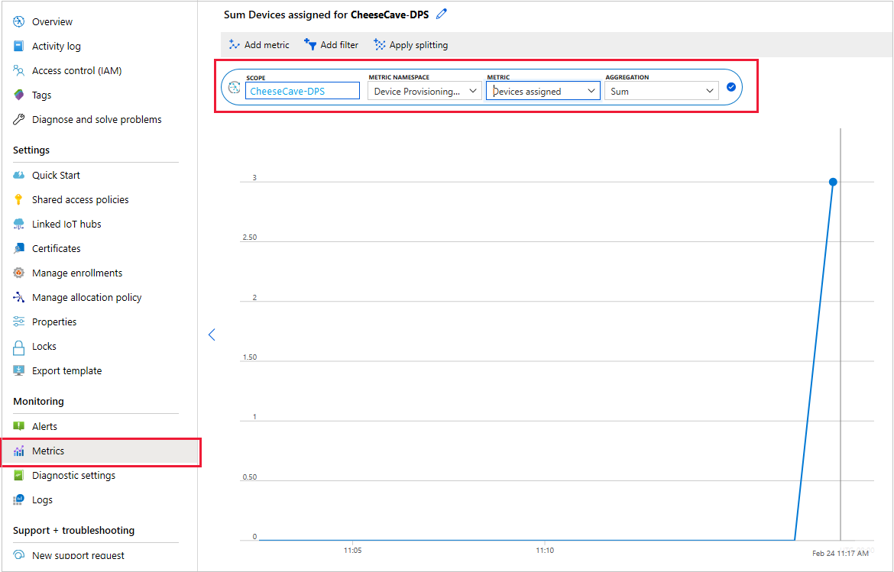
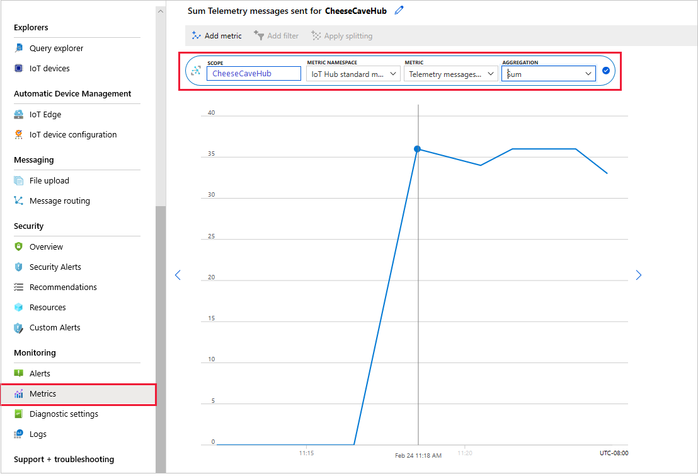
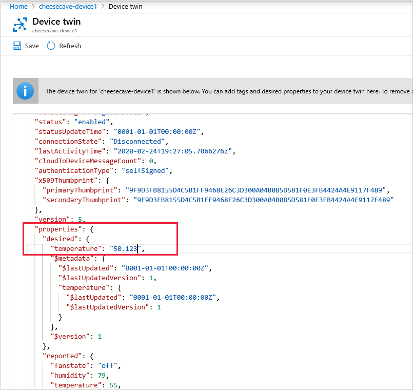
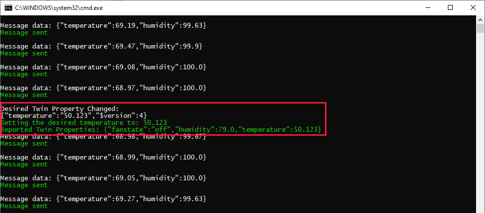

In this unit, we verify all the pieces we have put in place work as expected. You've already set all the device apps running. First, we check the provisioning service handles the registration correctly. Then we'll check the IoT Hub gets automatic updates to its list of connected IoT devices, and receives the telemetry from the devices. Finally, in the portal, we change a device twin setting for one device, and verify the correct device picks up the change.

## Test the multiple devices are automatically assigned to your IoT Hub

> [!TIP]
> With three console screens running, a Visual Studio instance to initiate the devices, and a browser view of the Azure portal, it can help to have multiple monitors. The more screen real estate you've available for testing, the easier you'll find testing is!

1. Verify all three device apps are still sending telemetry.

    

1. In the Azure portal for your DPS service, locate **Monitoring** in the left-hand menu, and select **Metrics**. Verify all three devices are assigned, by setting **Metric** to **Devices assigned**, and **Aggregation** to **Sum**.

    

1. In the Azure portal, this time for your IoT Hub, select **IoT devices** in the left-hand menu. Verify all three devices are listed, and have **Status** set to **Enabled**.

    

    > [!NOTE]
    > You'll remember that you did not add any devices using the Azure portal. These devices have been added by the link from your DPS system.

1. For added reassurance, in the left-hand menu select **Metrics** for your hub. Enter **Connected devices** for **Metric**, and set **Aggregation** to **Max**.

    

1. Still in **Metrics**, verify telemetry is received by changing **Metric** to **Telemetry messages sent**, and **Aggregation** to **Sum**.

    

You've now verified that all devices connected automatically to the hub via the DPS resource. You've completed the substance of this module, but let's do one more test, to verify communication in the opposite direction.

### Test the cloud-to-device communication

In this test, let's change one of the device twin properties in the portal, and ensure it's communicated to the device.

1. Select **IoT devices** for your hub, select **cheesecave-device1**.  Then, in the bar, select **Device Twin**.

1. Locate the **desired** section of the **properties** in the code that appears.

1. Change the desired temperature to something different and noticeable: say "50.123". And click **Save**.

    

1. Verify, in the console output, the change is picked up quickly by the selected device.

    

If all this worked as expected, great work. You now know what needs to be done to provision devices at scale. We limited ourselves to three devices, but you can imagine, with some automation and tooling, how you could provision a large number of devices, with minimum human involvement.

To complete the module, let's summarize the goals, and finish with a knowledge check.
