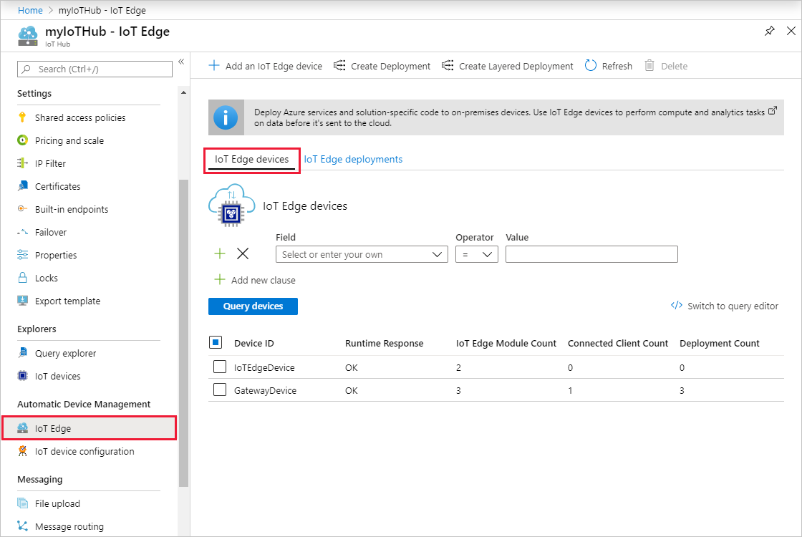

It's the first day on the job as lead IoT Solutions Engineer.  You've been told that you are in charge of implementing an Azure IoT Edge Gateway solution to facilitate secure transmission of manufacturing floor data into the cloud.  

The implementation of this solution is seen as high-impact, with lots of teams across the company counting on it's success.  Our Machine Learning and Data Analysts believe that we can automate a majority of our operations and the supply chain folks think that it could help optimize material usage and delivery of product.  If we successfully capture data from the manufacturing floor into Microsoft Azure, all of our business units can theoretically access and make use of it.

The first thing we need, is a registered identity for our IoT Edge Gateway.  This entity will ensure that the Azure cloud is ready for our eventual on-site deployment within the manufacturing site network.

In this unit, you will create a new IoT Edge Device identity in Azure IoT Hub for the IoT Edge Transparent Gateway.

## Create an IoT Edge Device Identity in IoT Hub using Azure portal

1. Make sure you've activated the sandbox, using the button above. The sandbox creates a free temporary resource.

1. Right-click on [Azure portal](https://portal.azure.com/learn.docs.microsoft.com?azure-portal=true) then select **Open in new window**.

1. Select **+ Create a resource**, from the top of the left-hand menu. In the **Search the Marketplace** search box, enter "IoT Hub".

1. Select **IoT Hub** from the search results, and click **Create**.

1. You'll be required to enter a **Subscription** from the selection offered to you. The sandbox subscription will be denoted by the name **Concierge Subscription**, so choose that. 

    For **Resource Group**, enter <rgn>[sandbox resource group name]</rgn>. A resource group is similar to a folder, it's largely there to help you organize your resources.

1. The **Region** should be the geographical region closest to you, and finally enter a friendly name for **IoT Hub Name** in the format **AZ-220-HUB-_{YOUR-ID}_**.

    >[!IMPORTANT]
    >Your hub names are publicly discoverable, so take this into account when entering names. Hub names must also be unique, as they form part of the Azure URL.

1. Select **Next: Size and scale** to view the capabilities of your hub, noting all the services we need are enabled. Open up **Advanced Settings** to see the number of partitions. You can leave all entries at their default settings. Or, for peace of mind, you can change **Pricing and scale tier** to **F1: Free tier**, although you'll not be charged if you leave the tier at **S1: Standard tier**, as sandbox resources are free.

1. Now, select **Review + create**, this option gives you a chance to verify your choices before clicking **Create**, and building the hub. Building your hub can take a few minutes.

1. With a sandbox, a containing resource with a name such as **AZ-220-HUB-_{YOUR-ID}** is created. From this containing resource, click **Go to resource** to go to the home page for your temporary hub.

1. On the IoT Hub summary, click **IoT Edge** under the **Automatic Device Management** section. This section of the IoT Hub summary allows you to manage the IoT Edge devices connected to the IoT Hub.

    

1. Click the **Add an IoT Edge device** button to begin adding a new IoT Edge Device to the IoT Hub.

1. On the **Create a device** section, enter `az-220-vm-edgegw-{YOUR-ID}` into the **Device ID** field. This value is the device identity used for authentication and access control.

1. Select **Symmetric key** for the **Authentication type**, and leave the **Auto-generate keys** box checked. This option tells the IoT Hub to automatically generate the symmetric keys for authenticating the device.

1. Click **Save**.

1. Once the IoT Edge Device is added, click on the **Device ID** in the list of IoT Edge devices.

1. On the IoT Edge Device summary, copy the **Primary Connection String** and save it for later.

1. Notice the list of **Modules** configured for the IoT Edge Device contains the **$edgeAgent** and **$edgeHub** modules.

    The IoT Edge Agent (`$edgeAgent`) and IoT Edge Hub (`$edgeHub`) modules are a part of the IoT Edge Runtime. The Edge Hub is responsible for communication, and the Edge Agent deploys and monitors the modules on the device.

1. Click the **Set Modules** button at the top of the IoT Edge Device summary blade. This section is used to add additional modules to the IoT Edge Device. You'll use this section to ensure the message routing is configured correctly for the IoT Edge Gateway device.

1. Leave all fields as they are in the **Modules** step, and click **Next: Routes >**.

1. Within the **Specify Routes**, the editor will display the configured default route for the IoT Edge Device. It should be configured with a route that sends all messages from all modules to Azure IoT Hub. If the route configuration doesn't match this definition, then update it to match the following route:

    - Name: **route**
    - Value: `FROM /* INTO $upstream`

    The `FROM /*` part of the message route will match all device-to-cloud messages or twin change notifications from any module or leaf device. Then, the `INTO $upstream` tells the route to send those messages to the Azure IoT Hub.
 
    >[!NOTE]
    >To learn more about configuring message routing within Azure IoT Edge, reference the [Learn how to deploy modules and establish routes in IoT Edge documentation article](https://docs.microsoft.com/azure/iot-edge/module-composition).

1. Click the **Next: Review + create >** button.

1. On the **Review + create** step, click the **Create** button.

Congratulations, that's the end of the unit! In the next unit, we'll deploy an Azure IoT Edge enabled Linux Virtual Machine.