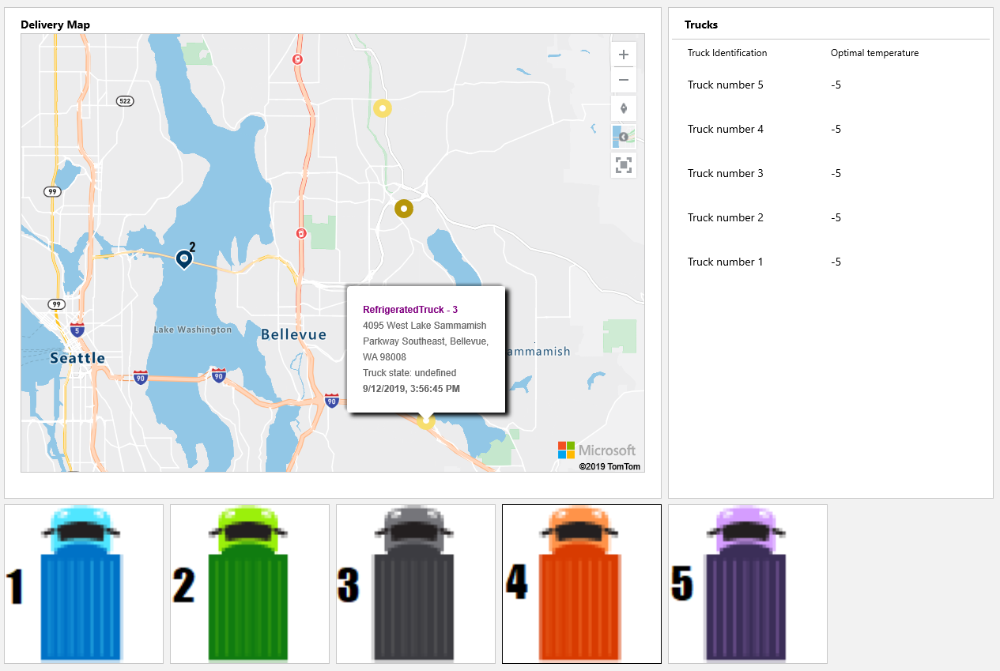
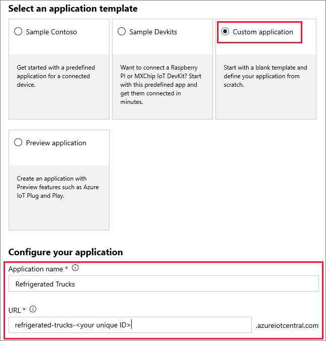

Azure IoT Central enables the easy monitoring and management of a fleet of remote devices. 

Azure IoT Central encompasses a range of underlying technologies that work great, but can be complicated to implement when a lot of these technologies are needed. These technologies include Azure IoT Hub, the Azure Device Provisioning System (DPS), Azure Maps, Azure Time Series Insights, Azure IoT Edge, and others. It is only now necessary to use these technologies specifically, if more granularity is needed than that available through IoT Central.

One of the purposes of this series of modules on IoT Central, is to help you decide if there is enough features in IoT Central to support the scenarios you are likely to need, or whether going deeper into the underlying component technologies will be necessary. IoT Central is by far the easier option, so let's investigate what it is capable of with a fun and involved scenario.

## The scenario

In the scenario that follows, you operate a fleet of refrigerated trucks.
|  |  |  |  |  |
| ---- | ---- | ---- | ---- | ---- |
|  |   |  |   |   |
|  |  |  |  |  |

 You have a number of customers within the city that you operate from, and you must command each truck to take its contents and deliver it to any one customer. However, the cooling system may fail on any one of your trucks, and if the contents does start to melt, you will need the option of returning to base and dumping the contents. Alternatively, of course you can deliver the contents to another customer who might be nearer to the truck when you become aware the contents are in jeopardy. In order to make these decisions, you will need an up-to-date picture of all that is going on with your trucks, certainly including their location on a map, their state, and the state of the contents, and the ability to redirect or recall the trucks quickly.

IoT Central provides all you need to handle this scenario. To spread the workload, we build this scenario across three modules.

In this first module you will:
  - Create an Azure IoT Central custom app
  - Create a device template for a refrigerated truck
  - Perform initial tests of the device template using a default simulated device

In the modules that follow this one, you will add code to support real refrigerated trucks with routes selected by Azure Maps, and be able to track all of them on an IoT Central dashboard!


## Create a custom IoT Central app

1. It is a good idea to bookmark, or otherwise store for regular use, the following Url:  ```https://apps.azureiotcentral.com/```. This is the home for your IoT Central apps. Navigate to this location.

2. Click on **New Application**. Select the free **Trial** payment plan, the 7 days that this gives you will be plenty of time to complete, and evaluate, the complete scenario.


3. Select **Custom application**, and configure the app as shown in the following image:



4. Enter the rest of the required fields appropriately.

5. Click **Create** and wait a few seconds whilst the app resource is built.

6. In you home page, a large icon for your  **Refrigerated Trucks** app should now appear.

That is all that is needed to create the app. The next step is to specify a device template. 
