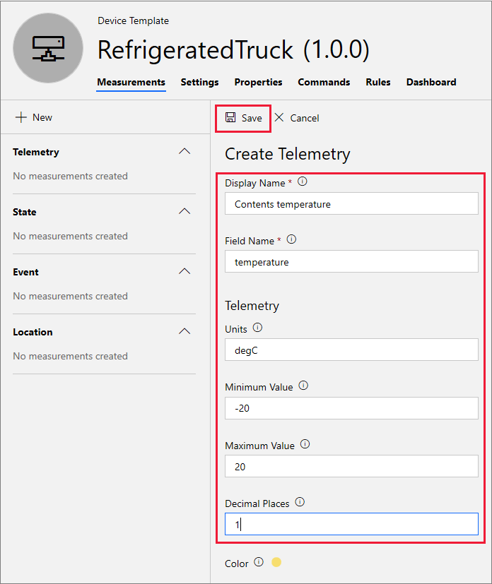
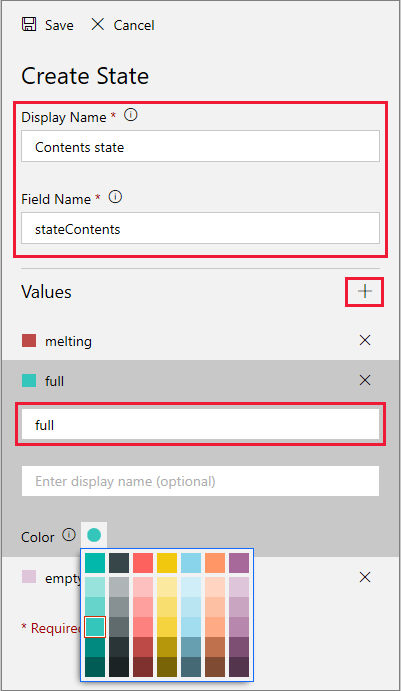
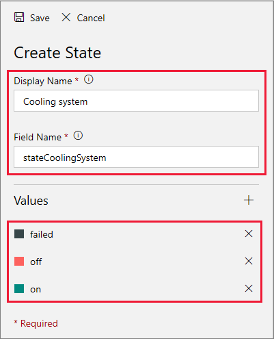
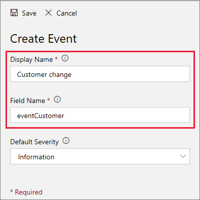
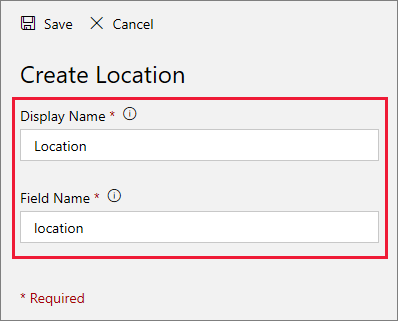
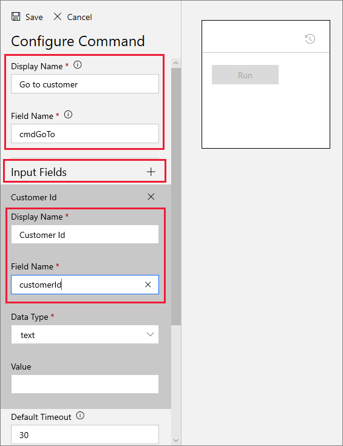

The data communicated between a remote device, and IoT Central, is specified in a _device template_. The device template specifies all the required details about the data, so that both the device and IoT Central have all they need to make sense of the communication.

In this unit, we will create a device template for a refrigerated truck. The IoT Central portal creates a simulated refrigerated truck device for us by default. This simulated device allows us to do some testing of the template before committing to real devices. In the unit that follows this one, we will examine this first level of testing.

## Create a device template

1. Select **Device Templates** from the menu on the left-hand side.

1. On the right-hand side of the screen, click **+ New** to create a new template.

1. You will next see a range  of **New Template** options, select **Custom**.
   > [!TIP]
   > Take note of the other options, **MXChip**, **Raspberry Pi**, and so on, just in case you need them in a future project!

1. Enter the name for your template: "RefrigeratedTruck", then click **Create**.

1. You should now see a template **RefrigeratedTruck (1.0.0)**, and see that a template can consist of **Measurements**, **Settings**, **Properties**, **Commands**, **Rules**, and a **Dashboard**. Our refrigerated truck will need entries under most of these headings.

  > [!NOTE]
  > We are creating this template with all we need for the units that follow this one. If the purpose of these entries is not immediately obvious, it should become clear as you work through this set of units. It is possible to complete a template, then come back to it and add more entries later, but this can involve managing multiple _versions_ of a template, which is a small complexity, but one we will avoid in this Learn module.

## Measurements

_Measurements_ are data transmitted by the device, and cover four types of values: _Telemetry_, _State_, _Event_, and _Location_. Our scenario requires at least one of each of these types for the refrigerated truck. We need to go through the measurements carefully, and enter all the required data. The most important entry is the **Field Name**. Make sure to enter this text accurately, as it is used when devices communicate values to the IoT Central app. When we come to write code in some of the following units, the reference in the code and the **Field Name** _must_ be an exact match.

### Telemetry

Telemetry is the values transmitted by sensors. We only implement one sensor in our scenario, the temperature of a truck's contents. The frequency with which this information is transmitted is determined by the device. In order for an operator to respond to an abnormal situation, the frequency of the transmission will need to be set appropriately.

Notice that minimum and maximum values are specified for a telemetry entry, these values are _only_ used by a simulated device to mimic the values from a real device. A real device can transmit any value. The units of the telemetry are a text value to show on charts and tables, IoT Central does not have any inherent understanding of degrees Celsius, or any other possible physical unit.

1. With the **Measurements** option underlined in blue, add the telemetry values from the image that follows. Click **+ New** and select **Telemetry** from the drop-down list.
  

1. Remember to click the **Save** icon after entering the data. If you are warned you are leaving a page with unsaved changes, it often means you have neglected to click the **Save** icon.

1. You should now see a **Missing Data** screen. This message is as it should be for a minute or so, but after a while you will start to see simulated values generated by IoT Central.

Let's add the rest of the template.

### State

States are important, they let the operator know what is going on. A state in IoT Central is a name associated with any number of values. In addition, you get to choose a color to associate with each value, which can make identifying what is going on (in particular, changes in state), much easier to identify in a visual display. It is easy to see why color is important, for example a "go" state might be a green color, a "failed" state a red or darker color, and so on.

1. Use the **+ New** option to add a state for the truck's refrigerated contents. First enter the **Display Name** and **Field Name**, then click the **+** to the right of **Values** three times, each time entering one of the three values: _empty_, _full_, and _melting_. No need to enter text for the display name of a value. Leave the default color as is, or choose a specific color if you are up for it! Finally, click **Save**.
  

1. To add some uncertainty to our simulation, let's add a failure state for the cooling system. If the cooling system fails, as you will see in the following units, the chances of the contents melting increase considerably! Add _on_, _off_ and _failed_ entries for a cooling system. Start by clicking **+ New**, and add another state.
  

1. A more complex state is the state of the truck itself. If all goes well, a truck's normal routing might be: _ready_, _enroute_, _delivering_, _returning_, _loading_, and back to _ready_ again.  However, we should add the _dumping_ state to cater for when melted contents need to be disposed of! Using the same process as for the last two steps, create this new state.
  

### Event

Events are issues triggered by the device, and communicated to the IoT Central app. Events can be one of three types: _Error_, _Warning_, or _Informational_. 

One possible event a device might trigger is a conflicting command. An example might be a truck is returning empty from a customer, but receives a command to deliver its contents to another customer. The conflict is caused by the device (the truck) being unable to act on the command. If a conflict occurs, it is a good idea for the device to trigger an event to warn the operator of the IoT Central app, with a _Warning_ class of event.

1. Use **+ New**, then click **Event**, to create an event to cover a conflicting command as follows.
  

1. Remember to click **Save** when you have entered the fields.

1. A second event that we will add is informational. When a truck receives a command to deliver to a customer, and the truck is able to perform the task, the truck triggers a change-of-customer-ID event. Add this event now.
  

  > [!NOTE]
  > One reason we add this event is to keep track of which truck is going to which customer. In a later unit we implement multiple trucks and a single dashboard to monitor them, and having this event helps provide a record of what is going on.

### Location

A location is probably the most important, and yet one of the easiest measurements to add to a device template. Under the hood, it consists of a latitude, longitude, and an optional altitude, for the device.

1. Add a location for our trucks as follows.
  

1. You should now have completed adding all the measurements we need. Validate the measurements you have created against the following screen (though your colors may differ from the colors in the image):
  

## Settings

A Setting contains device configuration data. In our refrigerated truck example, we are going to define an optimal temperature for the contents as a setting. This optimal temperature might conceivably change with different types of content, different weather conditions, or whatever might be appropriate. A setting has an initial default value, which may not need to be changed, but the ability to change it easily and quickly is there, if needed.

A setting is a single value. If more complex sets of data need to be transmitted to a device, a Command (see below) might be the more appropriate way of handling it.

1. Click on the **Settings** title (just to the right of **Measurements**) under the device template name. Add a single setting to set an optimal contents temperature, by clicking on **Number**, then entering the following fields:
  

1. Click **Save**.

## Properties

Properties of a device are typically constant values, that are communicated to the IoT Central app once when communication is first initiated. In our refrigerated truck scenario, a good example of a property would be the license plate of the truck, or some similar unique truck ID.

1. Click on the **Properties** title under the device template name, and add a single **Text** property to contain a truck ID.
  

1. Click **Save**.

## Commands

Commands are sent by the operator of the IoT Central app to the remote devices. Commands are similar to settings, but a command can contain no, or multiple, input fields if necessary, whereas a setting is limited to a single value.

For refrigerated trucks, there are two commands we should add: a command to deliver the contents to a customer (identified by a customer ID), and a command to recall the truck to base.

1. Click the **Commands** title under the device template name, then click **New Command**.

1. For the first command, to send the truck to a customer, enter the following display and field names, and click **+** beside the **Input Fields** title to enter a text field.
  
    > [!TIP]
    > You can use the corner icon in the lower-right corner of the box displaying the command, to stretch the bounding rectangle so that all elements of the command are displayed fully.

1. Enter another new command, this time with no input fields, but with "Recall" as the **Display Name**, and "cmdRecall" as the **Field Name**.

1. Click **Save**.

1. Validate that your two commands match the image below.  
  

Preparing a device template does take some care and some time.

Now, in the next unit, we can do some validation of our device template.
