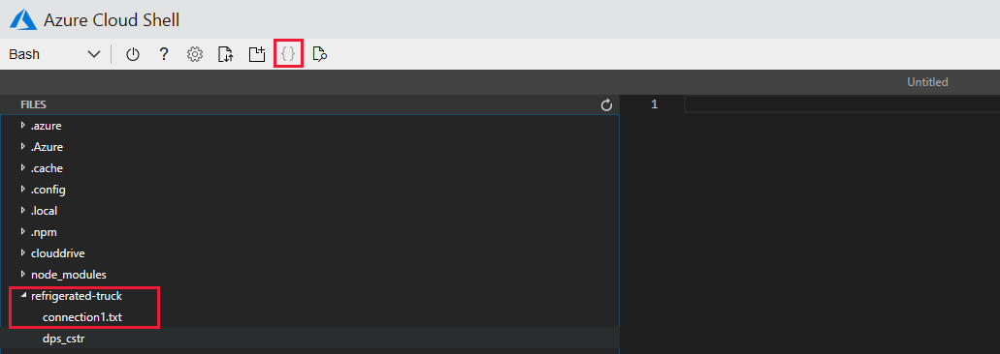

In this unit, we will setup the process to connect a real device to IoT Central. By "real" IoT Central understands that there is a remote app running - the app can be in a real device, taking input from real sensors, or running a simulation. Both options are treated as a connection to a real device.

The essential component for communication between a device and IoT Central is a _connection string_. There are some tools that make generating these strings easy. In this unit we will access these tools in such as way that we can reuse them later on. To start with, we need some information on our real device.

## Add a real device

1. With your Refrigerated Truck app open in the IoT Central portal, select **Devices** from the left-hand menu.

2. Open the **+** dropdown menu, and select **Real**.


3. Change the default Device Name to something readable, leaving the Device ID as is, and then select **Create**.


When the device is created, you will notice the phrase "Missing Data" where the telemetry would normally be. Not until the device starts transmitting data will this phrase change.

4. Click on the **Connect** button for the device, top right of your screen. Take your time and copy the **Scope ID**, **Device ID**, and **Primary Key**, to a text tool, such as Notepad, and save the file. You will be using these values after installing and running a few utilities to generate connection strings.

5. Click **Close**.


## Generate a connection string

All of the work to generate connection strings is handled through Azure Cloud Shell.

1. Navigate to ```https://shell.azure.com/```. Perhaps save this Url off as a favorite bookmark.

2. In the Azure Cloud Shell, create a refrigerated-truck folder, and navigate to it:

``` Azure Cloud Shell
   mkdir ~/refrigerated-truck
   cd ~/refrigerated-truck
```

3. Install the Device Provisioning System (DPS) key generator (dps-keygen), in the refrigerated-truck folder:

``` Azure Cloud Shell
   npm install dps-keygen
```

4. Download and install a DPS connection string utility (dps-cstr) from GitHub:

``` Azure Cloud Shell
   wget https://github.com/Azure/dps-keygen/blob/ota/bin/linux/dps_cstr?raw=true -O dps_cstr
```

> [!NOTE]
> You may have noticed in the above Url that we are downloading the Linux version of dps-cstr. This is needed to run in Azure Cloud Shell.

5. To give dps-cstr the correct permissions, run the following command:

``` Azure Cloud Shell
   chmod +x dps_cstr
```

6. Remember that in the previous section we stored a **Scope ID**, **Device ID**, and **Primary Key**, for our device. It is a good idea to keep a text tool such as Notepad open, and create in it the following string, replacing **scope-id**, **device-id**, and **primary-key** with the true values. Using the text tool enables you to create and validate the string before committing to running it.

```
    ./dps_cstr scope_id device_id primary_key > connection1.txt
```

7. Now copy this command from your text tool into the refrigerated-truck folder of Azure Cloud Shell, and run it. If successful, the tool will generate a connection string and write it out to the connection1.txt file.

8. Use the **{ }** icon in Azure Cloud Shell to navigate to the connection1.txt file. You will probably have to expand the **refrigerated-truck** node to locate it. Double-click on connection1.txt to open the file. Carefully copy all the contents to your text tool.



> [!IMPORTANT]
> The last element of the connection string is the Primary Key. During testing, sometimes a minor corruption occurred at the end of the string. Verify that the connection string in connection1.txt ends with an exact copy of the Primary Key, and if not, correct the copy you have made of the correction string in your text tool.

9. The connection string you will use in the Node.JS app (that follows in the next unit) starts with **HostName=**, so separate off this part of the string in your text tool, so you have one line containing a string that looks similar to the following (though the xxxx parts will be much longer):

```js
HostName=iotc-xxxx.azure-devices.net;DeviceId=xxxx;SharedAccessKey=xxxx
```

10. Save off your text file.

You now have the all important connection string. The scope Id identifies the app, the device Id the real device, and the primary key gives you permission for the connection.

## Create a free Azure Maps account

If you do not already have an Azure Maps account, you will need to create one.

1. Navigate to ```https://azure.microsoft.com/services/azure-maps/```.
2. Follow the prompts to create a free account. When this is completed, you will need the **Primary Key** for the account. Copy and paste this key into your text tool, with a note that it applies to Azure Maps.

You have now completed the fiddly part of building your first IoT Central app. The next step is to use the connection string in a Node.JS app.
