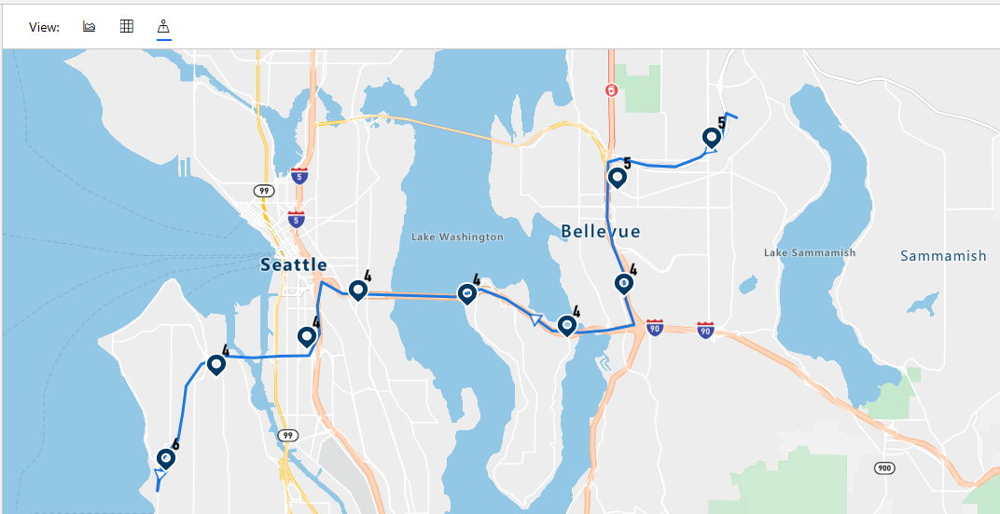
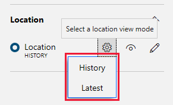

To fully test our one refrigerated truck device, it helps to break down the testing into a number of discreet checks:

1. The Node.JS app connects to Azure IoT Central.
1. The telemetry functions send data on the specified interval, and that data is picked up correctly by IoT Central.
1. The command to send the truck to a specified customer works as expected.
1. The command to recall the truck works as expected.
1. Check customer and conflict events are transmitted correctly.

In addition to this list, there are edge-cases we could also investigate, such as what happens when the truck's contents start to melt. However, as we have left this up to chance in our simulation (note the use of random numbers in our code in the previous unit) we can perhaps leave this out of our first round of testing.

To begin the testing, make sure the IoT Central app is up and running, and run the Node.JS app (**Debug/Start without Debugging** from Visual Studio, or enter ```node app.js``` into a terminal in Visual Studio Code). This will open a console screen, that should now say **Starting Truck number 1**.

### 1. The Node.JS app connects to Azure IoT Central

1. If the next line on the console is **Device successfully connected to Azure IoT Central** you have made the connection. This should be followed by some text verifying the settings and properties were sent successfully.

### 2. The telemetry functions send data on the specified interval, and that data is picked up correctly by IoT Central

1. A console message should appear every 5 seconds, with the contents temperature.

2. To verify the data is being received at IoT Central, make sure your app is open, and select the **Devices** entry in the left-hand menu. Double-click the real device (**RefrigeratedTruck - 1**), not the simulated device, in the list of devices.

3. This is an exciting time in IoT Central development! Verify approximately that the temperatures being sent by the Node.JS app match those being shown in the telemetry view.

4. Hover the mouse over the states, just to verify the truck and its contents are in the expected state.

5. Check the map view for the device. A blue circle near Seattle, USA shows our truck ready to go. You may have to zoom in a bit.

### 3. The command to send the truck to a specified customer works as expected

1. Now for the best fun of all. Click the **Commands** title for the device. Enter a customer Id, say "6", and click **Run**.

2. In the console for the Node.JS app you should see **Number of points=**, followed by a list of lat/lon co-ordinates. If you see a message including the text "Access denied due to invalid subscription key", then check your subscription key to Azure Maps.

3. Go back to the **Measurements** view in IoT Central. Hover over the Truck state bar chart, does it say "enroute"? Now, select the map view. Is your truck on its way?



4. If you have got this far, this is great progress. Take a moment to just watch the map update, and your truck deliver its contents!

### 4. The command to recall the truck works as expected

1. When the truck returns to base, try issuing another delivery command, then a recall command to check the truck returns.

### 5. Check customer and conflict events are transmitted correctly

1. Go to the table view for the device. Change the time range to the past hour. Click on **Show details** for any event that appears. There should be informational events showing the change of customer Id.

2. To test a conflict event, send a returning truck a command to deliver to another customer.

> [!TIP]
> To better see where a truck is at any one moment, change the Location settings to show **Latest**. For the full route, choose **History**.
>
> 

## Update the dashboard

1. Navigate to the dashboard you created a few units back. Edit the dashboard so that it picks up the location, and KPI, from the real device, not the simulated device. Select the pencil icons to edit dashboard elements. Click **Done** when both elements are picking up real data.

2. Give the dashboard a few seconds to sync up. Now, is it showing the values from the real device?

## Next steps

Before we move on to adding multiple devices, a short quiz to help establish what you have learned in the past few units.
