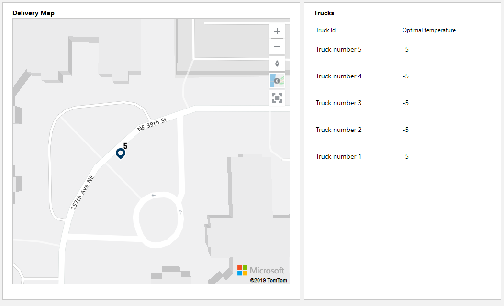

## Create a device set

1. In IoT Central, click the **Device sets** left-hand menu entry.
2. On the far right of your screen, click **+ New**.
3. Enter a device set name, and select the right template:

4. Click **Save**.
5. Click  **Dashboard** on the bar, click **Edit**, then **Map** in the library of options. Give the map a title, such as "Delivery Map", the **Location** entry should just have the one option (**Location**), and select one of the three states to be displayed, say **Truck state**.
6. Click **Save**.
7. Click **Grid** in the library options, name it something like "Trucks", and add **Truck Id** and **Optimal temperature** to the columns to be displayed. And again, click **Save**.
8. Click **Done** to save your device set dashboard.
9. You may need to zoom out a bit on your Delivery Map, but you should get a map with five trucks at base.

10. In order to make commanding the trucks easier, we should add links to the Commands page for each truck. Navigate through the **Devices** menu to the **Commands** for **RefrigeratedTruck - 1**. Copy the URL, which will be something like **https://refrigerated-trucks.azureiotcentral.com/details/device/1obmjuo/commands**. Now navigate back to the device set dashboard (the one named "All refrigerated trucks"), click **Edit**, and add a **Link** from the library. Call the link something like "Truck 1 commands", and paste in the URL.

If you are up for it, repeat the process for trucks 2 through 5. Though this is not strictly necessary as you now understand the process. By building up the device set dashboard in this way, we can make controlling multiple devices a matter of a few clicks. You could add links to other device pages, device charts or tables for example.

Rather than have link text, if you enter the library **Image** option, you can attach a link to an image on the dashboard.

You have completed this unit, but feel free to order trucks to different customer numbers (valid range is 0 through 9), and get a feel for IoT Central control of remote devices.
