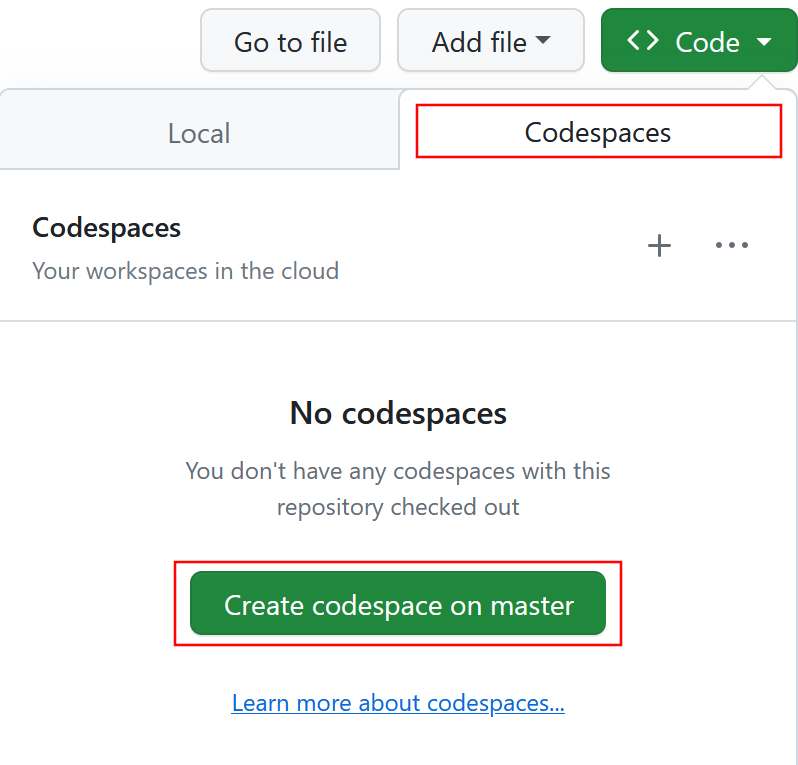

In order for Kubernetes to create a container image, it needs a place from which to get it. Docker Hub is a central place to upload Docker images. Many products, including Kubernetes, can create containers based on images in Docker Hub.

> [!NOTE]
> You will complete this exercise in a GitHub Codespace that has [Docker](https://www.docker.com/products/docker-desktop) and the [.NET SDK](https://dotnet.microsoft.com/download) pre-installed. When you use these techniques in your own development environment, make sure you have these prerequisites installed.

## Connect to the codespace

Let's start by connecting to the GitHub codespace that hosts the exercise.

1. Open a browser and go to the [eShopLite repository](https://github.com/microsoftdocs/mslearn-dotnet-cloudnative).
2. Select **Code** and then select the **Codespaces** tab.
3. Select **Create codespace on main**. GitHub creates and configures the codespace. This may take a few minutes.

    

### Verify the Docker images by creating containers in the codespace

There are two containers in the Contoso Shop project. Before pushing the images to Docker Hub, let's use them to create the containers in the codespace. After the containers are created and running, we'll be able to browse the Contoso company website and verify the microservices are running OK.

Follow these steps to create and run Docker containers in the codespace.

1. When the setup is complete, within the dotnet-kubernetes directory, open the file named **docker-compose.yml**.
1. Switch to the **PORTS** tab, point at the **Forwarded Address** for the **Back End (32001)** port, and then click the **Copy Local Address** icon.

    

1. Paste this URL into the `ImagePrefix` environment variable in the **docker-compose.yml** file, replacing the text `http://localhost`. 
1. Append `images` to the pasted text:

    ```docker-compose
    environment: 
      - ProductEndpoint=http://backend:8080
      - ImagePrefix=https://studious-fortnight-4g4rx9g47wg249w-32001.app.github.dev/images
    ```

1. Switch to the **TERMINAL** tab and the run the following command to build the containers:

    ```bash
    docker compose build
    ```

    It may take a while to build the containers.

1. Run the following command to run the app and attach the containers:

    ```bash
    docker compose up
    ```

1. To test the front end service, switch to the **PORTS** tab, then to the right of the local address for the **Front End** port, select the globe icon. The browser displays the homepage. 
1. Select **Products**. The catalog shows Contoso's merchandise.
1. Close the web site, return to the **TERMINAL** tab, and then press <kbd>Ctrl + C</kbd>. Docker compose halts the containers.

## Sign in to Docker Hub

The next step in uploading the images to Docker Hub is to sign into Docker Hub. From the command prompt, enter the following:

```bash
docker login
```

> [!IMPORTANT]
> Use the same username and password from when you created your Docker account. You can visit the [Docker Hub website](https://hub.docker.com) to reset your password, if needed.

## Upload the images to Docker Hub

1. Enter the following code to retag or rename the Docker images you created under your Docker username.

    ```bash
    docker tag storeimage [YOUR DOCKER USER NAME]/storeimage
    docker tag productservice [YOUR DOCKER USER NAME]/productservice
    ```

1. Then finally upload, or push, the Docker images to Docker Hub.

    ```bash
    docker push [YOUR DOCKER USER NAME]/storeimage
    docker push [YOUR DOCKER USER NAME]/productservice
    ```

In this exercise, you used Dockerfiles and docker compose to create two Docker images and containers, and pushed those images to Docker Hub.

Now, you're ready to use Kubernetes to manage Contoso's microservices deployment.
