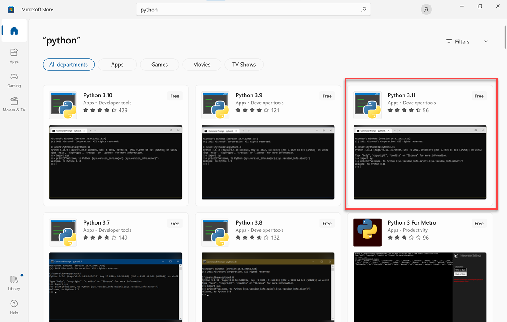
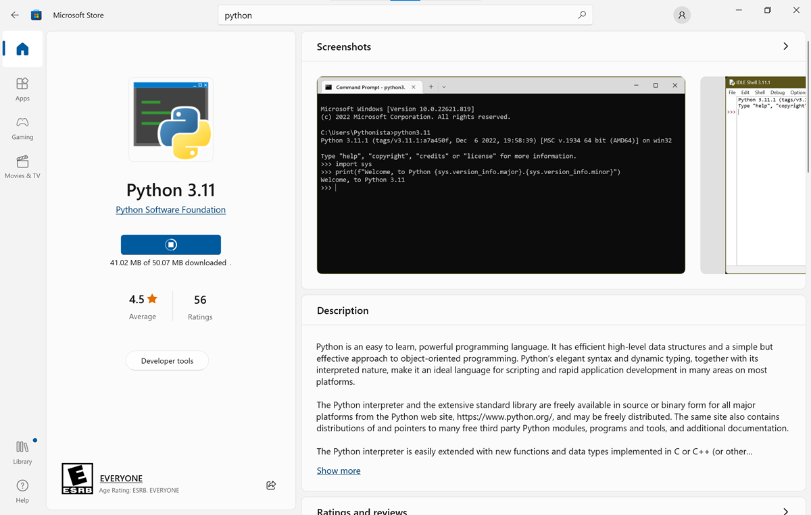

In the previous unit, you ran a command to determine whether you had Python 3 installed.  If you need to install Python 3, choose your operating system at the top of this page, and then follow the instructions.

If you determined that you already have Python 3 installed, scroll to the bottom of this page, and select **Continue**.

::: zone pivot="windows"

## Install Python on Windows from the Microsoft Store

When this module was written, Python 3.8 was the latest version of Python available, so we'll be referring to that version in the following instructions.

> [!NOTE]
> These instructions are specifically for Windows 10. If you're using a previous version of Windows, refer to the [official Python downloads page](https://www.python.org/downloads/?azure-portal=true) for more information.

> [!NOTE]
> At the time of this writing, Python 3.9.0 is the most current version of Python, so we refer to that version in these instructions. You should install the latest version available. If you install a different version, the text on buttons and the filenames that you see might be slightly different from the ones in these instructions.

### Step 1 - Open the Microsoft Store and install Python

Open the Microsoft Store by selecting *Start*, typing *start* and *Microsoft Store*. Once open, search for *Python*.

You will be presented with a list of various options. Select the most recent version of Python, which at the time of this writing is Python 3.9.



On the details screen, select *Install*.


Python will be installed in the background. This may take a couple of minutes depending on the speed of your system.



After Python installs, return to the command prompt. Enter the following command and then press <kbd>Enter</kbd> to see the version of Python:

```bash
python --version
```

::: zone-end

::: zone pivot="linux"

## Install Python on Linux

When this module was written, Python 3.9 was the latest version of Python available, so we'll be referring to that version in the following instructions.

As you're probably aware, different Linux distributions use different package managers. Most popular Linux distributions include either APT (an acronym for "Advanced Packaging Tool") or YUM (an acronym for "Yellowdog Updater, Modified").

We provide instructions for APT and YUM in this unit. If your distribution of Linux uses a different package manager, you might need to search for **\<your Linux distribution> install python 3**.

### Install by using APT

If you use APT you can use these instructions to install Python 3.

#### Step 1 - Open a Terminal window

Assuming you're running a Linux graphical user interface desktop environment, locate and open a terminal window by using the Terminal icon.

#### Step 2 - Update the APT package indexes

Enter the following command, and then press <kbd>Enter</kbd>.

```bash
sudo apt-get update
```

The `apt-get update` command updates the list of packages (the package indexes) from the repositories and Personal Package Archives (PPAs) that it's aware of. This update enables `apt-get` to find the latest versions of the packages that you want to install and their dependencies.

The `sudo` command temporarily elevates your permissions to root, the most powerful level of the system. When you use `sudo`, you'll usually be asked for your user account's password.

`apt-get update` displays all the items it will update. It might prompt you to approve by entering `y` or `yes`, and then pressing <kbd>Enter</kbd>.

#### Step 3 - Install Python 3

Run the following command at a Bash prompt, and then press <kbd>Enter</kbd>.

```bash
sudo apt-get install python3
```

`apt-get install` locates the appropriate packages from the package index, downloads the necessary files, and installs the files into the appropriate folders.

#### Step 4 - Check your installation

To confirm that Python 3 installed correctly, run the following command at a Bash prompt, and then press <kbd>Enter</kbd>.

```bash
python3 --version
```

You should see the word `Python` with a set of numbers separated by `.` characters. The following example shows the output you might see.

```output
Python 3.9.1
```

As long as the first number is `3`, Python 3 installed successfully.

If the installation failed, you might see an error message. Enter the exact error message into a search engine's search box to find possible causes and solutions.

### Install by using YUM

The YUM package manager is used mainly by Red Hat systems, like Red Hat Enterprise Linux and Fedora, and by CentOS. If APT isn't installed on your system, you can try YUM instead.

#### Step 1 - Open a Terminal window

Assuming you're running a Linux graphical user interface desktop environment, locate and open a terminal window by using the Terminal icon.

#### Step 2 - Update the YUM package indexes

Run the following command at a Bash prompt, and then press <kbd>Enter</kbd>.

```bash
sudo yum update
```

`yum update` will make sure all packages and their dependencies are up to date. It's a good idea to update the package list before you install new software.

#### Step 3 - Install Python 3

Run the following command at a Bash prompt, and then press <kbd>Enter</kbd>.

```bash
yum install rh-python36
```

#### Step 4 - Check your installation

To confirm that Python 3 installed correctly, run the following command at a Bash prompt, and then press <kbd>Enter</kbd>.

```bash
python3 --version
```

You should see the word `Python` with a set of numbers separated by `.` characters. The following example shows the output you might see.

```output
Python 3.9.1
```

As long as the first number is `3`, Python 3 installed successfully.

If the installation failed, you might see an error message. If you do, continue to step 5.

#### Step 5 - (Optional) Enable the Software Collections feature in Bash

Software Collections enables you to install multiple versions of the same software components on your system. You need to specify which version of Python you want to run in the shell. Run the following command at a Bash prompt, and then press <kbd>Enter</kbd>.

```bash
scl enable rh-python36 bash
```

Now retry step 4. The output should resemble the following output.

```output
Python 3.9.1
```

As long as the first number is `3`, Python 3 installed successfully, in the context of a Software Collection.

`scl enable` starts a new Bash session, setting Python 3.6 as the default Python version. But Python 3.6 is the default version only for the current shell session. If you exit the session or open a new session from another terminal, Bash will revert to Python 2.7 as the default Python version.

For more information, see
[Red Hat Software Collections 2.4](https://access.redhat.com/documentation/en-us/red_hat_software_collections/2/html/2.4_release_notes/chap-rhscl?azure-portal=true).

> [!IMPORTANT]
> If you needed to use `scl enable` to run `python3 --version`, you might need to run that command every time you want to work in Python. There are workarounds, but this is the intended functionality of Software Collections.  See [Make a Red Hat Software Collection persist](https://access.redhat.com/solutions/527703?azure-portal=true) for a possible workaround.

::: zone-end

::: zone pivot="macos"

## Install Python on macOS

Follow these steps to download the Python installer from the Python website.

> [!NOTE]
> At the time of this writing, Python 3.8.0 was the most current version, so we refer to that version in these instructions. You should install the latest version available. If you install a different version, the text on buttons and the filenames that you see might be slightly different from the ones in these instructions.

> [!NOTE]
> Alternatively, you can use Homebrew to install Python and Visual Studio Code. For instructions, see 
[Homebrew documentation](https://docs.brew.sh/Homebrew-and-Python?azure-portal=true).

### Step 1: Go to the Python download website and download the installer

Go to the [Python download page](https://www.python.org/downloads/?azure-portal=true).

The website should automatically direct you to a page specifically for macOS. Select **Download Python 3.8.0**.

You might see a window prompting you to allow downloads from python.org. Select **Allow**.

After a moment, a file named python-3.8.0-mascosx10.9.pkg should download to the Downloads stack in your Dock.

### Step 2: Start the Python installer and accept options for a standard installation

Double-click the .pkg file that you downloaded to start the installer. The Python installer will prompt you to install, verify, and accept various options and license agreements. Take the time to read through these prompts to understand what the installer will do to your computer.

When the installation process finishes, a Finder window showing the contents of the Python folder will appear. You also should see a congratulations screen when the installation finishes. At that point, you can select **Close**.

If you're prompted to move the Python installer to the trash, you can do so.

### Step 3: Check to ensure that Python 3 installed correctly

Using Spotlight (<kbd>Command</kbd> + <kbd>Spacebar</kbd>), enter **terminal**, and then select <kbd>Return</kbd> to launch Terminal.

At the Terminal prompt, run the following command, and then select <kbd>Return</kbd>.

```bash
python3 --version
```

You should see the word `Python` with a set of numbers separated by `.` characters. The following example shows the output you might see.

```output
Python 3.8.0
```
As long as the first number is `3`, Python 3 installed successfully.

::: zone-end

You have now successfully installed Python on your local system.
