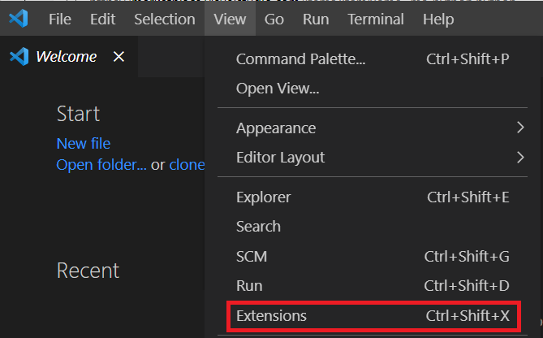

Now that you have Visual Studio Code installed, you'll install the Python extension for Visual Studio Code and, optionally, set up other tools and settings.

## Install the Python extension for Visual Studio Code

Visual Studio Code is a great lightweight general-purpose code editor, with a wide range of extensions available to provide even more functionality. The Python extension for Visual Studio Code provides visual cues and tools to help you write better Python code, and to write code faster.

### Step 1 - Open Extensions view

You can browse through extensions and install them from within Visual Studio Code.

Open the Extensions view by selecting **View** and **Extensions**.

Extensions view will display a list of the Visual Studio Code extensions that are the most popular on the Visual Studio Code Marketplace.

### Step 2 - Search for the Python extension

To filter the list of extensions, enter **python** in the search box at the top of the Extensions view.

Select the Python extension published by Microsoft (usually the first one in the list). The details about that extension appear in a tab in the main area to the right.

::: zone pivot="windows"

### Step 3 - Install the Python extension

In the main area, where you see the details about the Python extension, select **Install**.

When the installation is complete, the button's text will change to **Uninstall**. This message lets you know that you've successfully installed the Python extension.

::: zone-end

::: zone pivot="linux"

### Step 3 - Install the Python extension

In the main area, where you see the details about the Python extension, select **Install**.

When the installation is complete, the button's text will change to **Uninstall**. This message lets you know that you've successfully installed the Python extension.

::: zone-end

::: zone pivot="macos"

### Step 3 - Install the Python extension

In the main area, where you see the details about the Python extension, select **Install**.

When the installation is complete, the button's text will change to **Uninstall**. This message lets you know that you've successfully installed the Python extension.

> [!IMPORTANT]
> After you install the Python extension, you might see a dialog box that asks you whether you want to install the command-line developer tools. You should select **Install**. You'll need to agree to the Command Line Tools License Agreement. The installation process could take as long as 20 minutes or more, depending on your internet connection. After the install is complete, a dialog appears stating that the software is installed. You can select **Done** to proceed.

::: zone-end

## Summary

You have successfully installed the Python extension for Visual Studio Code. Let's create our first Python application!
