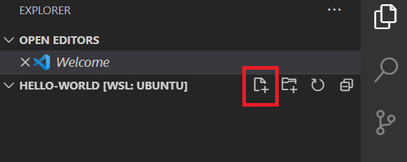
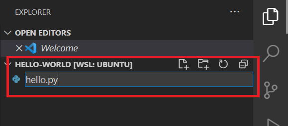
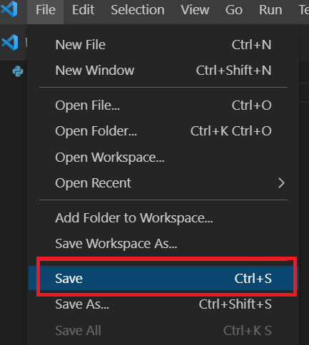
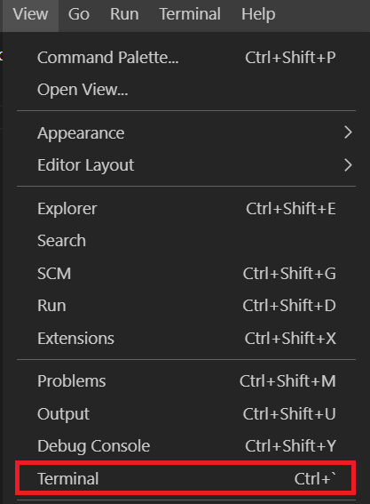

With Python and the tooling installed, you can now create your first Python application. You'll create an empty directory, open the directory in Visual Studio Code, and then create your first application.

## Step 1 - Create a directory for your code

Many projects start with an empty directory, which is how you'll start yours.

Open a terminal or command window (or return to the one you had open previously.) Create a new directory and open it in Visual Studio Code by entering the following commands:

::: zone pivot="windows"

```bash
md hello-world
cd hello-world
code .
```

::: zone-end

::: zone pivot="linux"

```bash
mkdir hello-world
cd hello-world
code .
```

::: zone-end

::: zone pivot="macos"

```bash
mkdir hello-world
cd hello-world
code .
```

::: zone-end

## Step 2 - Create a new Python file and add code

With Visual Studio Code now open and your empty folder created, you'll now create a Python file to display the class message "hello world".

You may see a prompt you to install [Pylint](https://pylint.org/), which you can install by selecting *Install*. If Visual Studio Code doesn't automatically [detect a Python interpreter](https://code.visualstudio.com/docs/languages/python#_environments), you may be prompted [select one](https://code.visualstudio.com/docs/languages/python#_environments) by selecting the default option.

Inside the *Explorer* window, click *New File*.



Name the new file **hello.py** by typing it into the new textbox and selecting *Enter*.



Enter the following Python code in the editor window, which uses the `print` function to display the text **Hello, world** when your application is executed.

```python
print('Hello, world!')
```

Save the file by selecting *File* and *Save*.



## Step 3 - Run your application

With the code now created, you can run your application. You can actually do run it from inside Visual Studio Code!

Open the built-in terminal inside Visual Studio Code by selecting *View* and *Terminal*.



In the new terminal window, run the following command to run your Python code.

::: zone pivot="windows"

```bash
python hello.py
```

::: zone-end

::: zone pivot="linux"

```bash
python3 hello.py
```

::: zone-end

::: zone pivot="macos"

```bash
python3 hello.py
```

::: zone-end

*Hello, world!* will now display in the Terminal window. Congratulations! You've created a Python application!
