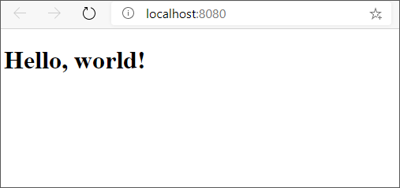

The most common way to start any programming course is to display the text "Hello, world!" Continuing with this tradition, we'll use React to display the famous text.

We'll create two items for the base of our project:

- The *index.html* file hosts our React application.
- The *index.jsx* file mounts our application.

## Create the application host

1. In Visual Studio Code, create a new file in the *public* folder. Name it *index.html*.
1. Add the following HTML:

    ```html
    <!DOCTYPE html>
    <html lang="en">
    <head>
        <title>Recipes</title>
    </head>
    <body>
        <div id="app"></div>
        <script type="module" src="/dist/index.js"></script>
    </body>
    </html>
    ```

### Explore the code

Notice two important lines in our HTML:

- `<div id="app"></div>`
  - This line creates the HTML element that hosts our React application.
  - We call this element by its ID to render our application.
- `<script type="module" src="/dist/index.js"></script>`
  - This line loads the JavaScript.

> [!NOTE]
> The name of the file we're importing is *index.js*. We don't use *index.jsx*, because browsers can't render JSX files. We always need a bundler (such as Snowpack) to generate JavaScript. We reference the JavaScript rather than the JSX.
>
> The `type="module"` attribute allows us to use `import` statements in our JavaScript (or JSX) files. This functionality is relatively new to browsers. It helps us import the necessary packages and components.

## Create the entry point for the React application

We need code to render our React application inside the HTML. Traditionally, the *index.jsx* file is used to render the application.

1. Create a new file inside the *src* folder. Name it *index.jsx*.
1. Add the following code:

    ```jsx
    import React from 'react';
    import ReactDOM from 'react-dom';

    ReactDOM.render(
        <h1>Hello, world!</h1>,
        document.getElementById('app')
    );
    ```

### Explore the code

Our *index.jsx* file starts by importing two important libraries. The first library, `React`, allows us to use JSX. It will be imported in every component or JSX file we create. The second library, `ReactDOM`, renders our application inside the HTML.

`render` takes two parameters: 
* The HTML we want to display. In this case, the HTML is an `h1` heading. 
* The HTML element we want to use to display our HTML. We'll use the element that has an ID of `app`. We created this element earlier.

The ability to use HTML inside our JavaScript coding is part of the power of JSX.

## Check the page

Now that we've created our code, let's see our site in action!

1. Open the integrated terminal in Visual Studio Code by selecting **View** > **Terminal** or by selecting **Ctrl+\`**. On a Mac, select **Cmd+\`** instead.
1. Use the following command to start Snowpack's development server:

    ```bash
    npm start
    ```

Your default browser should automatically open and display your page. If the page doesn't appear automatically, open your browser and go to http://localhost:8080. You should now see your page!



### Explore the generated code

Our JSX code is converted into the appropriate HTML and JavaScript for display in the browser. Open the JavaScript file generated by Snowpack: http://localhost:8080/dist/index.js. You'll see the following code:

```javascript
import React from "../web_modules/react.js";
import ReactDOM from "../web_modules/react-dom.js";
ReactDOM.render(/* @__PURE__ */ React.createElement("h1", null, "Hello, world!"), document.getElementById("app"));
```

Focus on the line of code that generates the `h1` element and places the text inside it:

```javascript
React.createElement("h1", null, "Hello, world!")
```

Using this code is similar to using `document.createElement` with vanilla JavaScript. The tooling provided by Snowpack and other bundlers allows us to use JSX to automatically generate the appropriate browser-friendly code.
