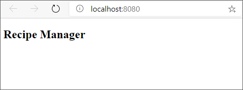

As highlighted in the overview of JSX, the core of React development is based around components. Components are self-contained units, designed for reuse and modularity. React projects will typically contain numerous components.

A component can either be a function or a class. Most React developers prefer using creating components with functions, and we'll focus on this style. Most applications have one core component, commonly called `App`, which acts as the root of the application. We're going to start by creating our `App` component.

## Create the component

1. Open Visual Studio Code.
1. Create a new file in **src** named **App.jsx**.
1. Add the following code:

    ```javascript
    import React from 'react';

    function App() {
        return (
            <article>
                <h1>Recipe Manager</h1>
            </article>
        )
    }

    export default App;
    ```

### Exploring the code

We start by importing `React`, which allows us to use JSX syntax. We then create a function named `App`, like we would any other function in JavaScript. At the end we export the function using the standard JavaScript syntax.

The core of our component is contained in the `return` statement. Notice that we're using HTML (or technically XML) embedded in JavaScript. This is the power of JSX. This allows us to use the logic and power of JavaScript as needed, and create self-contained units of work (or components).

The HTML returned by the function (or component) is what is displayed on the page. The display is a header containing the text **Recipe Manager**.

> [!NOTE]
> Notice that the `h1` element is contained inside an HTML 5 `article` element. Because JSX uses XML, we are required to always have one root element. `article` serves as the root for this component. This allows us to add HTML and other React components as our application continues to grow.

## Update our application to use our core component

Let's update our application to use our new component.

1. Open **index.jsx**.
1. After the line that reads `import ReactDOM from 'react-dom';` (this should be line 3), add the following:

    ```javascript
    import App from './App';
    ```

1. Replace the initial message, which is the code that reads `<h1>Hello, world!</h1>`, with a call to the `App` component:

    ```jsx
    <App />
    ```

### Exploring the code

The complete contents of **index.jsx** are now:

```jsx
import React from 'react';
import ReactDOM from 'react-dom';
import App from './App';

ReactDOM.render(
    <App />,
    document.getElementById('app')
);
```

Our `import` statement imports our component using the same syntax we would for any other module. We're now able to use the component as if it were HTML.

> [!NOTE]
> Because JSX uses XML syntax, we're required to close the `App` tag. We can do this by either using the long-form syntax of `<App></App>`, or the "self-closing" short-hand `<App />`. Both options are the same, but most developers use the short-hand option.

## See the results

Save all files. The browser automatically refreshes with the results!


