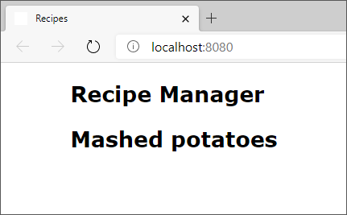

Components allow you to break down an application into logical pieces. In this unit, we'll explore this functionality by creating a component for the title of a recipe. We'll create components and import them into `App`. We'll also explore how to display data dynamically.

## Display dynamic data

To display dynamic data inside a component, use the syntax `{ }`, sometimes called *handlebars*. This style of syntax is relatively common in HTML templating tools. Use these handlebars to effectively switch to JavaScript mode and run almost any valid JavaScript. 

For example, to display the current time, you could use the following code:

```javascript
<div>{ Date.now() }</div>
```

## Create a RecipeTitle component

In our example, we'll create a component for the title of a recipe. We'll use a JavaScript variable for the title to show how React can display dynamic data. Future units will show you how to work with more complex data.

1. Create a new file in the *src* folder. Name it *RecipeTitle.jsx*.
1. Add the following code to *RecipeTitle.jsx*:

    ```jsx
    import React from 'react';

    function RecipeTitle() {
        const title = 'Mashed potatoes';
        return (
            <h2>{ title }</h2>
        )
    };
    export default RecipeTitle;
    ```

### Explore the code

Notice that we create a constant named `title`. We then use the handlebar syntax `{ }` to tell React we want to display the value of `title` inside the `<h2>` element. This feature of JSX allows us to mix JavaScript and HTML.

## Use the RecipeTitle component

Let's display `RecipeTitle` in our application by adding it to `App`.

1. Open *src/App.jsx*.
1. Below the line that reads `import React from 'react';` (it should be line 2), add the following code:

    ```javascript
    import RecipeTitle from './RecipeTitle'
    ```

1. Use `RecipeTitle` as an HTML element by adding the following code below the syntax that reads `<h1>Recipe Manager</h1>`:

    ```jsx
    <RecipeTitle />
    ```

### Explore the code

Here are the entire contents of the *src/App.jsx* file now:

```jsx
import React from 'react';
import RecipeTitle from './RecipeTitle'

function App() {
    return (
        <article>
            <h1>Recipe Manager</h1>
            <RecipeTitle />
        </article>
    )
}

export default App;
```

In much the same way we used `<App />` like an HTML element, we can use `RecipeTitle`. This example shows the essence of creating React applications: you create and use components to build your application.

## See the results

Save all of the files. The browser should automatically refresh and display the updated page. The heading **Mashed potatoes** appears at the top of the page.


