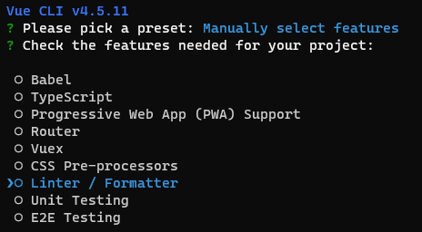
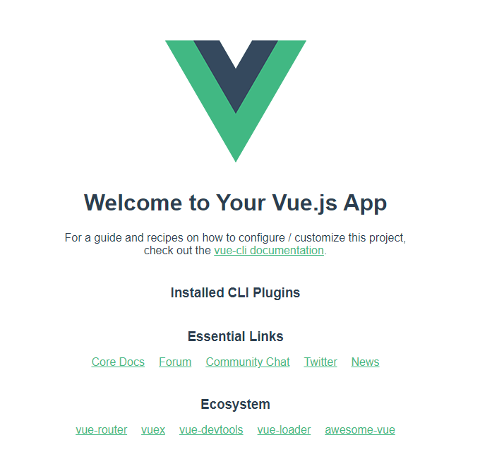

We want to create an application to allow someone to book a cruise to the moon for our fictitious company Relecloud. We will use Vue CLI to bootstrap our application.

## Install Vue CLI

Vue CLI is available through [npm](https://www.npmjs.com/?azure-portal=true), the packaging tool used by Node.js. npm is automatically installed when you install Node.js. To ensure you have npm and Node.js installed on your system, open a command or terminal window and execute the following commands:

```bash
node -v
npm -v
```

> [!IMPORTANT]
> Vue CLI is typically installed globally via npm, which requires elevated permissions if you have installed Node.js directly. Using Node Version Manager allows you to perform the installation as a regular user. You can install [nvm on Linux, Windows Subsystem for Linux (WSL), or macOS](https://github.com/nvm-sh/nvm#installing-and-updating/?azure-portal=true) or [nvm-windows on Windows](https://docs.microsoft.com/windows/nodejs/setup-on-wsl2/?azure-portal=true).

To install Vue CLI, perform the following steps:

1. Open a command or terminal window.

1. Inside the command or terminal window, execute the following command:

    ```bash
    npm install -g @vue/cli
    ```

Vue CLI will now be installed on your system. This will take a couple of minutes.

## Bootstrap an application

The fastest way to bootstrap a Vue application is through Vue CLI. We will now create a starter application with Vue CLI.

1. In the command or terminal window, navigate to a folder you want to use to store your application.
1. Create a Vue application by executing the following command:

    ```bash
    vue create relecloud
    ```

1. When prompted, select *Manually select features* by using your arrow keys to move down and pressing <kbd>Enter</kbd>.

    

1. When prompted for features needed for your project, arrow to *Babel* and press *space* to disable it, and arrow to *Linter / Formatter* and press *space* to disable it.

    

1. Ensure *Choose Vue version* is selected.
1. Press *enter* to confirm feature selection.

    > [!NOTE]
    > For production projects you may decide to add additional features. These features are outside the scope of this module.

1. When prompted to choose a version of Vue.js, arrow to *3.x (Preview)* and press <kbd>Enter</kbd>.

    

1. When prompted to choose where you prefer to place config files, leave the default of *In dedicated config files* and press <kbd>Enter</kbd>.

    

1. When prompted to save this as a preset, press <kbd>Enter</kbd> to accept the default of *No*.

Your project will now be created and the necessary libraries installed. This will take a few moments.

## Exploring the code

Let's explore the code created by Vue CLI.

1. When the installation completes, change directories into *relecloud* and open it in Visual Studio Code by executing the following commands:

    ```bash
    cd relecloud
    code .
    ```

1. Inside Visual Studio Code, open *package.json*.
1. Note *vue* is listed as a dependency, and *@vue/cli-service* is listed as a *devDependency*.
    > [!NOTE]
    > *@vue/cli-service is responsible for building your application and running the development server
1. Note the two *scripts*, *serve* which will launch the development server and *build* which will create the JavaScript/HTML/CSS when you are ready to publish your project.
1. Open *public/index.html*, which will host the Vue application.
1. Open *src/main.js* and note the code which imports `App` from *App.vue*.
1. Open *src/App.vue*, which contains the core component which we will explore in the next unit.
    > [!NOTE]
    > Visual Studio Code may prompt you with a suggested extension. We will install the extension in a later module.
1. Note the *src/components* folder, which is where all components will be stored.

## Run the development server

Let's start the development server and see the default page.

1. Open a new terminal window in Visual Studio Code by selecting *Terminal* > *New Terminal*
1. In the integrated terminal, execute the following command to start the development server.

    ```bash
    npm run serve
    ```

1. Open your browser and navigate to `http://localhost:8080`.
1. The default Vue application will be displayed.
    

Congratulations! You have now created a Vue application by using Vue CLI.
