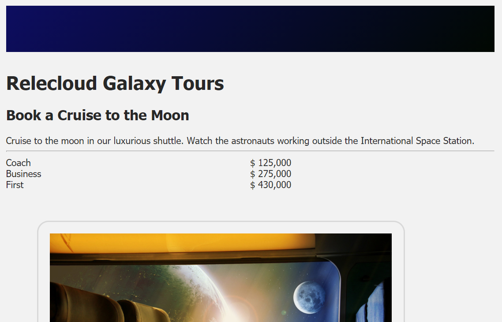

Before users decide to book a cruise, they'll want to know what options are available and how much they cost. Let's display these options.

## Clone the starter repository and explore the code

You've been provided a starter repository for this module.

1. Clone the starter repository, and open the folder in [Visual Studio Code](https://code.visualstudio.com/?azure-portal=true) by running the following code:

    ```bash
    git clone https://github.com/MicrosoftDocs/mslearn-vue-dynamic-render/
    cd mslearn-vue-dynamic-render/2-dynamic-render
    code .
    ```

1. Open the *index.js* file. Note the array of `productClasses`. Each `productClass` has `name`, `price`, `seatsAvailable`, and `earlyBird` properties.

## Display the list of options and prices

Let's update the HTML code to display the list of options and their prices.

1. Open the *index.html* file.
1. Below the line that reads, "TODO: Add code to display classes," add the following HTML code:

    ```html
    <div v-for="(productClass, index) in productClasses" :key="index" class="row">
        <div class="column">
            {{ productClass.name }}
        </div>
        <div class="column">
            $ {{ productClass.price.toLocaleString('en-US') }}
        </div>
        <!-- More to come -->

    </div>
    ```

### Explore the code

In the preceding code, the `v-for` directive creates a new `div` element for each `productClass` item. The code also generates an `index` for each item, which you use as the `:key` for the display. Finally, you can see that the code displays the `name` and `price` for each `productClass` item.

> [!NOTE]
> Note the call to `toLocaleString`. Because you're working inside the double braces ({{&nbsp;}}), you can call any valid JavaScript. Also, although the locale string is currently set to `en-US`, you can update it for your particular region.

## Open the page in Live Server

The [Live Server](https://marketplace.visualstudio.com/items?itemName=ritwickdey.LiveServer/?azure-portal=true) extension for Visual Studio Code creates a development web server that automatically refreshes the page as changes are detected. After you install the extension, you can use it to host your page.

1. Save all files.
1. In Visual Studio Code, open the Command Palette by selecting Ctrl+Shift+P (or Cmd+Shift+P on a Mac).
1. Enter <kbd>Live Server: Open with Live Server</kbd>.

    A message at the lower right confirms that your page is now being hosted on `http://localhost:5500`.

1. Open a browser, and go to `http://localhost:5500`.

You should now see the page you created.


