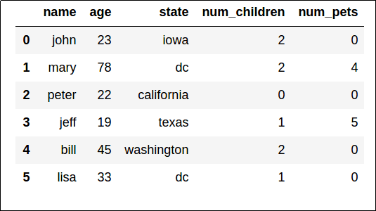

Data scientists can use various tools and techniques to explore, visualize, and manipulate data. One of the most common ways in which data scientists work with data is to use the Python language and some specific packages for data processing.

## What is NumPy

NumPy is a Python library that gives functionality comparable to mathematical tools such as MATLAB and R. While NumPy significantly simplifies the user experience, it also offers comprehensive mathematical functions.

## What is Pandas

Pandas is an extremely popular Python library for data analysis and manipulation. Pandas is like excel for Python - providing easy-to-use functionality for data tables.

## Explore data in a Jupyter notebook

Jupyter notebooks are a popular way of running basic scripts using your web browser. Typically, these notebooks are a single webpage, broken up into text sections and code sections that are executed on the server rather than your local machine. This means you can get started quickly without needing to install Python or other tools.

## Testing hypotheses

Data exploration and analysis is typically an *iterative* process, in which the data scientist takes a sample of data and performs the following kinds of task to analyze it and test hypotheses:

- **Clean data** to handle errors, missing values, and other issues.
- **Apply statistical techniques to better understand the data**, and how the sample might be expected to represent the real-world population of data, allowing for random variation.
- **Visualize data** to determine relationships between variables, and in the case of a machine learning project, identify *features* that are potentially predictive of the *label*.
- Revise the hypothesis and repeat the process.
