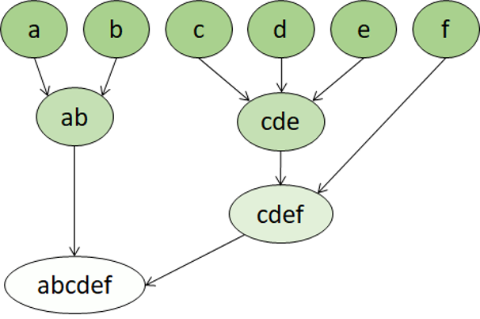

## Training a clustering model

There are multiple algorithms you can use for clustering. One of the most commonly used algorithms is *K-Means* clustering that, in its simplest form, consists of the following steps:

1. The feature values are vectorized to define n-dimensional coordinates (where *n* is the number of features). In the flower example, we have two features (number of petals and number of leaves), so the feature vector has two coordinates that we can use to conceptually plot the data points in two-dimensional space.
2. You decide how many clusters you want to use to group the flowers, and call this value ***k***. For example, to create three clusters, you would use a *k* value of 3. Then *k* points are plotted at random coordinates. These points will ultimately be the center points for each cluster, so they're referred to as *centroids*.
3. Each data point (in this case flower) is assigned to its nearest centroid.
4. Each centroid is moved to the center of the data points assigned to it based on the mean distance between the points.
5. After moving the centroid, the data points may now be closer to a different centroid, so the data points are reassigned to clusters based on the new closest centroid.
6. The centroid movement and cluster reallocation steps are repeated until the clusters become stable or a pre-determined maximum number of iterations is reached.

The following animation shows this process:

## Hierarchical Clustering

Hierarchical clustering is another type of clustering algorithm in which clusters themselves belong to a larger group, which belong to even larger groups, and so on. The result is that data points can be clusters in differing degrees of precision: with a large number of very small and precise groups, or a small number of larger groups.

For example, if we apply clustering to the meanings of words, we may get a group containing adjectives specific to emotions (‘angry’, ‘happy’, and so on), which itself belongs to a group containing all human-related adjectives (‘happy’, ‘handsome’, ‘young’), and this belongs to an even higher group containing all adjectives (‘happy’, ‘green’, ‘handsome’, ‘hard’ etc.).

Hierarchical clustering is useful for not only breaking data into groups, but understanding the relationships between these groups. A major advantage of hierarchical clustering is that it does not require the number of clusters to be defined in advance, and can sometimes provide more interpretable results than non-hierarchical approaches. The major drawback is that these approaches can take much longer to compute than simpler approaches and sometimes are not suitable for large datasets.
