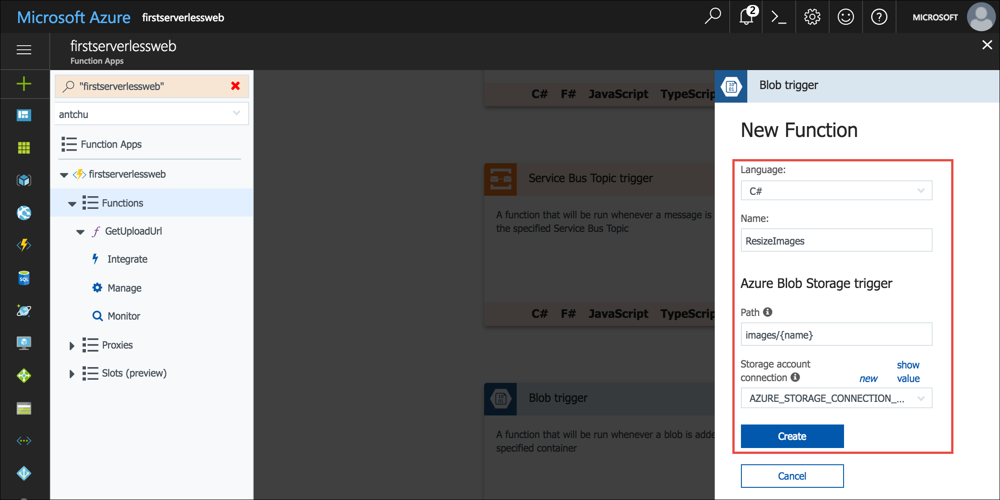
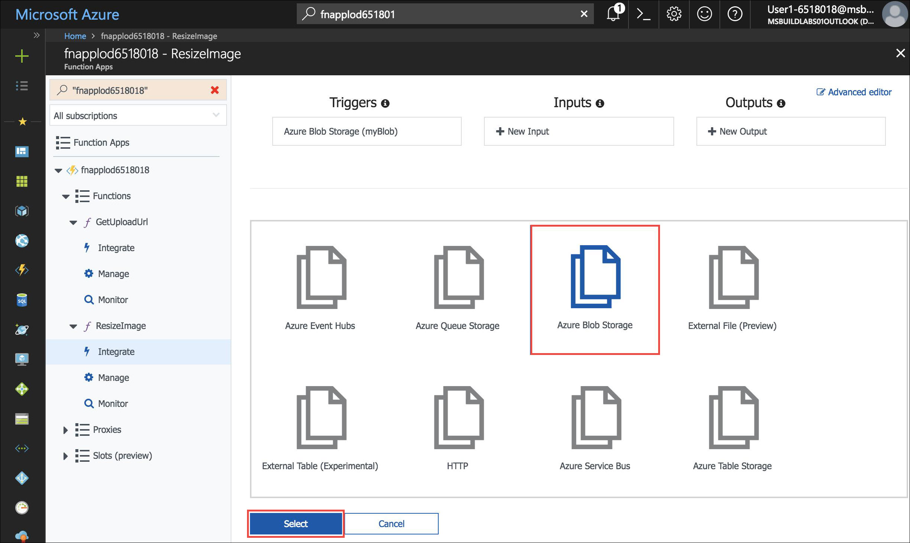
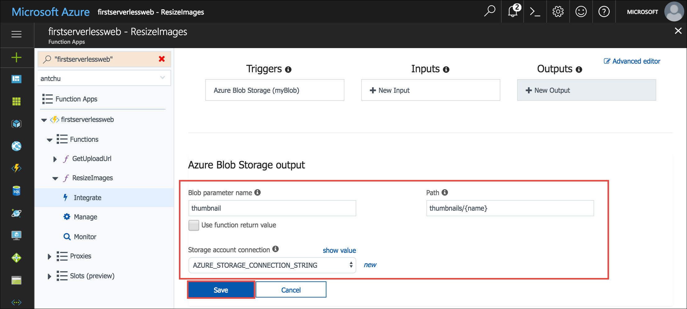
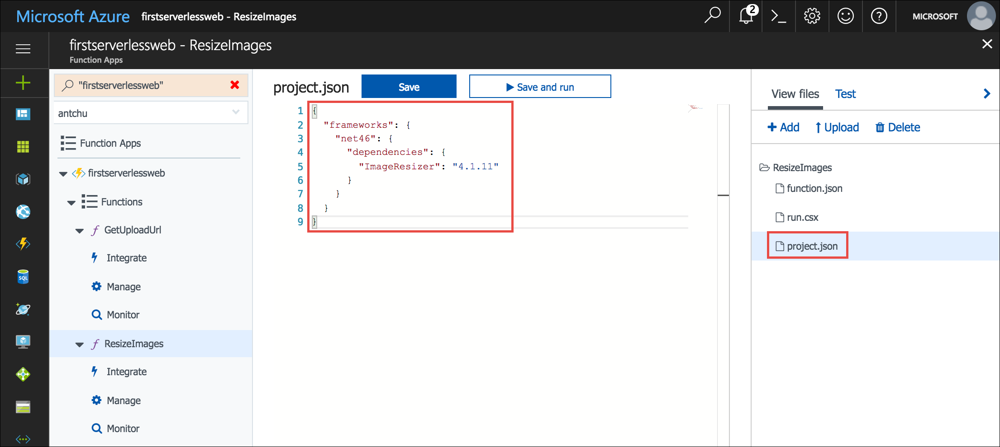

In the previous unit, you saw how a serverless function can facilitate the secure uploading of images to Blob storage from a web application. In this module, you create another serverless function to watch for uploaded images and create thumbnails from them.

## Create a blob storage container for thumbnails

The full size images are stored in a container named **images**. You need another container to store thumbnails of those images.

1. Ensure you are still signed in to the Cloud Shell (bash).  If not, select **Enter focus mode** to open a Cloud Shell window. 

1. Create a new container named **thumbnails** in your storage account with public access to all blobs.

    ```azurecli
    az storage container create -n thumbnails --account-name <storage account name> --public-access blob
    ```


## Create a blob-triggered serverless function

A trigger defines how a function is invoked. The function you create next uses a blob trigger: the function is automatically invoked when a blob (image file) is uploaded to the **images** container. A function must have one trigger. Triggers have associated data, which is usually the payload that triggered the function.

Bindings define how a function reads or writes data in Azure or third-party services. This function creates a thumbnail version of the image that triggers it and saves the thumbnail in a *thumbnails* container.

1. Open your function app in the Azure Portal.

1. In the function app window's left hand navigation, hover over **Functions** and click **+** to start creating a new serverless function. If a quickstart page appears, click **Custom function** to see a list of function templates.

1. Find the **BlobTrigger** template and select it.

1. Use these values to create a function that creates thumbnails as images are uploaded.

    | Setting      |  Suggested value   | Description                                        |
    | --- | --- | ---|
    | **Language** | C# or JavaScript | Choose your preferred language. |
    | **Name your function** | ResizeImage | Type this name exactly as shown so the application can discover the function. |
    | **Path** | images/{name} | Execute the function when a file appears in the **images** container. |
    | **Storage account information** | AZURE_STORAGE_CONNECTION_STRING | Use the environment variable previously created with the connection string. |

    

1. Click **Create** to create the function.

1. When the function is created, click **Integrate** to view its trigger, input, and output bindings.

1. Click **New output** to create a new output binding.

    

1. Select **Azure Blob Storage** and click **Select**. You may have to scroll down to see the **Select** button.

    

1. Enter the following values.

    | Setting      |  Suggested value   | Description                                        |
    | --- | --- | ---|
    | **Blob parameter name** | thumbnail | The function uses the parameter with this name to write the thumbnail. |
    | **Use function return value** | No |  |
    | **Path** | thumbnails/{name} | The thumbnails are written to a container named **thumbnails**. |
    | **Storage account connection** | AZURE_STORAGE_CONNECTION_STRING | Use the environment variable previously created with the connection string. |

    

1. **JavaScript**

    1. (JavaScript) Click on **Advanced editor** in the top right corner of the window to reveal the JSON representing the bindings.

    1. (JavaScript) In the `blobTrigger` binding, add a property named `dataType` with a value of `binary`. This configures the binding to pass the blob contents to the function as binary data.

    ```json
    {
      "name": "myBlob",
      "type": "blobTrigger",
      "direction": "in",
      "path": "images/{name}",
      "connection": "AZURE_STORAGE_CONNECTION_STRING",
      "dataType": "binary"
    }
    ```

1. Click **Save** to create the new binding.

1. **C#**

    1. (C#) Select the **ResizeImage** function name on the left navigation to open the function's source code.

    1. (C#) The function requires a NuGet package called **ImageResizer** to generate the thumbnails. NuGet packages are added to C# functions using a **project.json** file. To create the file, click **View Files** on the right to reveal the files that make up the function.
    
    1. (C#) Click **Add** to add a new file named **project.json**.
    
    1. (C#) Copy the contents of [**/csharp/ResizeImage/project.json**](https://raw.githubusercontent.com/Azure-Samples/functions-first-serverless-web-application/master/csharp/ResizeImage/project.json) into the newly created file. Save the file. Packages are automatically restored when the file is updated.
    
        
    
    1. (C#) Select **run.csx** under **View Files** and replace its content with the content in [**/csharp/ResizeImage/run.csx**](https://raw.githubusercontent.com/Azure-Samples/functions-first-serverless-web-application/master/csharp/ResizeImage/run.csx).

1. **JavaScript** 

    1. (JavaScript) This function requires the `jimp` package from npm to resize the photo. To install the npm package, click on the Function App's name on the left navigation and click **Platform features**.

    1. (JavaScript) Click **Console** to reveal a console window.

    1. (JavaScript) Run the command `npm install jimp` in the console. It may take a minute or two to complete the operation.

    1. (JavaScript) Click on the **ResizeImage** function name in the left navigation to reveal the function, replace all of **index.js** with the content of [**/javascript/ResizeImage/index.js**](https://raw.githubusercontent.com/Azure-Samples/functions-first-serverless-web-application/master/javascript/ResizeImage/index.js).

1. Click **Logs** below the code window to expand the logs panel.

1. Click **Save**. Check the logs panel to ensure the function is successfully saved and there are no errors.


## Test the serverless function

1. Open the application in a browser. Select an image file and upload it. The upload completes, but because we haven't added the ability to display images yet, the app doesn't show the uploaded photo.

1. In the Cloud Shell, confirm the image was uploaded to the **images** container.

    ```azurecli
    az storage blob list --account-name <storage account name> -c images -o table
    ```

1. Confirm the thumbnail was created in a container named **thumbnails**.

    ```azurecli
    az storage blob list --account-name <storage account name> -c thumbnails -o table
    ```

1. Obtain the thumbnail's URL.

    ```azurecli
    az storage blob url --account-name <storage account name> -c thumbnails -n <filename> --output tsv
    ```

    Open the URL in a browser and confirm the thumbnail was properly created.

1. Before moving on to the next tutorial, delete all files in the **images** and **thumbnails** containers.

    ```azurecli
    az storage blob delete-batch -s images --account-name <storage account name>
    ```
    ```azurecli
    az storage blob delete-batch -s thumbnails --account-name <storage account name>
    ```


## Summary

In this unit, you created a serverless function to create a thumbnail whenever an image is uploaded to a Blob storage container. Next, you learn how to use Azure Cosmos DB to store and list image metadata.