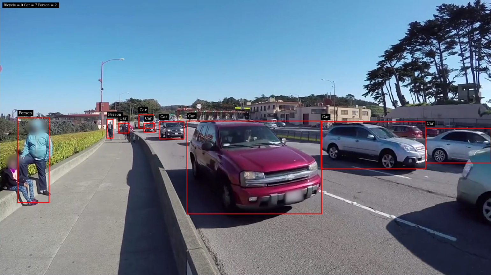

You've seen how the NVIDIA DeepStream Graph Composer can help in developing IVA applications. Now we're going to show how extra tooling can help to distribute these applications to datacenter and edge environments.

Containerization also provides many benefits during development and testing. Examples include:

- Consistency of behavior when you execute a workload on homogenous hardware.
- Incremental updates because of file-system layering, which can reduce time to deployment.
- Clear documentation of dependencies because of the self-documenting nature.

To achieve these benefits, you'll use the *container-builder* tool to package the previous example as a container.

1. Before you begin, you need to set up an account with the NVIDIA GPU Containers (NGC) service. This service is NVIDIA's official repository for distributing GPU-accelerated containers. Your workload requires access to this repository to pull in the DeepStream base container, which our containerized workload will use. To create an account or sign in with an existing account, see the [NVIDIA NGC sign-in page](https://ngc.nvidia.com/signin).

    1. Sign in or create a new account by going to the [NVIDIA NGC sign-in page](https://ngc.nvidia.com/signin). After you're signed in to NVIDIA NGC, select your username in the upper-right corner and select **Setup**. You'll see the following options:

        


    1. Select **Get API Key**. On the screen that appears, in the upper-right select **Generate API Key**. Then select **Confirm** on the resulting prompt.

        

    1. Supply the credentials to the Docker runtime by executing the following commands in a terminal on the host machine:

        ```Bash
        sudo docker login nvcr.io
        ```

    1. When you're prompted for **Username**, enter *$oauthtoken* exactly as shown. When you're prompted for **Password**, enter the value of your generated API key. You should receive the message "Login Succeeded."

1. Now that you have access to nvcr.io, you can begin to build containers that use the base images provided through NVIDIA NGC. The *container-builder* tool can build images by supplying it with a configuration file. You'll use one of the examples provided in the reference graphs package.

    1. To invoke the *container-builder* to package the deepstream-test1 application, run the following commands on the host machine:

        ```
        cd /opt/nvidia/deepstream/deepstream-6.0/reference_graphs/deepstream-test1
        sudo container_builder -c ds_test1_container_builder_dgpu.yaml
        ```

    1. After successful completion, you should see output that contains the message "Successfully tagged deepstream_test1_dgpu:latest."

    >[!NOTE]
    > If you receive a "docker.errors.DockerException" error when you run the preceding commands, it might indicate that you don't have the Docker runtime installed on the host machine. To proceed, review the instructions in the "Install NVIDIA DeepStream Graph Composer Dependencies" section of this module on how to install Docker.

    >[!NOTE]
    > If you receive "docker.errors.BuildError: unauthorized: authentication required," this message indicates that you might not have properly authenticated your NVIDIA NGC account for use with Docker.

1. Before you run this containerized workload, you're required to grant access to the X11 display environment when it runs from a container because of the workload by using an output sink of type EGL (type = 2).

    Run the following commands from a terminal on the host machine to enable access to the X11 services:

    ```Bash
    sudo xhost +
    ```

1. Confirm that the containerized workload runs as expected by running the following code in a terminal on the host machine:

    ```
    sudo docker run -it --rm --gpus all -v /tmp/.X11-unix/:/tmp/.X11-unix/ -e DISPLAY=:0 
    deepstream_test1_dgpu
    ```

    This command starts an instance of the `deepstream_test1_dgpu` container image and supplies it access to all available GPU hardware on the machine while also supplying access to the X11 socket and current `DISPLAY`. You should see output similar to the previous run that was invoked by using `execute_graph.sh`.
    
     

You're now ready to publish your working containerized workload into a secure container registry for distribution.
