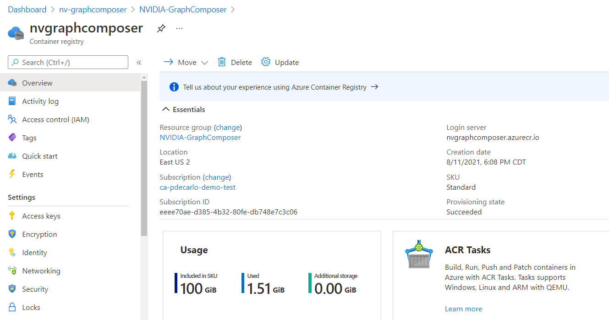
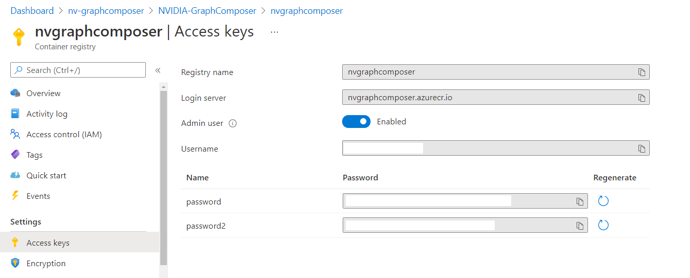

Now that we have packaged our DeepStream Graph Composer application into a container, we are now ready to publish this artifact into an [Azure Container Registry](https://azure.microsoft.com/services/container-registry/#overview) for secure distribution to other supported devices.  

This preparation will also set the stage for potential deployment using [Azure IoT Edge](https://docs.microsoft.com/azure/iot-edge/about-iot-edge), which we will cover in more detail in the next module.

1. To begin, we will follow instructions from the official Microsoft Docs to "create a container registry".  This document will demonstrate how to instantiate the necessary Azure Container Registry resources in Microsoft Azure and how to login and push images to this service.  Once you have completed the steps in this section, we will proceed to publish our DeepStream Graph Composer container artifact into this registry.

    Follow the steps in the [Quickstart: Create an Azure container registry using the Azure portal](https://docs.microsoft.com/azure/container-registry/container-registry-get-started-portal).  You only need to follow the steps to "Create a container registry", the extra steps mentioned in the documentation are optional.  Once this task has been completed, you may proceed with the next steps.

1. Navigate to your newly deployed Azure Container Registry within the Azure portal:

    


    You will notice your Azure Container Registry has a property of `Login server` that refers to the url for accessing your service remotely, this property ends in `azurecr.io`.  Take note of this value as we will refer to it shortly.

1. Next, select the `Access keys` section on the left-hand side under `Settings`, and enable the option for `Admin user`.  This operation will grant us the ability to authenticate against our Azure Container Registry to allow access from the Docker instance running on our host machine.  Again, take note of the values for `Login server`, `Username`, and `password` as they will be used in the next step.

    


1. We are now ready to authenticate against our Azure Container Registry and grant access to the host's Docker instance.  To accomplish this step, run the following commands in a terminal session on the host machine:

    ```Bash
    sudo docker login <Login server>
    ```

    1. When prompted for `Username`, enter the value provided in the `Access keys` section of your Azure Container Registry in the Azure portal.

    1. When prompted for `Password`, enter the value provided in the `Access keys` section of your Azure Container Registry in the Azure portal.

    1. You should see a message indicating `Login Succeeded` upon successful entry.

1. Before we can push our recently create docker image into our container registry, we must tag our image to reference our Azure Container Registry.  This can be accomplished by running the following command in a terminal on the host machine:

    ```Bash
    sudo docker tag deepstream_test1_dgpu <Login Server>/deepstream_test1_dgpu:v1
    ```

1. We can now push our DeepStream Graph Composer container image into this repository by running:

    ```Bash
    sudo docker push <Login Server>/deepstream_test1_dgpu:v1
    ```

1. Await for the push to complete, then navigate back to your Azure Container Registry in the Azure portal and verify that the image has been uploaded by selecting `Repositories` under the `Services` section on the left-hand side of the overview page.  You should see your freshly pushed `deepstream_test1_dgpu:v1` image in the repository list as shown below:

    

1. Finally, if you wish to execute and run this image using the image contained in the Azure Container Registry you can execute the following commands in a terminal on a compatible host:

    ```Bash
    sudo docker run -it --rm --gpus all -v /tmp/.X11-unix/:/tmp/.X11-unix/ -e DISPLAY=:0 
    <Login server>/deepstream_test1_dgpu:v1
    ```

    >[!NOTE]
    > If you intend to run this workload on machine that is not the current host that we have been working with, you will need to enable access to X11 with `sudo xhost +` and also authenticate your Docker instance for access to your Azure Container Registry.

Congratulations!  You've successfully built and published your first DeepStream Graph Composer application into a secure Azure Container Registry to enable distribution of your workload to various compatible hosts!

### Try this

Imagine that you have been tasked to develop an IVA application to count people entering into a restaurant establishment. Your development team works in close connection to a testing team that validates the accuracy of the IVA solution before deploying into production.  How could you distribute new builds of the IVA application to the test team in a way that does not require manual reconfiguration of test hardware?
