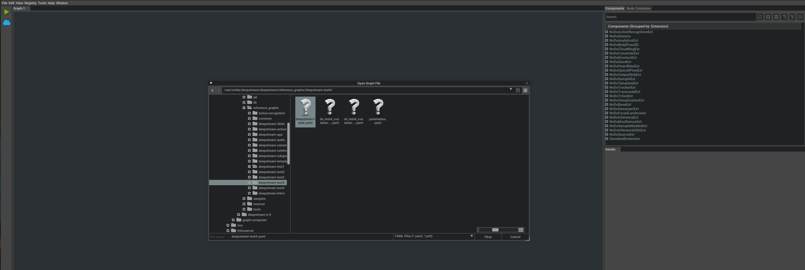
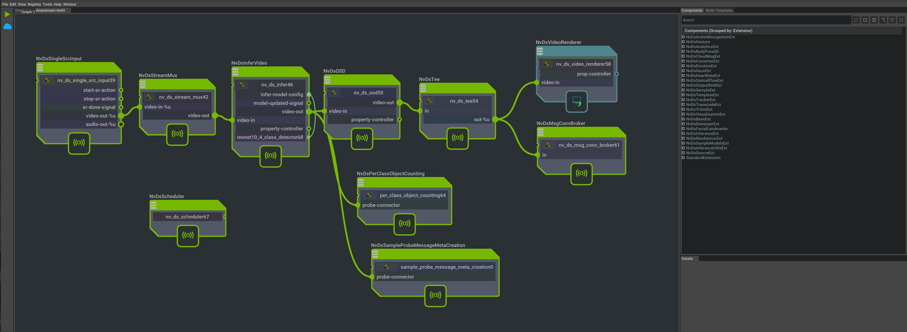

An Azure IoT Hub is a managed service in the Azure cloud that provides secure registration for IoT devices to allow for high-throughput communication from your device to the cloud and from the cloud down to your device. We will use this resource to register an NVIDIA embedded device and configure it with a DeepStream-based IoT Edge deployment.

1. Follow the steps in the [Quickstart: Create an IoT hub using the Azure portal](/azure/iot-hub/iot-hub-create-through-portal#create-an-iot-hub).  Note that you only need to follow the steps to "Create an IoT hub", the extra steps mentioned in the documentation are optional.  Once this task has been completed, you may proceed with the next step.

1. NVIDIA DeepStream supports integration with Azure IoT Edge through [Azure MQTT Protocol Adapter Libraries](https://docs.nvidia.com/metropolis/deepstream/dev-guide/text/DS_plugin_gst-nvmsgbroker.html#azure-mqtt-protocol-adapter-libraries). These libraries extend the [`Gst-nvmsbroker`](https://docs.nvidia.com/metropolis/deepstream/dev-guide/text/DS_plugin_gst-nvmsgbroker.html#) plugin provided in the DeepStream SDK.  The Azure protocol adapter allows DeepStream applications to publish messages directly to an Azure IoT Hub using the MQTT protocol.

    The following steps are to be completed on an X86 based host machine that has the DeepStream 6.0 Graph Composer installed and assumes that you have completed the steps described in the previous modules `Setup and Configuration of an NVIDIA DeepStream Development Environment` and `Introduction to DeepStream 6.0 Graph Composer with Microsoft Azure`.

1. In the Composer application, select "File => Open Graph" and navigate to the `/opt/nvidia/deepstream/deepstream/reference_graphs/deepstream-test4` path and select the `deepstream-test4.yaml` file, then "Okay".

    

    This sample builds on top of the earlier "deepstream-test1" graph to demonstrate how to send inference output messages to the cloud.

    

    The graph contains additional `NvDsSampleProbeMessageMetaCreation` and `NvDsMsgConvBroker` components, which are together responsible for sending message to the cloud. The `NvDsSampleProbeMessageMetaCreation` transforms the metadata generated by the pipeline into another metadata of type `NVDS_EVENT_MSG_DATA`.  This metadata is serialized by `NvDsMsgConvBroker` and then sent to the cloud using a message broker protocol.

1. To modify this sample to publish to the Azure cloud, we can update the `msg-conv-config` property of the `NvDsMsgConvBroker` from `/opt/nvidia/deepstream/deepstream/lib/libnvds_kafka_proto.so` to `/opt/nvidia/deepstream/deepstream/lib/libnvds_azure_edge_proto.so`.  This change will configure the output to then use the Azure protocol adapter that ships with the DeepStream SDK.
