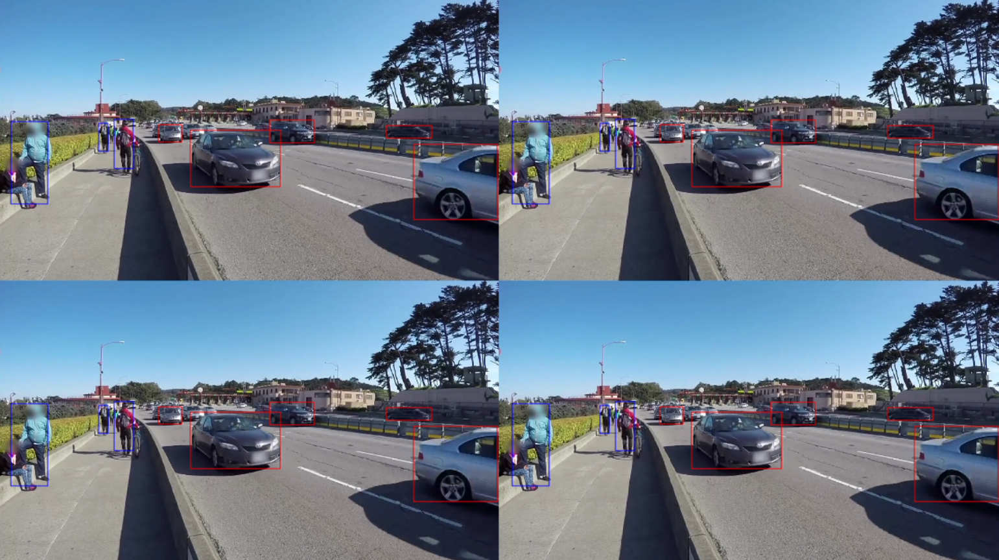

Now that we have installed the NVIDIA DeepStream dependencies and SDK, we can begin working with the included DeepStream reference applications.

1. Navigate to `/opt/nvidia/deepstream/deepstream/samples`. Here you will find many sample applications and configurations.  Let's navigate to the deepstream-app samples and launch one of the reference applications.  

    The commands below will launch the deepstream-app using the configuration present in `source4_1080p_dec_infer-resnet_tracker_sgie_tiled_display_int8.txt`

    ```
    cd /opt/nvidia/deepstream/deepstream/samples/configs/deepstream-app
    deepstream-app -c source4_1080p_dec_infer-resnet_tracker_sgie_tiled_display_int8.txt
    ```

    The deepstream-app should begin building the execution engine using the model metadata defined in the supplied configuration.  This process may take a few minutes depending on the available hardware, and will run  faster on consecutive executions due to caching of the resulting engine output. 

    It is important to note that the name of the configuration file tells us a bit of information about what to expect from the sample.  The `source4_1080p_dec_infer-resnet_tracker_sgie_tiled_display_int8.txt` sample will decode four 1080-p video sources and apply inference using Resnet as the primary GPU inference engine (to detect people, bicycles, vehicles, and road signs), employ object tracking, and use a Secondary GPU inference engine (for make / color / model of vehicle) that will render results on a tiled display using int8 precision (to speed up inference processing time).  

    The application should display as shown below:

    

    You may view the labels assigned to detected object by left-clicking on any of the sources within the tiled display, this action will show a bit more information regarding detections (to return the tiled display, right-click anywhere in the application window):
    
    

Now that we can successfully run a DeepStream reference application, we can begin to look at making modifications to customize the behavior of these examples.