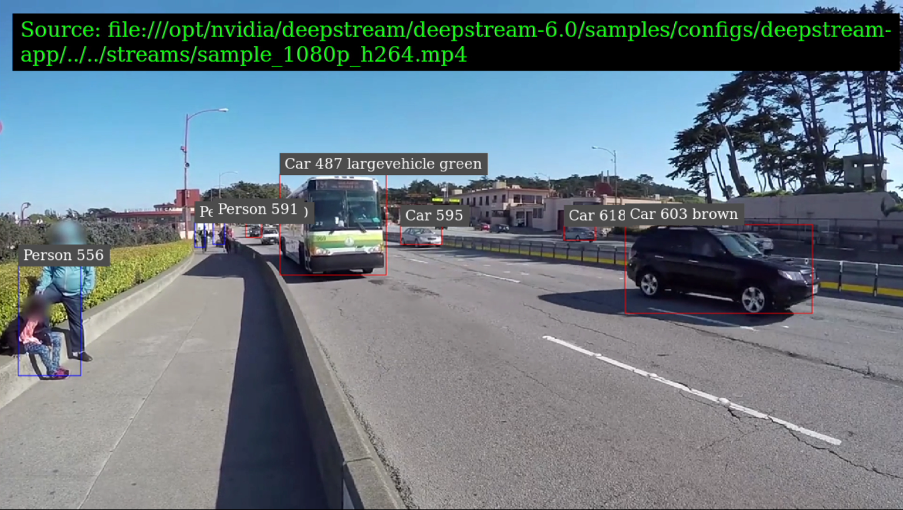

In this module, you will learn how to set up and configure an X86 based Ubuntu 18.04 System to host an NVIDIA DeepStream development environment.

## Prerequisites
* X86 Based System running Ubuntu 18.04 OS
* RTX2080, RTX3080, T4, or A100 NVIDIA Graphics Card

## Scenario: develop an application that counts people and vehicles within an area of business

Your boss has mentioned an interest in adopting Artificial Intelligence, specifically Computer Vision, to aid the automation of gathering metrics regarding customer traffic in designated areas.  The task seems like a difficult one at first, rife with various complexities and areas in need of never-ending optimization.  However, you've noticed that there may be a way to simplify this task by employing the NVIDIA DeepStream SDK and pairing it with Azure services to create a production-grade solution that could lend itself to other use cases with minimal modification.  You've decided to get started by exploring what is possible by setting up a development environment to evaluate the NVIDIA DeepStream SDK.  

## What will you learn?

When you finish this module, you'll be able to:

- Describe the components of Intelligent Video Applications
- Install the NVIDIA DeepStream SDK and Dependencies onto an x86 host
- Run NVIDIA DeepStream applications
- Modify and customize NVIDIA DeepStream application configurations

## What is the main goal?

This module will show you how to get started developing Intelligent Video Applications using the NVIDIA DeepStream SDK.